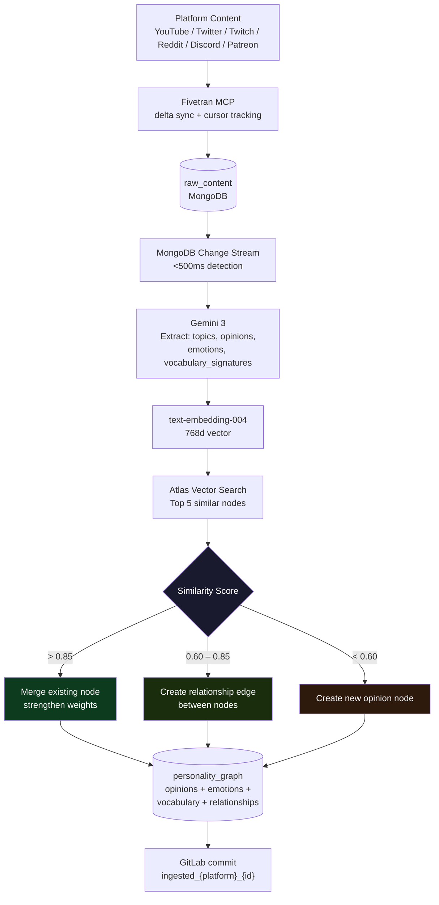
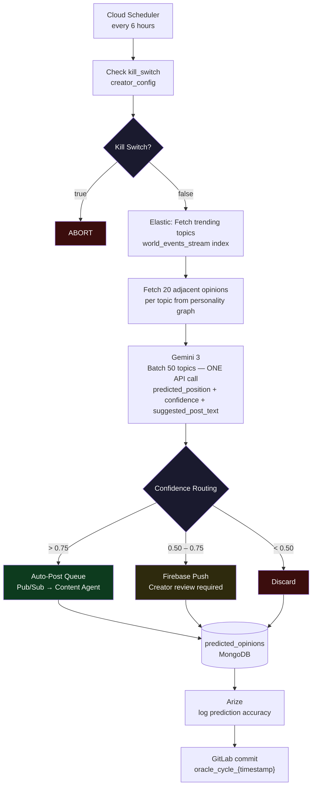
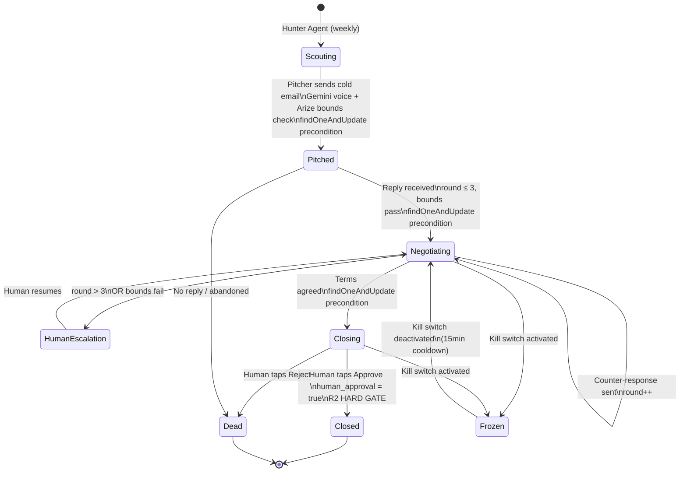
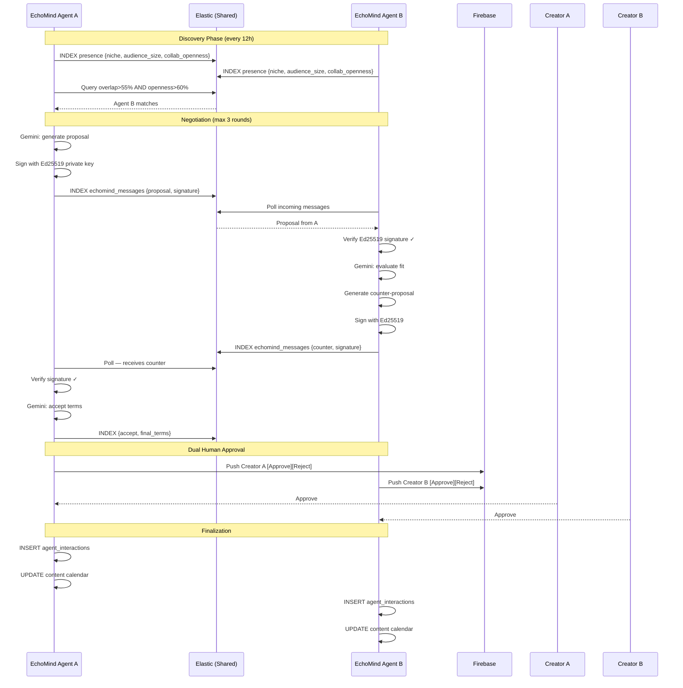
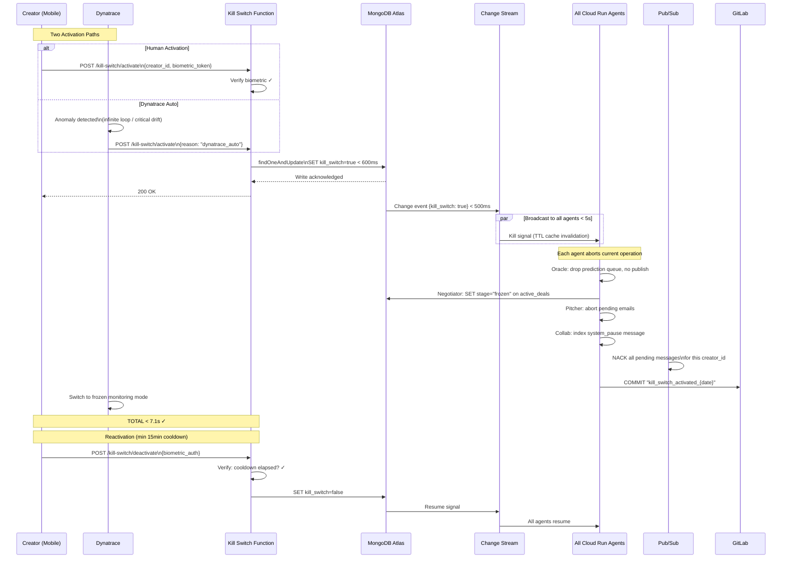
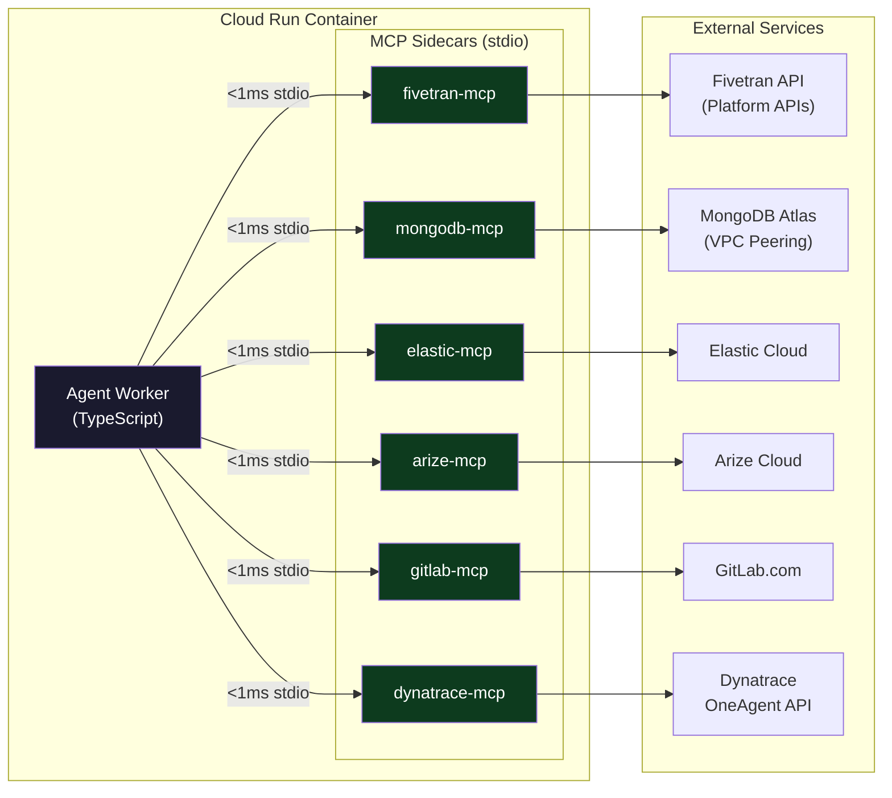
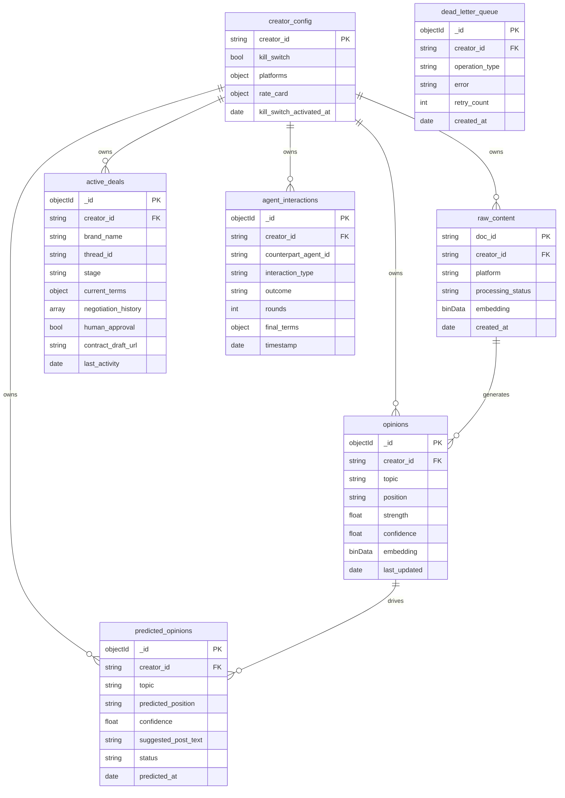
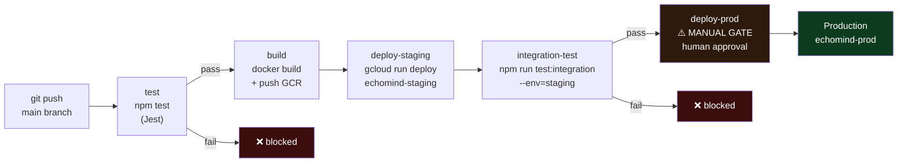
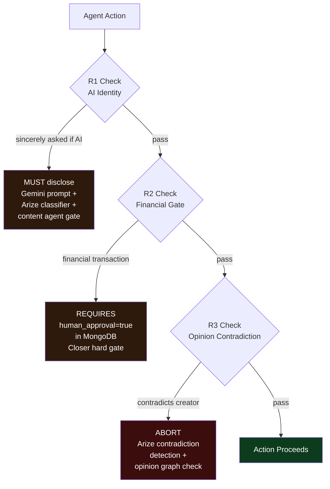

# EchoMind 

> **The world's first fully autonomous AI creator operating system.**
> Ingests your entire digital existence. Posts as you. Closes brand deals. Negotiates collaborations. While you sleep.

[](https://www.typescriptlang.org/)
[](https://nodejs.org/)
[](https://cloud.google.com/)
[](https://www.mongodb.com/atlas)
[](https://www.elastic.co/)
[]()

---

## What It Does

| Function | Description |
|---|---|
| **Personality Graph** | Ingests every post, video, comment, email you've ever made. Builds a living computational model of your opinions, voice, and emotional patterns. |
| **Oracle Engine** | Predicts what opinions you'll form — 4 weeks before you form them. Posts content in your exact voice with zero human input. |
| **Sovereign Economy** | Autonomously hunts brands, writes cold emails in your voice, negotiates deals, generates contracts, and closes — end to end. |
| **Multi-Agent Civilization** | Discovers other EchoMind instances. Negotiates collaborations. Competes for audience share. Fully automated. |

**Your only interaction: one daily approve/reject push notification.**

---

## System Architecture

```mermaid
graph TB
    subgraph "Creator Interface"
        HUMAN["Creator (Mobile App)"]
        FCM["Firebase Cloud Messaging"]
    end

    subgraph "Data Ingestion"
        FT["Fivetran MCP\n(Platform API Shield)"]
        YT["YouTube"]
        TW["Twitter/X"]
        TW2["Twitch"]
        RD["Reddit"]
        DC["Discord"]
        PT["Patreon"]
    end

    subgraph "Agent Fleet (Cloud Run concurrency=1)"
        ING["Ingestion Agent\n<6.5s per doc"]
        ORA["Oracle Agent\n<45s / 50 topics"]
        CON["Content Agent"]
        HUN["Hunter Agent"]
        PIT["Pitcher Agent"]
        NEG["Negotiator Agent"]
        CLO["Closer Agent"]
        IAG["Inter-Agent"]
        KSW["Kill Switch\n<7.1s freeze"]
    end

    subgraph "AI Layer"
        GEM["Gemini 3\nGoogle Cloud Agent Builder"]
    end

    subgraph "Persistence"
        MDB["MongoDB Atlas MCP\n12 Collections + Vector Search"]
    end

    subgraph "Search & Messaging"
        ES["Elastic Cloud MCP\nTrending + Inter-Agent Msgs"]
    end

    subgraph "Observability"
        ARIZE["Arize MCP\nDrift + Policy Checks"]
        GL["GitLab MCP\nImmutable Audit Log"]
        DT["Dynatrace MCP\nAnomaly Detection"]
    end

    subgraph "Infrastructure"
        PS["Google Cloud Pub/Sub"]
        SCHED["Cloud Scheduler"]
        SM["Secret Manager + KMS"]
    end

    YT & TW & TW2 & RD & DC & PT --> FT
    FT --> MDB
    MDB -->|"Change Stream"| ING
    ING <--> GEM
    ING --> MDB

    SCHED -->|"6h cron"| PS
    PS --> ORA
    ORA <--> GEM
    ORA <--> MDB
    ORA <--> ES
    ORA -->|">0.75 confidence"| PS
    ORA -->|"0.50-0.75"| FCM

    PS --> CON
    CON <--> GEM
    CON --> ARIZE
    CON --> FT

    SCHED -->|"weekly"| HUN
    HUN <--> ES
    HUN <--> GEM
    HUN --> PS
    PS --> PIT
    PIT <--> GEM
    PIT --> ARIZE
    PIT --> MDB

    SCHED -->|"2h cron"| NEG
    NEG <--> GEM
    NEG <--> MDB
    NEG --> FCM

    NEG -->|"terms agreed"| PS
    PS --> CLO
    CLO <--> GEM
    CLO --> FCM
    HUMAN -->|"[Approve]"| CLO
    CLO --> MDB

    SCHED -->|"12h cron"| IAG
    IAG <--> ES
    IAG <--> GEM
    IAG --> FCM

    HUMAN -->|"Kill Switch tap"| KSW
    DT -->|"Anomaly auto-trigger"| KSW
    KSW --> MDB
    MDB -->|"Change Stream broadcast"| ING & ORA & CON & NEG & IAG

    ING & ORA & CON & HUN & PIT & NEG & CLO & IAG --> GL
    ING & ORA & CON & NEG & CLO --> ARIZE
    ING & ORA & CON & KSW --> DT

    FCM --> HUMAN
```



---

## Ingestion → Personality Graph



---

## Oracle Engine → Auto-Post



---

## Brand Deal Pipeline



---

## Inter-Agent Collaboration



---

## Kill Switch — Full System Freeze



---

## MCP Transport Architecture



> **Why stdio?** Zero network hop. <1ms overhead per MCP call. Agents make 10–50 MCP calls per reasoning cycle — network latency would destroy every SLA.

---

## MongoDB Schema



---

## CI/CD Pipeline



---

## Hard Laws



---

## Tech Stack

| Layer | Technology |
|---|---|
| AI Reasoning | Gemini 3 via Google Cloud Agent Builder |
| Data Ingestion | Fivetran MCP (stdio) |
| Persistence | MongoDB Atlas MCP + Vector Search (stdio) |
| Search & Messaging | Elastic Cloud MCP (stdio) |
| AI Observability | Arize MCP (stdio) |
| Audit & Versioning | GitLab MCP (stdio) |
| Infrastructure Monitoring | Dynatrace MCP (stdio) |
| Compute | Google Cloud Run (concurrency=1) |
| Messaging | Google Cloud Pub/Sub (shared topic, attribute filtering) |
| Scheduling | Google Cloud Scheduler |
| Secrets | Google Cloud Secret Manager + KMS (CSFLE) |
| Notifications | Firebase Cloud Messaging |
| Runtime | Node.js 22 + TypeScript 5.8 strict |
| Testing | Jest |

---

## Scaling Thresholds

| Creators | Action Required |
|---|---|
| 5 | MongoDB M10 → M30 |
| 20 | MongoDB M30 → M50 |
| 50 | Add MongoDB read replicas for Oracle |
| 100 | Deploy dedicated Vector Search nodes (S30) |
| 100 | Elastic 3-node cluster |
| 200 | MongoDB 3-shard cluster |
| 500 | Elastic: per-creator → shared index + routing |
| 1,000 | Request Gemini 5,000 RPM quota |

---

## Project Structure

```
Echomind/
├── src/
│   ├── agents/
│   │   ├── ingestion/
│   │   ├── oracle/
│   │   ├── content/
│   │   ├── deal/
│   │   │   ├── hunter/
│   │   │   ├── pitcher/
│   │   │   ├── negotiator/
│   │   │   └── closer/
│   │   └── inter-agent/
│   ├── cloud-functions/
│   │   └── kill-switch.ts
│   ├── db/
│   │   └── collection-defs.ts
│   ├── mcp/
│   │   ├── fivetran.ts
│   │   ├── mongodb.ts
│   │   ├── elastic.ts
│   │   ├── arize.ts
│   │   ├── gitlab.ts
│   │   └── dynatrace.ts
│   ├── utils/
│   │   └── kill-switch-checker.ts
│   └── workers/
│       └── kill-switch-broadcaster.ts
├── __tests__/
├── infra/
│   ├── cloud-run/
│   ├── pubsub/
│   ├── scheduler/
│   ├── secrets/
│   └── vpc/
├── docs/
│   └── EchoMind_Complete_Architecture.md
├── .gitlab-ci.yml
├── AGENTS.md
└── opencode.json
```

---

## Monitoring

| Metric | SLA | Alert Threshold |
|---|---|---|
| Agent Cycle Completion Rate | 99.9% | < 99.0% over 15min |
| MongoDB Query Latency P99 | < 200ms | > 500ms over 5min |
| Elastic Query Latency P99 | < 100ms | > 250ms over 5min |
| Gemini API Latency P99 | < 3,000ms | > 5,000ms over 5min |
| Kill Switch Latency | < 7s | > 10s |
| DLQ Size | < 10 | > 50 |
| Prediction Accuracy (30d) | > 0.70 | < 0.65 |
| Drift Events | < 5/day | > 10/day |
| Negotiation Bounds Violations | — | > 3/day |

---

## Security

- **Credential isolation** — each creator has isolated Secret Manager secrets via Workload Identity
- **CSFLE** — `contract_draft_url`, `oauth_tokens`, `rate_card` encrypted at field level via KMS
- **Ed25519** — all inter-agent messages cryptographically signed and verified before processing
- **Zero hardcoded credentials** — enforced via GitLab CI secret scanning
- **Immutable audit log** — every agent action commits to GitLab. Tamper-proof by design.
- **Triple enforcement** — R1/R2/R3 enforced at Gemini prompt, Arize observability, and MongoDB precondition layers simultaneously

---

<div align="center">
  <strong>EchoMind </strong><br/>
</div>
