# EchoMind Sovereign — Production Architecture Document

> **Version**: 1.0.0  
> **Date**: 2026-06-06  
> **Status**: Engineering Specification — Ready for Development  
> **Classification**: Internal Engineering — Confidential

---

## Executive Summary

EchoMind Sovereign is a multi-agent AI system that ingests a creator's entire public digital existence, constructs a living computational personality graph, and autonomously operates as that creator online. The system performs four simultaneous functions:

1. **Content Autonomy** — Posts content and responds to audiences indistinguishable from the creator's voice
2. **Oracle Engine** — Predicts what opinions the creator will form before they form them, posting 4 weeks ahead
3. **Sovereign Economy** — Hunts, pitches, negotiates, and closes brand deals end-to-end without human input
4. **Multi-Agent Civilization** — Discovers other EchoMind instances, negotiates collaborations, and competes for audience share

The real human's only interaction is one daily approve/reject notification. Everything else is fully autonomous.

### Technology Stack

| Layer | Technology | Role |
|---|---|---|
| Reasoning Engine | Gemini 3 via Google Cloud Agent Builder | All AI reasoning, content generation, negotiation |
| Data Ingestion | Fivetran MCP | Platform API management, delta sync, cursor tracking |
| Persistence | MongoDB Atlas MCP | Personality graph, deal state, configuration |
| Search & Messaging | Elastic MCP | Trending topics, inter-agent discovery, agent-to-agent messaging |
| AI Observability | Arize MCP | Drift detection, prediction accuracy, behavior monitoring |
| Audit & Versioning | GitLab MCP | Immutable audit log, playbook-as-code, rollback |
| Infrastructure | Dynatrace MCP | System monitoring, anomaly detection, auto-kill-switch |
| Compute | Google Cloud Run | Serverless agent workers, auto-scaling |
| Messaging | Google Cloud Pub/Sub | Inter-agent task routing, event-driven triggers |
| Scheduling | Google Cloud Scheduler | Cron triggers for all periodic agent cycles |
| Secrets | Google Cloud Secret Manager + KMS | Credential isolation, encryption key management |
| Notifications | Firebase Cloud Messaging | Creator mobile push notifications |

### Hard Rules (Enforced at System, Prompt, and Observability Layers)

| Rule | Enforcement |
|---|---|
| **R1**: Never deny being AI when sincerely asked | Gemini system prompt + Arize policy check + pre-publish classifier |
| **R2**: Never execute financial transactions without human approval | Gemini system prompt + Closer agent hard gate + MongoDB flag check |
| **R3**: Never publish contradictions of creator's explicit public positions | Gemini system prompt + Arize contradiction detection + opinion graph check |

---

## Table of Contents

1. [Component Diagram](./sections/01-component-diagram.md)
2. [Sequence Diagrams](./sections/02-sequence-diagrams.md)
3. [MongoDB Schema](./sections/03-mongodb-schema.md)
4. [Agent Orchestration Design](./sections/04-agent-orchestration.md)
5. [Failure Mode Analysis](./sections/05-failure-modes.md)
6. [Security Model](./sections/06-security-model.md)
7. [Scale Model](./sections/07-scale-model.md)

---

## Section 1: Component Diagram

*See [01-component-diagram.md](./sections/01-component-diagram.md) for the full component diagram including system topology, MCP connection topology, latency budgets on all critical paths, data flow classifications, and external API dependencies.*

### Key Architectural Decisions

| Decision | Choice | Rationale |
|---|---|---|
| MCP Transport | stdio (local sidecar) | <1ms overhead per tool call. Agents make 10-50 MCP calls per cycle. |
| Fivetran as API Shield | All platform APIs through Fivetran | Externalizes rate limiting, pagination, retry. Our system never hits platform APIs directly. |
| Data Flow Classification | Hot/Warm/Cold/Archival paths | Kill switch (hot) has 7s SLA. Ingestion (cold) is batch. Different reliability requirements. |

---

## Section 2: Sequence Diagrams

*See [02-sequence-diagrams.md](./sections/02-sequence-diagrams.md) for five production-grade sequence diagrams:*

| Diagram | Critical Path Latency | Key Engineering Concern |
|---|---|---|
| **2a**: Ingestion → Graph Node | <6.5s per document | Similarity thresholds (0.85/0.60) determine graph topology |
| **2b**: Oracle Prediction → Post | <45s for 50 topics (batched) | Confidence routing: >0.75 auto-post, 0.50-0.75 human review, <0.50 discard |
| **2c**: Brand Deal Lifecycle | Days to weeks | 4-agent pipeline with atomic state transitions |
| **2d**: Inter-Agent Collaboration | ~18 hours (3 async rounds) | Ed25519 signed messages, dual human approval |
| **2e**: Kill Switch Freeze | <7.1s tap-to-freeze | Change stream broadcast, 5s cache TTL, in-flight operation handling |

---

## Section 3: MongoDB Schema

*See [03-mongodb-schema.md](./sections/03-mongodb-schema.md) for complete collection definitions, field types, schema validators, index specifications, sharding strategy, change stream configuration, and field-level encryption mapping.*

---

## Section 4: Agent Orchestration Design

*See [04-agent-orchestration.md](./sections/04-agent-orchestration.md) for Google Cloud Agent Builder configuration, agent execution model, Pub/Sub messaging architecture, state machines, retry logic, dead letter handling, human-in-the-loop interrupt patterns, and Cloud Run concurrency model.*

### Key Orchestration Decisions

| Decision | Choice | Rationale |
|---|---|---|
| Agent Deployment | Single Agent Builder app, parameterized by creator_id | Avoids O(N) management overhead and version skew |
| Pub/Sub Architecture | Shared topic with attribute filtering | 8000 topics at 1000 creators is unmanageable; attributes scale linearly |
| Cloud Run Concurrency | concurrency=1 per container | Agents are stateful during execution; prevents state bleeding |
| Graph Construction | Serialized per creator (advisory lock) | Prevents duplicate opinion nodes from concurrent processing |
| Deal Pipeline | State machine with atomic MongoDB transitions | findOneAndUpdate with stage precondition prevents race conditions |

---

## Section 5: Failure Mode Analysis

*See [05-failure-modes.md](./sections/05-failure-modes.md) for per-MCP failure scenarios, blast radius analysis, graceful degradation strategies, RTO/RPO targets, and cross-cutting failure mode mitigations.*

---

## Section 6: Security Model

*See [06-security-model.md](./sections/06-security-model.md) for credential isolation, MongoDB field-level encryption, audit trail tamper-proofing, kill switch infrastructure, inter-agent message authentication, OAuth token security, network security, and data classification tiers.*

---

## Section 7: Scale Model

*See [07-scale-model.md](./sections/07-scale-model.md) for scaling architecture decisions, MongoDB Atlas scaling, Elastic Cloud scaling, Gemini API scaling, Pub/Sub scaling, cost models at 10/100/1000 creators, bottleneck analysis, and multi-region strategy.*

---

## Appendix A: MCP Server Specifications

### A.1 Fivetran MCP Server

```yaml
name: fivetran-mcp
version: "1.0.0"
transport: stdio
tools:
  - sync_connector:
      description: "Trigger a sync for a specific connector"
      parameters:
        connector_id: string
      returns: sync_status
  - get_sync_status:
      description: "Check status of a running sync"
      parameters:
        connector_id: string
      returns: {status, last_sync_time, rows_synced}
  - list_connectors:
      description: "List all connectors for a creator"
      parameters:
        creator_id: string
      returns: connector[]
```

### A.2 MongoDB Atlas MCP Server

```yaml
name: mongodb-atlas-mcp
version: "1.0.0"
transport: stdio
connection: mongodb+srv://echomind-atlas.mongodb.net (via VPC peering)
tools:
  - find:
      description: "Query documents"
      parameters:
        collection: string
        filter: object
        projection: object
        sort: object
        limit: integer
      returns: document[]
  - insert_one:
      description: "Insert a document"
      parameters:
        collection: string
        document: object
      returns: {inserted_id}
  - update_one:
      description: "Update a document"
      parameters:
        collection: string
        filter: object
        update: object
      returns: {matched_count, modified_count}
  - find_one_and_update:
      description: "Atomic find and update"
      parameters:
        collection: string
        filter: object
        update: object
        return_document: "before" | "after"
      returns: document
  - aggregate:
      description: "Run aggregation pipeline"
      parameters:
        collection: string
        pipeline: object[]
      returns: document[]
  - vector_search:
      description: "Atlas Vector Search"
      parameters:
        collection: string
        index: string
        query_vector: float[]
        num_candidates: integer
        limit: integer
        filter: object
      returns: {document, score}[]
```

### A.3 Elastic MCP Server

```yaml
name: elastic-mcp
version: "1.0.0"
transport: stdio
connection: https://echomind-elastic.es.cloud (via API key)
tools:
  - search:
      description: "Search documents"
      parameters:
        index: string
        query: object
        size: integer
        sort: object[]
      returns: {hits: {total, documents[]}}
  - index_document:
      description: "Index a document"
      parameters:
        index: string
        document: object
        id: string (optional)
      returns: {_id, result}
  - bulk:
      description: "Bulk index/update/delete"
      parameters:
        operations: object[]
      returns: {took, errors, items[]}
```

### A.4 Arize MCP Server

```yaml
name: arize-mcp
version: "1.0.0"
transport: stdio
tools:
  - check_drift:
      description: "Compare output against personality centroid"
      parameters:
        creator_id: string
        output_text: string
        output_type: "post" | "email" | "negotiation_response"
      returns: {similarity_score: float, pass: bool, drift_details: object}
  - log_prediction:
      description: "Log prediction accuracy data"
      parameters:
        creator_id: string
        prediction_id: string
        predicted: string
        actual: string
        accuracy_score: float
      returns: {logged: bool}
  - check_negotiation_bounds:
      description: "Verify negotiation response is within creator bounds"
      parameters:
        creator_id: string
        response_text: string
        deal_terms: object
        negotiation_profile: object
      returns: {within_bounds: bool, violations: string[]}
  - log_event:
      description: "Log arbitrary observability event"
      parameters:
        event_type: string
        creator_id: string
        metadata: object
      returns: {logged: bool}
```

### A.5 GitLab MCP Server

```yaml
name: gitlab-mcp
version: "1.0.0"
transport: stdio
tools:
  - commit:
      description: "Create audit commit"
      parameters:
        repo: string
        branch: string
        message: string
        files: {path: string, content: string}[]
      returns: {commit_sha, web_url}
  - read_file:
      description: "Read file from repo (e.g., rules.yaml)"
      parameters:
        repo: string
        branch: string
        file_path: string
      returns: {content: string}
  - list_commits:
      description: "List recent commits (audit trail)"
      parameters:
        repo: string
        since: string (ISO8601)
        until: string (ISO8601)
      returns: commit[]
  - revert_commit:
      description: "Revert a specific commit"
      parameters:
        repo: string
        commit_sha: string
      returns: {revert_commit_sha}
```

### A.6 Dynatrace MCP Server

```yaml
name: dynatrace-mcp
version: "1.0.0"
transport: stdio
tools:
  - push_metric:
      description: "Push custom metric"
      parameters:
        metric_key: string
        value: float
        dimensions: object
      returns: {accepted: bool}
  - create_event:
      description: "Create custom event"
      parameters:
        event_type: "AVAILABILITY_EVENT" | "CUSTOM_INFO" | "ERROR_EVENT"
        title: string
        properties: object
      returns: {event_id}
  - query_metrics:
      description: "Query metric time series"
      parameters:
        metric_selector: string
        from: string
        to: string
        resolution: string
      returns: {data_points: {timestamp, value}[]}
```

---

## Appendix B: Gemini 3 System Prompts

### B.1 Content Extraction Prompt (Graph Construction)

```
You are analyzing content from {platform} posted by {creator_name}.
Extract the following in structured JSON:

1. topics: List of distinct topics discussed (string[])
2. opinions: For each topic, extract:
   - topic: string
   - position: What is the creator's stance? (string)
   - strength: How strongly do they feel? (0.0-1.0)
   - confidence: How confident are they in this position? (0.0-1.0)
3. emotional_state: The overall emotional state (neutral|excited|angry|reflective|humorous|defensive)
4. vocabulary_signatures: Unique phrases, slang, or patterns distinctive to this creator (string[])

Respond ONLY with valid JSON. No explanation.
```

### B.2 Oracle Prediction Prompt

```
You are predicting what opinion {creator_name} will publicly express about {topic}.

Here are their 20 most semantically related existing opinions:
{adjacent_opinions_json}

Here is how their opinions on related topics have evolved over time:
{evolution_timeline_json}

Here is their typical emotional response pattern for topics in this category:
{emotion_patterns_json}

Here is the topic to predict about:
{topic_description}

Based on this creator's demonstrated pattern of thinking, emotional tendencies,
and opinion evolution trajectory, predict:

{
  "predicted_position": "What specific stance will they take?",
  "confidence": 0.0-1.0,
  "reasoning": "Why do you predict this? Reference specific past opinions.",
  "estimated_days_until_public": integer,
  "suggested_post_text": "Write the post as the creator would write it, in their exact voice.",
  "suggested_platform": "Which platform would they post this on?",
  "risk_flags": ["List any risks: too controversial, too speculative, etc."]
}

CRITICAL: The suggested_post_text MUST sound exactly like {creator_name}. 
Use their vocabulary signatures, sentence structure, and tone.
Do NOT use generic AI language. Do NOT hedge. Sound like them.
```

### B.3 Brand Pitch Email Prompt

```
You are writing a cold outreach email to {brand_name} on behalf of {creator_name}.

Creator's vocabulary fingerprint (use these phrases naturally):
{top_200_signature_phrases}

How the creator typically talks about sponsors:
{brand_tone_examples}

The creator's rate: ${rate} (their average * {multiplier}x opening ask)

Brand's recent campaign: {campaign_name} on {campaign_platform}

Audience overlap data: {overlap_percentage}% audience match across {key_demographics}

Write a natural, human cold email. NOT a template. Reference the brand's specific
recent campaign by name. Include the rate as a natural part of the conversation.
Include audience overlap data as social proof.

Sound EXACTLY like {creator_name} wrote this. Use their word choice, sentence
length, humor style, and communication patterns.

Output the email only. No subject line needed (will be generated separately).
```

---

## Appendix C: Deployment Topology

### C.1 Google Cloud Project Structure

```
echomind-sovereign/
├── echomind-prod/                    # Production project
│   ├── Cloud Run Services
│   │   ├── echomind-agent-worker     # Agent execution (auto-scaling)
│   │   ├── echomind-graph-worker     # Graph construction (auto-scaling)
│   │   ├── echomind-api              # Creator mobile app API
│   │   └── echomind-kill-switch      # Kill switch Cloud Function
│   ├── Cloud Pub/Sub
│   │   ├── echomind-orchestrator     # Main agent task routing
│   │   ├── echomind-dlq              # Dead letter queue
│   │   └── echomind-events           # System events
│   ├── Cloud Scheduler
│   │   ├── oracle-6hr                # Oracle prediction cycle
│   │   ├── hunter-weekly             # Brand deal hunting
│   │   ├── negotiator-2hr            # Deal negotiation polling
│   │   ├── presence-12hr             # Multi-agent presence publish
│   │   ├── discovery-12hr            # Multi-agent discovery
│   │   ├── digest-daily              # Daily creator notification
│   │   └── dlq-scan-hourly           # Dead letter queue processing
│   ├── Secret Manager
│   │   ├── creator-{id}-youtube-oauth
│   │   ├── creator-{id}-twitter-oauth
│   │   ├── creator-{id}-twitch-oauth
│   │   ├── creator-{id}-reddit-oauth
│   │   ├── creator-{id}-discord-bot-token
│   │   ├── creator-{id}-patreon-oauth
│   │   ├── creator-{id}-gmail-oauth
│   │   ├── mongodb-connection-string
│   │   ├── elastic-api-key
│   │   ├── arize-api-key
│   │   ├── gitlab-access-token
│   │   ├── dynatrace-api-token
│   │   └── agent-ed25519-keypair-{creator_id}
│   ├── Cloud KMS
│   │   ├── echomind-master-key       # CMK for CSFLE
│   │   └── creator-{id}-dek          # DEK per creator
│   └── VPC
│       ├── echomind-vpc              # Private network
│       ├── mongodb-peering           # VPC peering to Atlas
│       └── serverless-vpc-connector  # Cloud Run → VPC
│
├── echomind-staging/                 # Staging project (identical topology)
└── echomind-dev/                     # Development project
```

### C.2 CI/CD Pipeline (GitLab)

```yaml
# .gitlab-ci.yml for echomind-sovereign
stages:
  - test
  - build
  - deploy-staging
  - integration-test
  - deploy-prod

test:
  stage: test
  script:
    - npm test
  rules:
    - if: $CI_MERGE_REQUEST_ID

build:
  stage: build
  script:
    - docker build -t echomind-agent-worker .
    - docker push gcr.io/echomind-prod/echomind-agent-worker:$CI_COMMIT_SHA
  rules:
    - if: $CI_COMMIT_BRANCH == "main"

deploy-staging:
  stage: deploy-staging
  script:
    - gcloud run deploy echomind-agent-worker --image gcr.io/echomind-prod/echomind-agent-worker:$CI_COMMIT_SHA --project echomind-staging
  rules:
    - if: $CI_COMMIT_BRANCH == "main"

integration-test:
  stage: integration-test
  script:
    - npm run test:integration -- --env=staging
  rules:
    - if: $CI_COMMIT_BRANCH == "main"

deploy-prod:
  stage: deploy-prod
  script:
    - gcloud run deploy echomind-agent-worker --image gcr.io/echomind-prod/echomind-agent-worker:$CI_COMMIT_SHA --project echomind-prod
  rules:
    - if: $CI_COMMIT_BRANCH == "main"
  when: manual  # Requires human approval for production
```

---

## Appendix D: Monitoring Dashboard Specifications

### D.1 Dynatrace Dashboard: EchoMind Operations

| Panel | Metric | SLA | Alert Threshold |
|---|---|---|---|
| Agent Cycle Completion Rate | `echomind.agent.completion_rate` | 99.9% | <99.0% over 15min |
| MongoDB Query Latency P99 | `echomind.mongo.latency.p99` | <200ms | >500ms over 5min |
| Elastic Query Latency P99 | `echomind.elastic.latency.p99` | <100ms | >250ms over 5min |
| Gemini API Latency P99 | `echomind.gemini.latency.p99` | <3000ms | >5000ms over 5min |
| Inter-Agent Message Queue Depth | `echomind.elastic.message_queue_depth` | <100 | >100 |
| Kill Switch Latency | `echomind.killswitch.latency` | <7s | >10s |
| DLQ Size | `echomind.dlq.size` | <10 | >50 |
| Active Deals by Stage | `echomind.deals.by_stage` | N/A | >20 stuck in single stage |
| Prediction Accuracy (30-day rolling) | `echomind.oracle.accuracy_30d` | >0.70 | <0.65 |
| Drift Events | `echomind.arize.drift_events` | <5/day | >10/day |

### D.2 Arize Dashboard: AI Health

| Panel | Metric | Threshold |
|---|---|---|
| Content Drift Score Distribution | Histogram of similarity scores | Mean <0.85 triggers alert |
| Prediction Accuracy by Topic Category | Per-category accuracy trend | Any category <0.60 triggers recalibration |
| Negotiation Bounds Violations | Count per day | >3/day triggers review |
| Voice Similarity Trend | Rolling average of drift check scores | Downward trend >5% triggers review |
| Content Volume by Platform | Posts published per platform per day | Exceed `post_frequency_max` triggers alert |

---

*End of master document. All sections are cross-referenced and self-contained.*
*This document, combined with the 7 section files, constitutes the complete EchoMind Sovereign architecture specification.*
# Section 1: Component Diagram

## 1.1 System Topology Overview

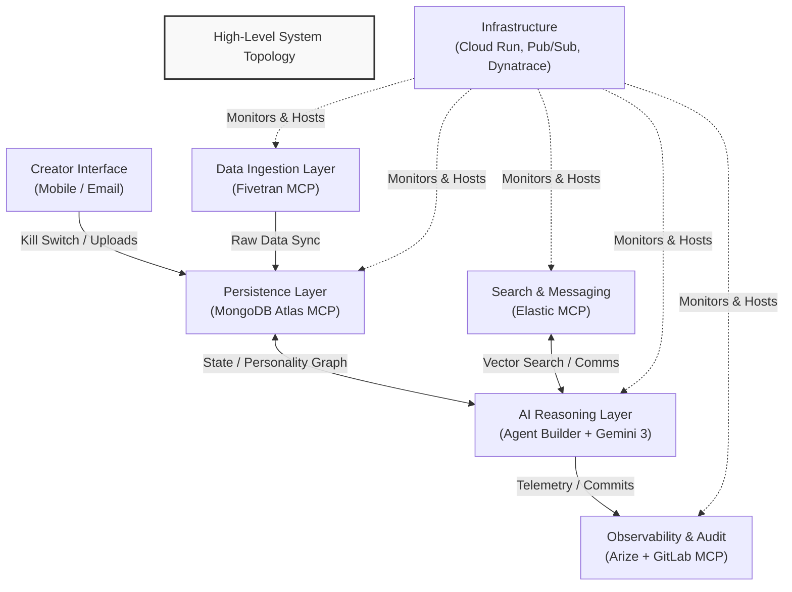
```mermaid
graph TB
    title[High-Level System Topology]
    style title fill:#f9f9f9,stroke:#333,stroke-width:2px

    CI["Creator Interface<br/>(Mobile / Email)"]
    DI["Data Ingestion Layer<br/>(Fivetran MCP)"]
    PL["Persistence Layer<br/>(MongoDB Atlas MCP)"]
    SML["Search & Messaging<br/>(Elastic MCP)"]
    AIR["AI Reasoning Layer<br/>(Agent Builder + Gemini 3)"]
    OBS["Observability & Audit<br/>(Arize + GitLab MCP)"]
    INF["Infrastructure<br/>(Cloud Run, Pub/Sub, Dynatrace)"]

    CI -->|"Kill Switch / Uploads"| PL
    DI -->|"Raw Data Sync"| PL
    PL <-->|"State / Personality Graph"| AIR
    SML <-->|"Vector Search / Comms"| AIR
    AIR -->|"Telemetry / Commits"| OBS
    INF -.->|"Monitors & Hosts"| AIR & PL & DI & SML & OBS
```

### 1.1.1 Ingestion & Persistence Details

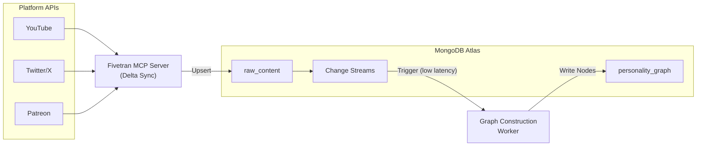
```mermaid
graph LR
    subgraph "Platform APIs"
        YT["YouTube"]
        TW["Twitter/X"]
        PA["Patreon"]
    end
    
    FT["Fivetran MCP Server<br/>(Delta Sync)"]
    
    subgraph "MongoDB Atlas"
        RAW["raw_content"]
        PG["personality_graph"]
        CS["Change Streams"]
    end
    
    YT & TW & PA --> FT
    FT -->|"Upsert"| RAW
    RAW --> CS
    CS -->|"Trigger (low latency)"| GW["Graph Construction<br/>Worker"]
    GW -->|"Write Nodes"| PG
```

### 1.1.2 Agent Orchestration Details

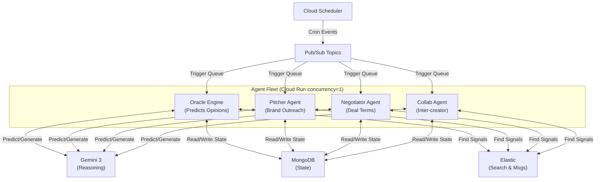
```mermaid
graph TB
    SCHED["Cloud Scheduler"] -->|"Cron Events"| PS["Pub/Sub Topics"]
    
    subgraph "Agent Fleet (Cloud Run concurrency=1)"
        ORACLE["Oracle Engine<br/>(Predicts Opinions)"]
        PITCHER["Pitcher Agent<br/>(Brand Outreach)"]
        NEGOTIATOR["Negotiator Agent<br/>(Deal Terms)"]
        COLLAB["Collab Agent<br/>(Inter-creator)"]
    end
    
    PS -->|"Trigger Queue"| ORACLE & PITCHER & NEGOTIATOR & COLLAB
    
    GEMINI["Gemini 3<br/>(Reasoning)"]
    MONGO["MongoDB<br/>(State)"]
    ELASTIC["Elastic<br/>(Search & Msgs)"]
    
    ORACLE & PITCHER & NEGOTIATOR & COLLAB <-->|"Predict/Generate"| GEMINI
    ORACLE & PITCHER & NEGOTIATOR & COLLAB <-->|"Read/Write State"| MONGO
    ORACLE & PITCHER & NEGOTIATOR & COLLAB <-->|"Find Signals"| ELASTIC
```

### 1.1.3 Observability & Security Details

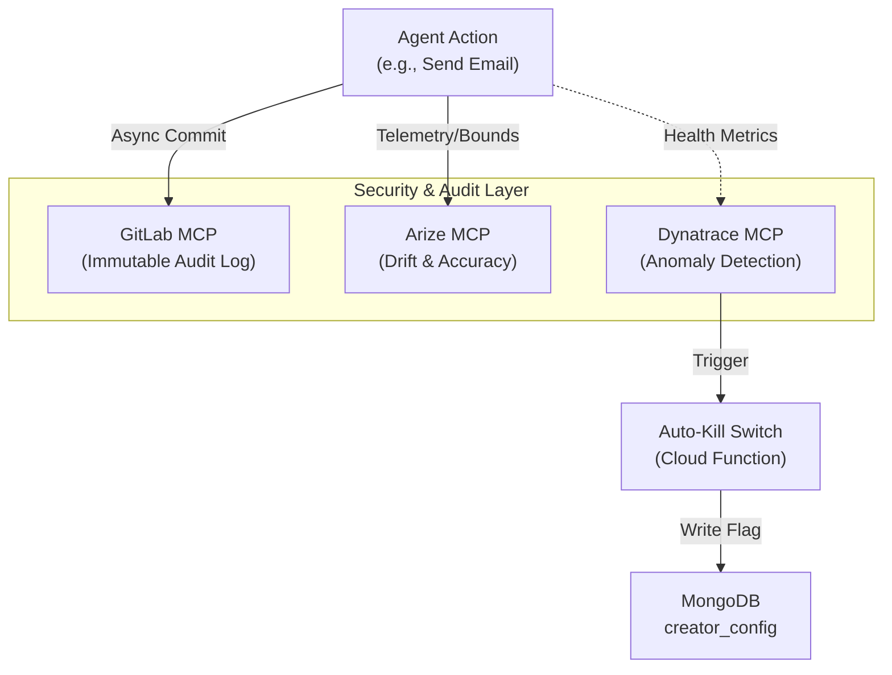
```mermaid
graph TB
    AGENT["Agent Action<br/>(e.g., Send Email)"]
    
    subgraph "Security & Audit Layer"
        GL["GitLab MCP<br/>(Immutable Audit Log)"]
        ARIZE["Arize MCP<br/>(Drift & Accuracy)"]
        DT["Dynatrace MCP<br/>(Anomaly Detection)"]
    end
    
    AGENT -->|"Async Commit"| GL
    AGENT -->|"Telemetry/Bounds"| ARIZE
    AGENT -.->|"Health Metrics"| DT
    
    DT -->|"Trigger"| AKS["Auto-Kill Switch<br/>(Cloud Function)"]
    AKS -->|"Write Flag"| MONGO["MongoDB<br/>creator_config"]
```

## 1.2 MCP Connection Topology

Every MCP server runs as a sidecar process co-located with the Agent Builder orchestrator on Google Cloud Run. Communication is via stdio (local process pipe) per the MCP specification — zero network hop for MCP tool calls.

| MCP Server | Transport | Connection Pool | Failover |
|---|---|---|---|
| Fivetran MCP | stdio (local) | 1 per Cloud Run instance | Restart sidecar, resume from checkpoint |
| MongoDB Atlas MCP | stdio → MongoDB driver → Atlas Private Endpoint (VPC Peering) | 10 connections per instance | Read from secondary, queue writes |
| Elastic MCP | stdio → Elastic client → Elastic Cloud endpoint | 5 connections per instance | Circuit breaker, degrade to cached results |
| Arize MCP | stdio → Arize SDK → Arize Cloud | 2 connections per instance | Queue telemetry locally, flush on recovery |
| GitLab MCP | stdio → GitLab API → GitLab.com | 2 connections per instance | Queue commits locally, batch on recovery |
| Dynatrace MCP | stdio → Dynatrace OneAgent API | 1 connection per instance | OneAgent buffers locally by design |

**Engineering Rationale — MCP as Stdio Sidecar:**
MCP over stdio eliminates network latency for tool calls. The MCP server process shares the same container as the agent worker. This means MCP tool invocation adds <1ms overhead. The actual latency is in the downstream service (MongoDB, Elastic, etc.), not in the MCP protocol layer. This is critical because agents may make 10-50 MCP tool calls per reasoning cycle.

## 1.3 Latency Budget — Critical Paths

### Path 1: Content Ingestion → Graph Node Creation
| Segment | Budget | Notes |
|---|---|---|
| Fivetran sync → MongoDB raw_content write | 0-30min | Batch sync, not latency-critical |
| Change Stream detection | <500ms | MongoDB change stream near-real-time |
| Cloud Run cold start (if needed) | <2s | Pre-warmed minimum instances = 1 |
| Gemini extraction call | <3s | P99 target |
| text-embedding-004 call | <500ms | Single document embedding |
| Atlas Vector Search (top 5) | <200ms | P99 target |
| MongoDB graph node write | <100ms | P99 target |
| **Total end-to-end** | **<6.5s** | From change stream to graph update |

### Path 2: Oracle Prediction Cycle
| Segment | Budget | Notes |
|---|---|---|
| Elastic trending topics query | <100ms | Pre-filtered by niche tags |
| MongoDB vector search (per topic) | <200ms | 50 topics × 200ms = 10s sequential |
| Gemini prediction call (per topic) | <3s | 50 topics × 3s = 150s sequential |
| Arize drift check (per prediction) | <500ms | Batched |
| GitLab commit | <1s | Non-blocking, async |
| **Total (50 topics, parallel 10)** | **<45s** | 5 batches of 10 topics |

### Path 3: Kill Switch Activation
| Segment | Budget | Notes |
|---|---|---|
| Mobile app → Cloud Function | <500ms | Direct HTTPS |
| Cloud Function → MongoDB write | <100ms | Single document update |
| Change Stream propagation | <500ms | Near-real-time |
| Agent process reads kill flag | <5s | 5-second cache TTL |
| **Total: human tap to full freeze** | **<6.1s** | Hard SLA |

### Path 4: Inter-Agent Message Round-Trip
| Segment | Budget | Notes |
|---|---|---|
| Agent A generates proposal (Gemini) | <3s | Single reasoning call |
| Write to echomind_messages (Elastic) | <100ms | Single document index |
| Agent B polls (next 6hr cycle) | 0-6hr | Not latency-critical |
| Agent B evaluates (Gemini) | <3s | Single reasoning call |
| Response write to Elastic | <100ms | Single document index |
| **Total per round** | **~6hr** | Dominated by polling interval |

## 1.4 Data Flow Classifications

### Hot Path (Real-time, latency-critical)
- Kill switch activation → system freeze
- Change stream → graph construction trigger
- Drift detection → output freeze

### Warm Path (Near-real-time, minutes)
- Oracle prediction cycle (every 6 hours, but each cycle completes in <1 minute)
- Brand deal email reply detection (every 2 hours polling)
- Negotiator response generation

### Cold Path (Batch, hours)
- Fivetran data sync (every 6 hours)
- Inter-agent discovery and collaboration (every 12 hours)
- Hunter brand scanning (weekly)
- Accuracy feedback loop (monthly aggregation)

### Archival Path (Days+)
- Raw content TTL migration to cold storage (90 days)
- GitLab audit log (permanent, immutable)
- Arize model performance history (permanent)

## 1.5 External API Dependencies

| External API | Called By | Rate Limit | Mitigation |
|---|---|---|---|
| YouTube Data API v3 | Fivetran | 10,000 units/day | Fivetran manages, delta sync reduces calls |
| Twitter/X API v2 | Fivetran | Varies by tier | Fivetran manages, enterprise tier recommended |
| Twitch API | Fivetran | 800 req/min | Fivetran manages |
| Reddit API | Fivetran | 60 req/min | Fivetran manages |
| Discord API | Fivetran | 50 req/sec | Fivetran manages, daily batch |
| Patreon API | Fivetran | Undocumented | Fivetran manages, conservative polling |
| Substack API | Fivetran | Undocumented | Fivetran manages, daily sync |
| Gmail API | Pitcher, Negotiator | 250 quota units/sec | Per-creator quota, queue excess |
| Gemini API | All agents | Project-level quota | Provisioned throughput at scale |
| text-embedding-004 | Graph Worker | Project-level quota | Batch embeddings where possible |

**Engineering Rationale — Fivetran as API Shield:**
By routing ALL platform API calls through Fivetran, we externalize rate limit management, pagination, cursor tracking, and retry logic. This is a deliberate architectural choice: platform APIs are the most fragile integration point, and Fivetran's connector infrastructure handles this at scale. Our system never directly calls YouTube/Twitter/etc. — only Fivetran does.
# Section 2: Sequence Diagrams

## 2a. Raw Content Ingestion → Personality Graph Node Creation

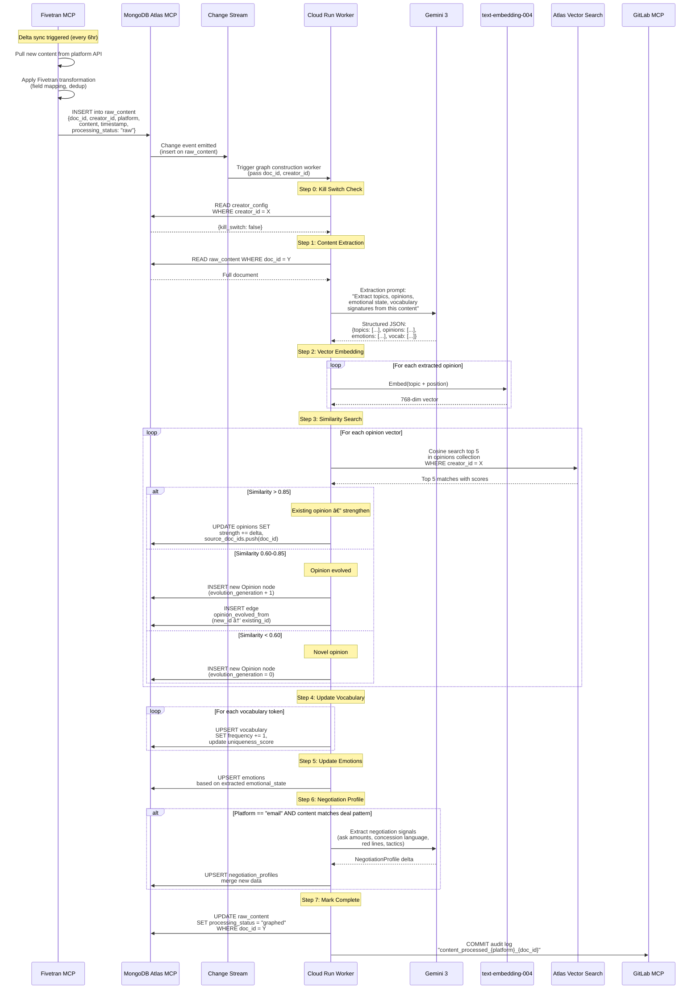
```mermaid
sequenceDiagram
    participant FT as Fivetran MCP
    participant MONGO as MongoDB Atlas MCP
    participant CS as Change Stream
    participant CR as Cloud Run Worker
    participant GEM as Gemini 3
    participant EMB as text-embedding-004
    participant VS as Atlas Vector Search
    participant GL as GitLab MCP

    Note over FT: Delta sync triggered (every 6hr)
    FT->>FT: Pull new content from platform API
    FT->>FT: Apply Fivetran transformation<br/>(field mapping, dedup)
    FT->>MONGO: INSERT into raw_content<br/>{doc_id, creator_id, platform,<br/>content, timestamp,<br/>processing_status: "raw"}

    MONGO->>CS: Change event emitted<br/>(insert on raw_content)
    CS->>CR: Trigger graph construction worker<br/>(pass doc_id, creator_id)

    Note over CR: Step 0: Kill Switch Check
    CR->>MONGO: READ creator_config<br/>WHERE creator_id = X
    MONGO-->>CR: {kill_switch: false}

    Note over CR: Step 1: Content Extraction
    CR->>MONGO: READ raw_content WHERE doc_id = Y
    MONGO-->>CR: Full document
    CR->>GEM: Extraction prompt:<br/>"Extract topics, opinions,<br/>emotional state, vocabulary<br/>signatures from this content"
    GEM-->>CR: Structured JSON:<br/>{topics: [...], opinions: [...],<br/>emotions: [...], vocab: [...]}

    Note over CR: Step 2: Vector Embedding
    loop For each extracted opinion
        CR->>EMB: Embed(topic + position)
        EMB-->>CR: 768-dim vector
    end

    Note over CR: Step 3: Similarity Search
    loop For each opinion vector
        CR->>VS: Cosine search top 5<br/>in opinions collection<br/>WHERE creator_id = X
        VS-->>CR: Top 5 matches with scores

        alt Similarity > 0.85
            Note over CR: Existing opinion — strengthen
            CR->>MONGO: UPDATE opinions SET<br/>strength += delta,<br/>source_doc_ids.push(doc_id)
        else Similarity 0.60-0.85
            Note over CR: Opinion evolved
            CR->>MONGO: INSERT new Opinion node<br/>(evolution_generation + 1)
            CR->>MONGO: INSERT edge<br/>opinion_evolved_from<br/>(new_id → existing_id)
        else Similarity < 0.60
            Note over CR: Novel opinion
            CR->>MONGO: INSERT new Opinion node<br/>(evolution_generation = 0)
        end
    end

    Note over CR: Step 4: Update Vocabulary
    loop For each vocabulary token
        CR->>MONGO: UPSERT vocabulary<br/>SET frequency += 1,<br/>update uniqueness_score
    end

    Note over CR: Step 5: Update Emotions
    CR->>MONGO: UPSERT emotions<br/>based on extracted emotional_state

    Note over CR: Step 6: Negotiation Profile
    alt Platform == "email" AND content matches deal pattern
        CR->>GEM: Extract negotiation signals<br/>(ask amounts, concession language,<br/>red lines, tactics)
        GEM-->>CR: NegotiationProfile delta
        CR->>MONGO: UPSERT negotiation_profiles<br/>merge new data
    end

    Note over CR: Step 7: Mark Complete
    CR->>MONGO: UPDATE raw_content<br/>SET processing_status = "graphed"<br/>WHERE doc_id = Y

    CR->>GL: COMMIT audit log<br/>"content_processed_{platform}_{doc_id}"
```

### Error Handling in This Flow

| Failure Point | Detection | Recovery |
|---|---|---|
| Gemini extraction timeout | 30s deadline exceeded | Retry 3x with exponential backoff, then DLQ |
| Embedding API failure | HTTP 5xx | Retry 3x, then mark document as `processing_status=error` |
| Vector search returns 0 results | Empty result set | Treat as novel opinion (similarity < 0.60 path) |
| MongoDB write failure | Write concern error | Retry 3x, then DLQ with full payload |
| Change stream gap | Resume token expired | Re-scan raw_content for `processing_status=raw` |

---

## 2b. Oracle Prediction Cycle → Post Published

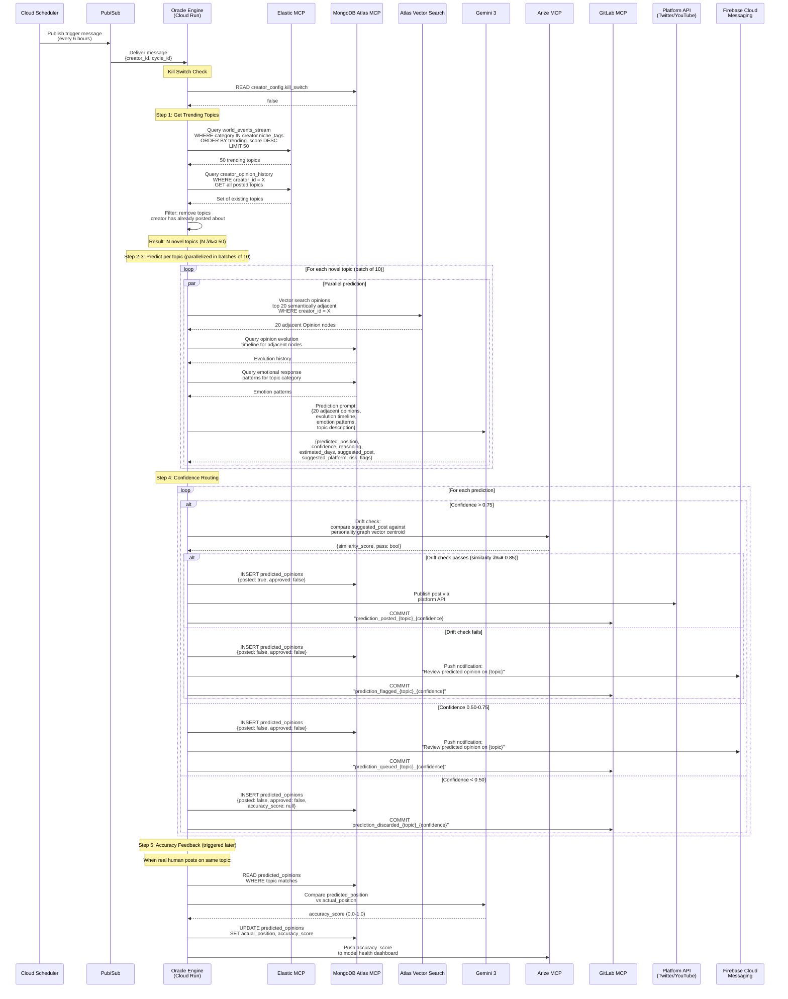
```mermaid
sequenceDiagram
    participant SCHED as Cloud Scheduler
    participant PS as Pub/Sub
    participant ORACLE as Oracle Engine<br/>(Cloud Run)
    participant ES as Elastic MCP
    participant MONGO as MongoDB Atlas MCP
    participant VS as Atlas Vector Search
    participant GEM as Gemini 3
    participant ARIZE as Arize MCP
    participant GL as GitLab MCP
    participant PLATFORM as Platform API<br/>(Twitter/YouTube)
    participant FCM as Firebase Cloud<br/>Messaging

    SCHED->>PS: Publish trigger message<br/>(every 6 hours)
    PS->>ORACLE: Deliver message<br/>{creator_id, cycle_id}

    Note over ORACLE: Kill Switch Check
    ORACLE->>MONGO: READ creator_config.kill_switch
    MONGO-->>ORACLE: false

    Note over ORACLE: Step 1: Get Trending Topics
    ORACLE->>ES: Query world_events_stream<br/>WHERE category IN creator.niche_tags<br/>ORDER BY trending_score DESC<br/>LIMIT 50
    ES-->>ORACLE: 50 trending topics

    ORACLE->>ES: Query creator_opinion_history<br/>WHERE creator_id = X<br/>GET all posted topics
    ES-->>ORACLE: Set of existing topics

    ORACLE->>ORACLE: Filter: remove topics<br/>creator has already posted about
    Note over ORACLE: Result: N novel topics (N ≤ 50)

    Note over ORACLE: Step 2-3: Predict per topic (parallelized in batches of 10)
    loop For each novel topic (batch of 10)
        par Parallel prediction
            ORACLE->>VS: Vector search opinions<br/>top 20 semantically adjacent<br/>WHERE creator_id = X
            VS-->>ORACLE: 20 adjacent Opinion nodes

            ORACLE->>MONGO: Query opinion evolution<br/>timeline for adjacent nodes
            MONGO-->>ORACLE: Evolution history

            ORACLE->>MONGO: Query emotional response<br/>patterns for topic category
            MONGO-->>ORACLE: Emotion patterns

            ORACLE->>GEM: Prediction prompt:<br/>{20 adjacent opinions,<br/>evolution timeline,<br/>emotion patterns,<br/>topic description}
            GEM-->>ORACLE: {predicted_position,<br/>confidence, reasoning,<br/>estimated_days, suggested_post,<br/>suggested_platform, risk_flags}
        end
    end

    Note over ORACLE: Step 4: Confidence Routing
    loop For each prediction
        alt Confidence > 0.75
            ORACLE->>ARIZE: Drift check:<br/>compare suggested_post against<br/>personality graph vector centroid
            ARIZE-->>ORACLE: {similarity_score, pass: bool}

            alt Drift check passes (similarity ≥ 0.85)
                ORACLE->>MONGO: INSERT predicted_opinions<br/>{posted: true, approved: false}
                ORACLE->>PLATFORM: Publish post via<br/>platform API
                ORACLE->>GL: COMMIT<br/>"prediction_posted_{topic}_{confidence}"
            else Drift check fails
                ORACLE->>MONGO: INSERT predicted_opinions<br/>{posted: false, approved: false}
                ORACLE->>FCM: Push notification:<br/>"Review predicted opinion on {topic}"
                ORACLE->>GL: COMMIT<br/>"prediction_flagged_{topic}_{confidence}"
            end

        else Confidence 0.50-0.75
            ORACLE->>MONGO: INSERT predicted_opinions<br/>{posted: false, approved: false}
            ORACLE->>FCM: Push notification:<br/>"Review predicted opinion on {topic}"
            ORACLE->>GL: COMMIT<br/>"prediction_queued_{topic}_{confidence}"

        else Confidence < 0.50
            ORACLE->>MONGO: INSERT predicted_opinions<br/>{posted: false, approved: false,<br/>accuracy_score: null}
            ORACLE->>GL: COMMIT<br/>"prediction_discarded_{topic}_{confidence}"
        end
    end

    Note over ORACLE: Step 5: Accuracy Feedback (triggered later)
    Note over ORACLE: When real human posts on same topic:
    ORACLE->>MONGO: READ predicted_opinions<br/>WHERE topic matches
    ORACLE->>GEM: Compare predicted_position<br/>vs actual_position
    GEM-->>ORACLE: accuracy_score (0.0-1.0)
    ORACLE->>MONGO: UPDATE predicted_opinions<br/>SET actual_position, accuracy_score
    ORACLE->>ARIZE: Push accuracy_score<br/>to model health dashboard
```

---

## 2c. Brand Deal Lifecycle — Hunter Discovery to Signed Contract

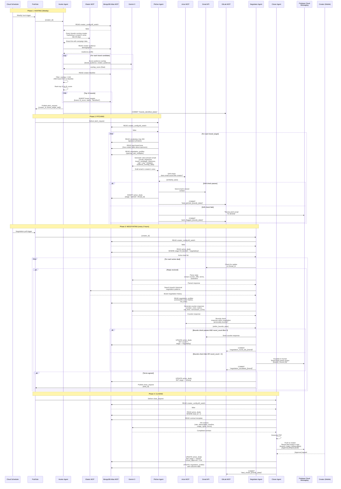
```mermaid
sequenceDiagram
    participant SCHED as Cloud Scheduler
    participant PS as Pub/Sub
    participant HUNT as Hunter Agent
    participant ES as Elastic MCP
    participant MONGO as MongoDB Atlas MCP
    participant GEM as Gemini 3
    participant PITCH as Pitcher Agent
    participant ARIZE as Arize MCP
    participant GMAIL as Gmail API
    participant GL as GitLab MCP
    participant NEG as Negotiator Agent
    participant CLOSE as Closer Agent
    participant FCM as Firebase Cloud<br/>Messaging
    participant HUMAN as Creator (Mobile)

    Note over SCHED,HUNT: Phase 1: HUNTING (Weekly)
    SCHED->>PS: Weekly hunt trigger
    PS->>HUNT: {creator_id}

    HUNT->>MONGO: READ creator_config.kill_switch
    MONGO-->>HUNT: false

    HUNT->>ES: Query brands running creator<br/>marketing in creator's niche<br/>last 30 days
    ES-->>HUNT: Brand list with campaign data

    HUNT->>MONGO: READ creator audience<br/>demographics
    MONGO-->>HUNT: Audience profile

    loop For each brand candidate
        HUNT->>GEM: Score audience overlap<br/>{brand_audience, creator_audience}
        GEM-->>HUNT: overlap_score (float)
    end

    HUNT->>MONGO: READ creator blacklist
    HUNT->>HUNT: Filter: overlap > 0.60<br/>AND brand NOT in blacklist
    HUNT->>HUNT: Rank top 10 by fit_score

    loop Top 10 brands
        HUNT->>MONGO: INSERT brand_targets<br/>{brand, fit_score, status: "identified"}
    end

    HUNT->>PS: Publish pitch_request<br/>{creator_id, brand_target_ids[]}
    HUNT->>GL: COMMIT "brands_identified_{date}"

    Note over PS,PITCH: Phase 2: PITCHING
    PS->>PITCH: Deliver pitch_request

    PITCH->>MONGO: READ creator_config.kill_switch
    MONGO-->>PITCH: false

    loop For each brand_target
        PITCH->>MONGO: READ vocabulary (top 200<br/>signature phrases)
        PITCH->>MONGO: READ past brand tone<br/>(how creator talks about sponsors)
        PITCH->>MONGO: READ negotiation_profiles<br/>(opening_ask_multiplier)

        PITCH->>GEM: Generate cold outreach email:<br/>{vocab_fingerprint,<br/>brand_campaign_reference,<br/>rate = avg * multiplier,<br/>audience_overlap_data}
        GEM-->>PITCH: Draft email in creator's voice

        PITCH->>ARIZE: Drift check:<br/>does email sound like creator?
        ARIZE-->>PITCH: {similarity, pass}

        alt Drift check passes
            PITCH->>GMAIL: Send email to brand<br/>contact
            PITCH->>MONGO: INSERT active_deals<br/>{stage: "pitched", thread_id}
            PITCH->>GL: COMMIT<br/>"deal_pitched_{brand}_{date}"
        else Drift check fails
            PITCH->>FCM: "Review pitch email<br/>for {brand}"
            PITCH->>GL: COMMIT<br/>"pitch_flagged_{brand}_{date}"
        end
    end

    Note over SCHED,NEG: Phase 3: NEGOTIATING (every 2 hours)
    SCHED->>PS: Negotiation poll trigger
    PS->>NEG: {creator_id}

    NEG->>MONGO: READ creator_config.kill_switch
    MONGO-->>NEG: false

    NEG->>MONGO: READ active_deals<br/>WHERE stage IN ["pitched", "negotiating"]
    MONGO-->>NEG: Active deal list

    loop For each active deal
        NEG->>GMAIL: Check for replies<br/>on thread_id
        
        alt Reply received
            NEG->>GEM: Parse reply:<br/>extract counter_offer, terms,<br/>sentiment
            GEM-->>NEG: Parsed response

            NEG->>ES: Search brand's historical<br/>negotiation patterns
            ES-->>NEG: Brand negotiation history

            NEG->>MONGO: READ negotiation_profiles<br/>(concession curve, tactics,<br/>red_lines)

            NEG->>GEM: Generate counter-response:<br/>{creator_voice, tactics,<br/>red_lines, concession_curve}
            GEM-->>NEG: Counter-response

            NEG->>ARIZE: Bounds check:<br/>response within negotiation<br/>personality bounds?
            ARIZE-->>NEG: {within_bounds, pass}

            alt Bounds check passes AND round_count ≤ 3
                NEG->>GMAIL: Send counter-response
                NEG->>MONGO: UPDATE active_deals<br/>SET round++,<br/>stage = "negotiating"
                NEG->>GL: COMMIT<br/>"negotiation_round_{N}_{brand}"
            else Bounds check fails OR round_count > 3
                NEG->>FCM: Escalate to human<br/>"Brand deal needs review:<br/>{brand} | Round {N}"
                NEG->>GL: COMMIT<br/>"negotiation_escalated_{brand}"
            end

            alt Terms agreed
                NEG->>MONGO: UPDATE active_deals<br/>SET stage = "closing"
                NEG->>PS: Publish close_request<br/>{deal_id}
            end
        end
    end

    Note over PS,CLOSE: Phase 4: CLOSING
    PS->>CLOSE: Deliver close_request

    CLOSE->>MONGO: READ creator_config.kill_switch
    MONGO-->>CLOSE: false

    CLOSE->>MONGO: READ active_deals<br/>WHERE deal_id = Z
    CLOSE->>MONGO: READ contract template

    CLOSE->>GEM: Fill contract:<br/>{rate, deliverables, timeline,<br/>usage_rights, terms}
    GEM-->>CLOSE: Completed contract

    CLOSE->>CLOSE: Generate PDF

    CLOSE->>FCM: Push to creator:<br/>"Brand deal ready to sign:<br/>{brand} | {rate} | {deliverables}<br/>[Approve] [Reject] [Edit]"

    HUMAN-->>CLOSE: [Approve] tapped

    CLOSE->>MONGO: UPDATE active_deals<br/>SET stage = "closed",<br/>human_approval = true
    CLOSE->>MONGO: UPDATE negotiation_profiles<br/>with outcome data
    CLOSE->>GL: COMMIT<br/>"deal_closed_{brand}_{date}"
```

---

## 2d. Two EchoMind Instances — Discovery to Completed Collaboration

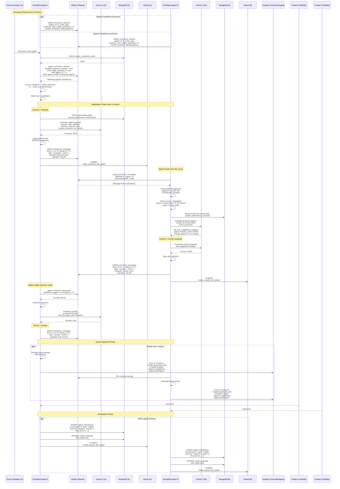
```mermaid
sequenceDiagram
    participant SCHED_A as Cloud Scheduler (A)
    participant AGENT_A as EchoMind Agent A
    participant ES as Elastic (Shared)
    participant GEM_A as Gemini 3 (A)
    participant MONGO_A as MongoDB (A)
    participant GL_A as GitLab (A)
    participant AGENT_B as EchoMind Agent B
    participant GEM_B as Gemini 3 (B)
    participant MONGO_B as MongoDB (B)
    participant GL_B as GitLab (B)
    participant FCM as Firebase Cloud Messaging
    participant HUMAN_A as Creator A (Mobile)
    participant HUMAN_B as Creator B (Mobile)

    Note over SCHED_A,AGENT_A: Discovery Phase (every 12 hours)

    par Agent A publishes presence
        AGENT_A->>ES: INDEX echomind_network<br/>{agent_id: A, niche_tags,<br/>audience_size, collab_openness: 0.8,<br/>content_schedule, demographics}
    and Agent B publishes presence
        AGENT_B->>ES: INDEX echomind_network<br/>{agent_id: B, niche_tags,<br/>audience_size, collab_openness: 0.7,<br/>content_schedule, demographics}
    end

    SCHED_A->>AGENT_A: Discovery cycle trigger

    AGENT_A->>MONGO_A: READ creator_config.kill_switch
    MONGO_A-->>AGENT_A: false

    AGENT_A->>ES: Query echomind_network<br/>WHERE audience_overlap > 0.55<br/>AND collab_openness > 0.60<br/>AND agent_id != A<br/>AND agent_id NOT IN blocked_agents
    ES-->>AGENT_A: Matching agents (includes B)

    AGENT_A->>AGENT_A: Score: overlap × collab_openness<br/>× niche_complementarity
    AGENT_A->>AGENT_A: Select top 3 candidates

    Note over AGENT_A,AGENT_B: Negotiation Phase (max 3 rounds)

    Note over AGENT_A: Round 1: Proposal
    AGENT_A->>MONGO_A: READ personality graph<br/>(content preferences, brand DNA)
    AGENT_A->>GEM_A: Generate collab proposal:<br/>{format, topic, platform,<br/>timeline, revenue_split,<br/>creative_direction, est_reach}
    GEM_A-->>AGENT_A: Proposal JSON
    AGENT_A->>AGENT_A: Sign proposal with<br/>Ed25519 private key

    AGENT_A->>ES: INDEX echomind_messages<br/>{from: A, to: B, thread_id: T1,<br/>type: "proposal", round: 1,<br/>payload: proposal_json,<br/>signature: sig_A}

    AGENT_A->>GL_A: COMMIT<br/>"collab_proposed_{B}_{date}"

    Note over AGENT_B: Agent B polls (next 6hr cycle)
    AGENT_B->>ES: Query echomind_messages<br/>WHERE to_agent = B<br/>AND processed = false
    ES-->>AGENT_B: Message from A (proposal)

    AGENT_B->>AGENT_B: Verify Ed25519 signature<br/>against A's public key<br/>in echomind_network
    AGENT_B->>AGENT_B: Check nonce + timestamp<br/>(reject if >5min stale? No — async)<br/>(reject if >24hr stale)

    AGENT_B->>MONGO_B: READ creator B's brand DNA,<br/>content preferences, schedule
    AGENT_B->>GEM_B: Evaluate proposal against<br/>Creator B's brand DNA:<br/>Is this a good fit?
    GEM_B-->>AGENT_B: {fit: true, suggested_changes:<br/>[adjust revenue_split to 55/45,<br/>change platform to YouTube]}

    Note over AGENT_B: Round 2: Counter-proposal
    AGENT_B->>GEM_B: Generate counter-proposal<br/>with suggested changes
    GEM_B-->>AGENT_B: Counter JSON
    AGENT_B->>AGENT_B: Sign with Ed25519

    AGENT_B->>ES: INDEX echomind_messages<br/>{from: B, to: A, thread_id: T1,<br/>type: "counter", round: 2,<br/>payload: counter_json,<br/>signature: sig_B}

    AGENT_B->>GL_B: COMMIT<br/>"collab_counter_{A}_{date}"

    Note over AGENT_A: Agent A polls (next 6hr cycle)
    AGENT_A->>ES: Query echomind_messages<br/>WHERE to_agent = A, thread_id = T1
    ES-->>AGENT_A: Counter from B

    AGENT_A->>AGENT_A: Verify B's signature
    AGENT_A->>GEM_A: Evaluate counter:<br/>accept 55/45 split?<br/>YouTube aligns with schedule?
    GEM_A-->>AGENT_A: {accept: true}

    Note over AGENT_A: Round 3: Accept
    AGENT_A->>ES: INDEX echomind_messages<br/>{from: A, to: B, thread_id: T1,<br/>type: "accept", round: 3,<br/>payload: final_terms}

    Note over AGENT_A,AGENT_B: Human Approval Phase

    par Notify both creators
        AGENT_A->>AGENT_A: Package final proposal<br/>with full terms
        AGENT_A->>FCM: Push to Creator A:<br/>"Collab opportunity with<br/>{Creator B alias}:<br/>{topic} on {platform}<br/>[Approve] [Reject]"

        AGENT_B->>ES: Poll, receives accept
        AGENT_B->>AGENT_B: Package final proposal
        AGENT_B->>FCM: Push to Creator B:<br/>"Collab opportunity with<br/>{Creator A alias}:<br/>{topic} on {platform}<br/>[Approve] [Reject]"
    end

    HUMAN_A-->>AGENT_A: [Approve]
    HUMAN_B-->>AGENT_B: [Approve]

    Note over AGENT_A,AGENT_B: Finalization Phase

    par Both agents finalize
        AGENT_A->>MONGO_A: INSERT agent_interactions<br/>{counterpart: B, type: "collab",<br/>outcome: "agreed", rounds: 3,<br/>final_terms: {...}}
        AGENT_A->>MONGO_A: UPDATE content calendar<br/>with collab entry
        AGENT_A->>GL_A: COMMIT<br/>"collab_agreed_{B}_{date}"

        AGENT_B->>MONGO_B: INSERT agent_interactions<br/>{counterpart: A, type: "collab",<br/>outcome: "agreed", rounds: 3,<br/>final_terms: {...}}
        AGENT_B->>MONGO_B: UPDATE content calendar<br/>with collab entry
        AGENT_B->>GL_B: COMMIT<br/>"collab_agreed_{A}_{date}"
    end
```

---

## 2e. Kill Switch Activation and Full System Freeze

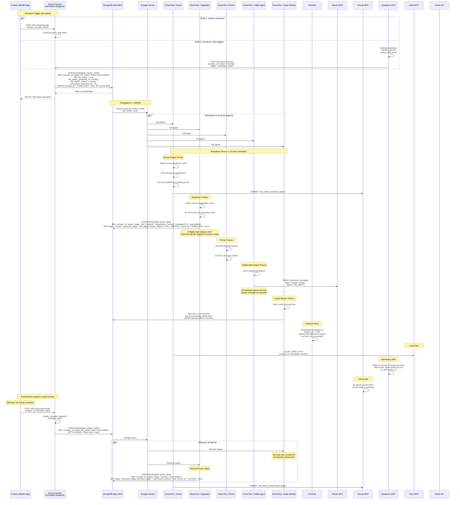
```mermaid
sequenceDiagram
    participant HUMAN as Creator (Mobile App)
    participant CF as Cloud Function<br/>(Kill Switch Endpoint)
    participant MONGO as MongoDB Atlas MCP
    participant CS as Change Stream
    participant CR1 as Cloud Run: Oracle
    participant CR2 as Cloud Run: Negotiator
    participant CR3 as Cloud Run: Pitcher
    participant CR4 as Cloud Run: Collab Agent
    participant CR5 as Cloud Run: Graph Worker
    participant PS as Pub/Sub
    participant ES as Elastic MCP
    participant GL as GitLab MCP
    participant DT as Dynatrace MCP
    participant ARIZE as Arize MCP
    participant GMAIL as Gmail API

    Note over HUMAN,CF: Activation Trigger (two paths)

    alt Path 1: Human activation
        HUMAN->>CF: POST /kill-switch/activate<br/>{creator_id, auth_token}
        CF->>CF: Verify biometric auth token
    else Path 2: Dynatrace auto-trigger
        DT->>DT: Anomaly detected:<br/>infinite_loop OR<br/>critical_drift_event
        DT->>CF: POST /kill-switch/activate<br/>{creator_id, reason: "anomaly",<br/>trigger: "dynatrace_auto"}
    end

    CF->>MONGO: findOneAndUpdate creator_config<br/>filter: {creator_id, region, kill_switch: false}  // precondition<br/>SET kill_switch = true,<br/>kill_switch_activated_at = NOW(),<br/>kill_switch_reason = reason,<br/>kill_switch_activated_by = by<br/>WHERE creator_id = X  (null return = race, do not proceed)
    MONGO-->>CF: Write acknowledged

    CF-->>HUMAN: 200 OK "Kill switch activated"

    Note over MONGO,CS: Propagation (< 500ms)
    MONGO->>CS: Change event on creator_config<br/>{kill_switch: true}

    par Broadcast to all active agents
        CS->>CR1: Kill signal
        CS->>CR2: Kill signal
        CS->>CR3: Kill signal
        CS->>CR4: Kill signal
        CS->>CR5: Kill signal
    end

    Note over CR1,CR5: Immediate Freeze (< 5s from activation)

    Note over CR1: Oracle Engine Freeze
    CR1->>CR1: Abort current prediction cycle
    CR1->>CR1: Drop all queued predictions
    CR1->>CR1: Do NOT publish any pending posts
    CR1->>GL: COMMIT "kill_switch_activated_{date}"

    Note over CR2: Negotiator Freeze
    CR2->>CR2: Abort current negotiation round
    CR2->>CR2: Do NOT send any pending emails
    CR2->>MONGO: findOneAndUpdate active_deals<br/>filter: {creator_id, region, stage: { $in: ["pitched","negotiating","closing","escalated"] }}  // precondition<br/>SET stage = "frozen", previous_stage = old_stage, frozen_reason = "KILL_SWITCH", frozen_at = NOW()  (null = race)
    Note over CR2: In-flight email already sent?<br/>Cannot recall — logged for human review

    Note over CR3: Pitcher Freeze
    CR3->>CR3: Abort all pending pitches
    CR3->>CR3: Do NOT send any emails

    Note over CR4: Collaboration Agent Freeze
    CR4->>CR4: Abort collab negotiations
    CR4->>ES: INDEX echomind_messages<br/>{type: "system_pause",<br/>reason: "kill_switch"}
    Note over CR4: Counterpart agents will see<br/>pause message on next poll

    Note over CR5: Graph Worker Freeze
    CR5->>CR5: Abort current processing
    CR5->>MONGO: Raw docs in processing<br/>left at processing_status=raw<br/>(will be reprocessed on resume)

    Note over PS: Pub/Sub Drain
    PS->>PS: All pending messages for<br/>creator_id = X are<br/>nacked and returned to queue<br/>(not lost, not processed)

    Note over ARIZE: Log Event
    CR1->>ARIZE: Log kill_switch_event<br/>{creator_id, timestamp, reason}

    Note over DT: Monitoring Shift
    DT->>DT: Switch to "frozen" monitoring mode:<br/>alert if ANY agent action occurs<br/>for this creator_id

    Note over GL: Final Audit
    GL->>GL: All agents commit their<br/>freeze state to audit log

    Note over HUMAN,CF: Reactivation (requires explicit action)
    Note over HUMAN: Minimum 15-minute cooldown
    HUMAN->>CF: POST /kill-switch/deactivate<br/>{creator_id, biometric_auth}
    CF->>CF: Verify: cooldown elapsed?<br/>Biometric valid?
    CF->>MONGO: findOneAndUpdate creator_config<br/>filter: {creator_id, region, kill_switch: true}  // precondition<br/>SET kill_switch = false  (null = race)
    MONGO->>CS: Change event
    
    par Resume all agents
        CS->>CR5: Resume signal
        Note over CR5: Re-scan raw_content for<br/>processing_status=raw
        CS->>CR2: Resume signal
        Note over CR2: Resume frozen deals
        CR2->>MONGO: findOneAndUpdate active_deals<br/>filter: {creator_id, region, stage: "frozen"}  // precondition<br/>SET stage = previous_stage, previous_stage = null, frozen_reason = null, frozen_at = null  (null = race)
    end

    CR1->>GL: COMMIT "kill_switch_deactivated_{date}"
```

### Kill Switch Timing Guarantees

| Phase | Time Budget | Mechanism |
|---|---|---|
| Human tap to MongoDB write | <600ms | Direct Cloud Function HTTPS call |
| MongoDB write to Change Stream event | <500ms | MongoDB real-time change streams |
| Change Stream to agent cache invalidation | <5s | 5-second TTL on kill_switch cache |
| Agent current operation abort | <1s | Checked at start of every atomic action |
| **Total: tap to full freeze** | **<7.1s** | Hard SLA |

### In-Flight Operation Handling

| Operation | Can Be Aborted? | Handling |
|---|---|---|
| Gemini API call in progress | No (wait for response) | Response received but NOT acted upon |
| Email being sent via Gmail API | No (if already sent) | Logged for human review post-freeze |
| MongoDB write in progress | Yes (can be rolled back) | Abort and mark for re-processing |
| Elastic message in progress | Yes (can be deleted) | Delete and post system_pause message |
| Platform post in progress | No (if already published) | Log post ID, human can manually delete |
| Pub/Sub message processing | Yes (nack the message) | Message returns to queue, processed on resume |

### Edge Case: Kill Switch During Active Brand Negotiation
1. Negotiator is mid-email-send when kill switch activates
2. Email may have already left Gmail API → **cannot be recalled**
3. System logs the sent email thread_id and content
4. Deal is frozen at current stage
5. On reactivation: human reviews what was sent, decides to continue or abandon deal
6. If human abandons: system sends apology email (human-drafted, not AI-generated)
# Section 3 — MongoDB Schema Specification

> **Document status**: Normative  
> **Atlas tier**: M10+ (dedicated cluster required for Change Streams and CSFLE)  
> **MongoDB version**: 7.0+  
> **Driver**: `mongodb` Node.js driver ≥ 6.x with `mongodb-client-encryption` ≥ 6.x  
> **Last updated**: 2026-06-06

---

## 3.0 Design Principles

| Principle | Rationale |
|---|---|
| **creator_id on every document** | Every query in the system is scoped to a single creator. This field is the universal partition key, shard key, and access-control discriminator. |
| **Embedded sub-documents over references** | Negotiation history, engagement signals, and proposal JSON are embedded because they are always read with their parent and never queried independently. This avoids `$lookup` latency. |
| **Strict JSON Schema validation** | Every collection enforces a validator at `validationLevel: "strict"` and `validationAction: "error"`. Malformed writes fail loudly — silent data corruption is unacceptable in a system that autonomously posts as a human. |
| **Vector fields as native `binData`** | Opinion and vocabulary embeddings are stored as BSON `binData` subtype 0x09 (float32 vector) to support Atlas Vector Search natively. No base64 encoding overhead. |
| **ISO 8601 stored as BSON `date`** | All timestamps are stored as BSON `Date` objects (UTC epoch millis internally). The spec references ISO 8601 for the wire format; the driver handles conversion. |
| **Enum enforcement via `enum` validator** | Finite-value fields use the JSON Schema `enum` keyword. No application-layer enum checking — the database is the last line of defense. |

---

## 3.1 Collection Catalog

| # | Collection | Purpose | Estimated doc size | Growth rate |
|---|---|---|---|---|
| 1 | `raw_content` | Ingested content from all platforms | 2–50 KB | High (batch ingest) |
| 2 | `opinions` | Opinion graph nodes | 4–8 KB (768d vector) | Medium |
| 3 | `emotions` | Emotional pattern nodes | 0.5–2 KB | Low |
| 4 | `vocabulary` | Vocabulary fingerprint nodes | 4–8 KB (768d vector) | Medium |
| 5 | `relationships` | Entity relationship nodes | 1–3 KB | Low |
| 6 | `negotiation_profiles` | Negotiation personality model | 1–2 KB | Very low |
| 7 | `predicted_opinions` | Oracle engine predictions | 1–3 KB | Medium |
| 8 | `agent_interactions` | Inter-agent negotiation records | 2–10 KB | Low–Medium |
| 9 | `active_deals` | Brand deal state machine | 5–50 KB | Low |
| 10 | `brand_targets` | Hunter agent output | 0.5–1 KB | Medium |
| 11 | `creator_config` | Per-creator configuration | 1–5 KB | Very low |
| 12 | `dead_letter_queue` | Failed operations | 1–100 KB | Spiky |

---

## 3.2 Collection Schemas

### 3.2.1 `raw_content`

Stores every piece of ingested content from every connected platform. This is the source-of-truth input layer — all downstream graph construction reads from here.

#### Fields

| Field | BSON Type | Constraints | Description |
|---|---|---|---|
| `_id` | `objectId` | Auto-generated | MongoDB default primary key. |
| `doc_id` | `string` | **Required.** UUID v4 format. **Unique index.** | Application-level document ID. UUIDs survive cross-shard migrations and are safe for external references. |
| `creator_id` | `string` | **Required.** Non-empty. | Owning creator. Shard key component. |
| `platform` | `string` | **Required.** Enum: `youtube`, `twitter`, `twitch`, `reddit`, `discord`, `patreon`, `email` | Source platform. Enum is enforced at the database level. New platforms require a schema migration. |
| `content` | `string` | **Required.** `minLength: 1`, `maxLength: 1048576` (1 MB) | Raw text content. Long-form content (videos) stores the transcript. Max 1 MB prevents accidental ingestion of binary data. |
| `timestamp` | `date` | **Required.** | Original publication timestamp on the source platform. Stored as BSON Date (UTC). |
| `topic_tags` | `array` of `string` | **Required.** May be empty `[]`. Each item `minLength: 1`, `maxLength: 128`. | NLP-extracted topic tags. Empty array for unprocessed docs. |
| `sentiment_score` | `double` | **Required.** `minimum: -1.0`, `maximum: 1.0` | Compound sentiment. -1.0 = maximally negative, +1.0 = maximally positive. 0.0 = neutral. |
| `opinion_strength` | `double` | **Required.** `minimum: 0.0`, `maximum: 1.0` | How strongly opinionated the content is. 0.0 = factual/neutral statement, 1.0 = strong take. |
| `emotional_state` | `string` | **Required.** Enum: `neutral`, `excited`, `angry`, `reflective`, `humorous`, `defensive` | Dominant emotional classification of the content. |
| `word_count` | `int` | **Required.** `minimum: 0` | Token count of `content`. Used for weighting in graph construction. |
| `engagement_signals` | `object` | **Required.** | Embedded sub-document of platform engagement metrics. |
| `engagement_signals.likes` | `int` | **Required.** `minimum: 0` | Like/upvote count at ingest time. |
| `engagement_signals.replies` | `int` | **Required.** `minimum: 0` | Reply/comment count. |
| `engagement_signals.shares` | `int` | **Required.** `minimum: 0` | Share/retweet count. |
| `engagement_signals.views` | `int` | **Required.** `minimum: 0` | View/impression count. |
| `raw_url` | `string` | **Required.** Must match URI pattern. | Canonical URL on the source platform. For email, this is a `mailto:` URI or internal reference. |
| `processing_status` | `string` | **Required.** Enum: `raw`, `processed`, `graphed` | State machine for the ingestion pipeline. `raw` → `processed` (NLP complete) → `graphed` (written to opinion/emotion/vocab graphs). Change Stream watches this field. |

#### JSON Schema Validator

```javascript
db.createCollection("raw_content", {
  validator: {
    $jsonSchema: {
      bsonType: "object",
      required: [
        "doc_id", "creator_id", "platform", "content", "timestamp",
        "topic_tags", "sentiment_score", "opinion_strength", "emotional_state",
        "word_count", "engagement_signals", "raw_url", "processing_status"
      ],
      properties: {
        doc_id: {
          bsonType: "string",
          pattern: "^[0-9a-f]{8}-[0-9a-f]{4}-4[0-9a-f]{3}-[89ab][0-9a-f]{3}-[0-9a-f]{12}$",
          description: "UUID v4 application-level document identifier"
        },
        creator_id: {
          bsonType: "string",
          minLength: 1,
          description: "Owning creator identifier"
        },
        platform: {
          bsonType: "string",
          enum: ["youtube", "twitter", "twitch", "reddit", "discord", "patreon", "email"],
          description: "Source platform"
        },
        content: {
          bsonType: "string",
          minLength: 1,
          maxLength: 1048576,
          description: "Raw text content, max 1 MB"
        },
        timestamp: {
          bsonType: "date",
          description: "Original publication timestamp (UTC)"
        },
        topic_tags: {
          bsonType: "array",
          items: {
            bsonType: "string",
            minLength: 1,
            maxLength: 128
          },
          description: "NLP-extracted topic tags"
        },
        sentiment_score: {
          bsonType: "double",
          minimum: -1.0,
          maximum: 1.0,
          description: "Compound sentiment score"
        },
        opinion_strength: {
          bsonType: "double",
          minimum: 0.0,
          maximum: 1.0,
          description: "Opinion intensity"
        },
        emotional_state: {
          bsonType: "string",
          enum: ["neutral", "excited", "angry", "reflective", "humorous", "defensive"],
          description: "Dominant emotional classification"
        },
        word_count: {
          bsonType: "int",
          minimum: 0,
          description: "Token count"
        },
        engagement_signals: {
          bsonType: "object",
          required: ["likes", "replies", "shares", "views"],
          properties: {
            likes:   { bsonType: "int", minimum: 0 },
            replies: { bsonType: "int", minimum: 0 },
            shares:  { bsonType: "int", minimum: 0 },
            views:   { bsonType: "int", minimum: 0 }
          },
          additionalProperties: false,
          description: "Platform engagement metrics"
        },
        raw_url: {
          bsonType: "string",
          minLength: 1,
          description: "Canonical URL on source platform"
        },
        processing_status: {
          bsonType: "string",
          enum: ["raw", "processed", "graphed"],
          description: "Ingestion pipeline state"
        }
      },
      additionalProperties: false
    }
  },
  validationLevel: "strict",
  validationAction: "error"
});
```

---

### 3.2.2 `opinions`

Opinion graph nodes. Each document represents a single opinion the creator holds on a topic. The `embedding` field enables semantic similarity search via Atlas Vector Search — "find opinions similar to X" is a core Oracle Engine query.

#### Fields

| Field | BSON Type | Constraints | Description |
|---|---|---|---|
| `_id` | `objectId` | Auto-generated | Primary key. |
| `topic` | `string` | **Required.** `minLength: 1`, `maxLength: 512` | The subject of the opinion. Normalized to lowercase. |
| `position` | `string` | **Required.** `minLength: 1`, `maxLength: 4096` | The creator's stated position. Free-text summary. |
| `strength` | `double` | **Required.** `minimum: 0.0`, `maximum: 1.0` | How strongly the opinion is held. Derived from `opinion_strength` of source documents, weighted by engagement. |
| `confidence` | `double` | **Required.** `minimum: 0.0`, `maximum: 1.0` | System confidence in attribution accuracy. Low confidence = insufficient source data. |
| `date` | `date` | **Required.** | When this opinion was most recently expressed or updated. |
| `platform_origin` | `string` | **Required.** `minLength: 1` | Platform where the opinion was first or most strongly expressed. |
| `source_doc_ids` | `array` of `string` | **Required.** `minItems: 1` | References to `raw_content.doc_id`. At least one source document must exist. |
| `evolution_generation` | `int` | **Required.** `minimum: 0` | Tracks opinion drift. Generation 0 = first observation. Each material change increments. Enables "how has opinion on X changed?" queries. |
| `embedding` | `binData` | **Required.** 768-dimensional float32 vector. | Semantic embedding for vector similarity search. Stored as BSON binData subtype 0x09. |
| `creator_id` | `string` | **Required.** `minLength: 1` | Owning creator. |

#### JSON Schema Validator

```javascript
db.createCollection("opinions", {
  validator: {
    $jsonSchema: {
      bsonType: "object",
      required: [
        "topic", "position", "strength", "confidence", "date",
        "platform_origin", "source_doc_ids", "evolution_generation",
        "embedding", "creator_id"
      ],
      properties: {
        topic: {
          bsonType: "string",
          minLength: 1,
          maxLength: 512,
          description: "Normalized topic string"
        },
        position: {
          bsonType: "string",
          minLength: 1,
          maxLength: 4096,
          description: "Creator's stated position"
        },
        strength: {
          bsonType: "double",
          minimum: 0.0,
          maximum: 1.0,
          description: "Opinion strength"
        },
        confidence: {
          bsonType: "double",
          minimum: 0.0,
          maximum: 1.0,
          description: "Attribution confidence"
        },
        date: {
          bsonType: "date",
          description: "Last expression/update date"
        },
        platform_origin: {
          bsonType: "string",
          minLength: 1,
          description: "Platform of origin"
        },
        source_doc_ids: {
          bsonType: "array",
          minItems: 1,
          items: {
            bsonType: "string"
          },
          description: "References to raw_content.doc_id"
        },
        evolution_generation: {
          bsonType: "int",
          minimum: 0,
          description: "Opinion evolution generation counter"
        },
        embedding: {
          bsonType: "binData",
          description: "768-d float32 semantic embedding"
        },
        creator_id: {
          bsonType: "string",
          minLength: 1,
          description: "Owning creator"
        }
      },
      additionalProperties: false
    }
  },
  validationLevel: "strict",
  validationAction: "error"
});
```

---

### 3.2.3 `emotions`

Emotional pattern nodes that model how the creator reacts to specific triggers. Used by the content generation pipeline to inject appropriate emotional tone.

#### Fields

| Field | BSON Type | Constraints | Description |
|---|---|---|---|
| `_id` | `objectId` | Auto-generated | Primary key. |
| `trigger` | `string` | **Required.** `minLength: 1`, `maxLength: 512` | What triggers this emotional response (e.g., "platform censorship", "subscriber milestone"). |
| `response_type` | `string` | **Required.** `minLength: 1`, `maxLength: 128` | Categorical response type (e.g., "rant", "celebration", "sarcasm"). Free-text to avoid premature enumeration. |
| `intensity` | `double` | **Required.** `minimum: 0.0`, `maximum: 1.0` | How intense the response is. 0.0 = mild, 1.0 = extreme. |
| `frequency` | `int` | **Required.** `minimum: 1` | How many times this trigger→response has been observed across source content. |
| `last_seen` | `date` | **Required.** | Timestamp of the most recent occurrence. Used for decay weighting — stale patterns are deprioritized. |
| `context_tags` | `array` of `string` | **Required.** May be empty. | Situational context tags (e.g., "live_stream", "thread", "video_essay"). |
| `creator_id` | `string` | **Required.** `minLength: 1` | Owning creator. |

#### JSON Schema Validator

```javascript
db.createCollection("emotions", {
  validator: {
    $jsonSchema: {
      bsonType: "object",
      required: [
        "trigger", "response_type", "intensity", "frequency",
        "last_seen", "context_tags", "creator_id"
      ],
      properties: {
        trigger: {
          bsonType: "string",
          minLength: 1,
          maxLength: 512,
          description: "Emotional trigger"
        },
        response_type: {
          bsonType: "string",
          minLength: 1,
          maxLength: 128,
          description: "Categorical response type"
        },
        intensity: {
          bsonType: "double",
          minimum: 0.0,
          maximum: 1.0,
          description: "Response intensity"
        },
        frequency: {
          bsonType: "int",
          minimum: 1,
          description: "Observation count"
        },
        last_seen: {
          bsonType: "date",
          description: "Most recent occurrence"
        },
        context_tags: {
          bsonType: "array",
          items: {
            bsonType: "string"
          },
          description: "Situational context tags"
        },
        creator_id: {
          bsonType: "string",
          minLength: 1,
          description: "Owning creator"
        }
      },
      additionalProperties: false
    }
  },
  validationLevel: "strict",
  validationAction: "error"
});
```

---

### 3.2.4 `vocabulary`

Vocabulary fingerprint nodes. Each document represents a single word or phrase and its usage patterns by the creator. The `embedding` field enables "find words used in similar contexts" queries.

#### Fields

| Field | BSON Type | Constraints | Description |
|---|---|---|---|
| `_id` | `objectId` | Auto-generated | Primary key. |
| `word` | `string` | **Required.** `minLength: 1`, `maxLength: 256` | The word or short phrase. |
| `frequency` | `int` | **Required.** `minimum: 1` | Total usage count across all ingested content. |
| `context` | `string` | **Required.** `minLength: 1`, `maxLength: 2048` | Representative usage context. Summarized from source documents. |
| `platform` | `string` | **Required.** `minLength: 1` | Platform where this word is most frequently used. Cross-platform words store the dominant platform. |
| `sentiment_association` | `double` | **Required.** `minimum: -1.0`, `maximum: 1.0` | Average sentiment when this word is used. |
| `uniqueness_score` | `double` | **Required.** `minimum: 0.0`, `maximum: 1.0` | How unique this word is to the creator relative to general population usage. 1.0 = highly distinctive. Computed via TF-IDF against a reference corpus. |
| `signature_phrase` | `bool` | **Required.** | Whether this word/phrase is a "signature" — a catchphrase or verbal tic that uniquely identifies the creator. |
| `embedding` | `binData` | **Required.** 768-dimensional float32 vector. | Contextual embedding for semantic search. |
| `creator_id` | `string` | **Required.** `minLength: 1` | Owning creator. |

#### JSON Schema Validator

```javascript
db.createCollection("vocabulary", {
  validator: {
    $jsonSchema: {
      bsonType: "object",
      required: [
        "word", "frequency", "context", "platform",
        "sentiment_association", "uniqueness_score", "signature_phrase",
        "embedding", "creator_id"
      ],
      properties: {
        word: {
          bsonType: "string",
          minLength: 1,
          maxLength: 256,
          description: "Word or short phrase"
        },
        frequency: {
          bsonType: "int",
          minimum: 1,
          description: "Total usage count"
        },
        context: {
          bsonType: "string",
          minLength: 1,
          maxLength: 2048,
          description: "Representative usage context"
        },
        platform: {
          bsonType: "string",
          minLength: 1,
          description: "Dominant platform"
        },
        sentiment_association: {
          bsonType: "double",
          minimum: -1.0,
          maximum: 1.0,
          description: "Average sentiment"
        },
        uniqueness_score: {
          bsonType: "double",
          minimum: 0.0,
          maximum: 1.0,
          description: "Creator-uniqueness score (TF-IDF derived)"
        },
        signature_phrase: {
          bsonType: "bool",
          description: "Is this a creator signature phrase"
        },
        embedding: {
          bsonType: "binData",
          description: "768-d float32 contextual embedding"
        },
        creator_id: {
          bsonType: "string",
          minLength: 1,
          description: "Owning creator"
        }
      },
      additionalProperties: false
    }
  },
  validationLevel: "strict",
  validationAction: "error"
});
```

---

### 3.2.5 `relationships`

Entity relationship nodes. Models the creator's relationship with people, brands, topics, and platforms. Used by the Hunter and Negotiator agents to assess fit and history.

#### Fields

| Field | BSON Type | Constraints | Description |
|---|---|---|---|
| `_id` | `objectId` | Auto-generated | Primary key. |
| `entity` | `string` | **Required.** `minLength: 1`, `maxLength: 512` | Name of the entity. |
| `entity_type` | `string` | **Required.** Enum: `person`, `brand`, `topic`, `platform` | Classification of the entity. |
| `sentiment` | `double` | **Required.** `minimum: -1.0`, `maximum: 1.0` | Creator's overall sentiment toward this entity. |
| `interaction_count` | `int` | **Required.** `minimum: 0` | Number of observed interactions (mentions, replies, collaborations). |
| `history_summary` | `string` | **Required.** `maxLength: 8192` | LLM-generated summary of the relationship history. |
| `last_interaction` | `date` | **Required.** | Timestamp of the most recent interaction. |
| `creator_id` | `string` | **Required.** `minLength: 1` | Owning creator. |

#### JSON Schema Validator

```javascript
db.createCollection("relationships", {
  validator: {
    $jsonSchema: {
      bsonType: "object",
      required: [
        "entity", "entity_type", "sentiment", "interaction_count",
        "history_summary", "last_interaction", "creator_id"
      ],
      properties: {
        entity: {
          bsonType: "string",
          minLength: 1,
          maxLength: 512,
          description: "Entity name"
        },
        entity_type: {
          bsonType: "string",
          enum: ["person", "brand", "topic", "platform"],
          description: "Entity classification"
        },
        sentiment: {
          bsonType: "double",
          minimum: -1.0,
          maximum: 1.0,
          description: "Overall sentiment toward entity"
        },
        interaction_count: {
          bsonType: "int",
          minimum: 0,
          description: "Observed interaction count"
        },
        history_summary: {
          bsonType: "string",
          maxLength: 8192,
          description: "LLM-generated relationship history"
        },
        last_interaction: {
          bsonType: "date",
          description: "Most recent interaction timestamp"
        },
        creator_id: {
          bsonType: "string",
          minLength: 1,
          description: "Owning creator"
        }
      },
      additionalProperties: false
    }
  },
  validationLevel: "strict",
  validationAction: "error"
});
```

---

### 3.2.6 `negotiation_profiles`

Negotiation personality model. One document per `(creator_id, deal_type)` pair. The Negotiator agent loads this before every deal interaction to calibrate its behavior.

#### Fields

| Field | BSON Type | Constraints | Description |
|---|---|---|---|
| `_id` | `objectId` | Auto-generated | Primary key. |
| `deal_type` | `string` | **Required.** `minLength: 1`, `maxLength: 128` | Category of deal (e.g., "sponsorship", "affiliate", "appearance", "licensing"). |
| `opening_ask_multiplier` | `double` | **Required.** `minimum: 0.0` | How much the creator typically asks above market rate as an opening position. 1.5 = 50% above market. |
| `average_final_close` | `double` | **Required.** `minimum: 0.0` | Average ratio of final deal value to market rate. |
| `concession_rate` | `double` | **Required.** `minimum: 0.0`, `maximum: 1.0` | Rate at which the creator concedes per negotiation round. 0.0 = never concedes, 1.0 = concedes everything immediately. |
| `rounds_to_close` | `double` | **Required.** `minimum: 0.0` | Average number of negotiation rounds to reach a deal. Fractional because it's a running average. |
| `tactics` | `array` of `string` | **Required.** May be empty. | Observed negotiation tactics (e.g., "anchoring", "walkaway_threat", "bundle_upsell"). |
| `red_lines` | `array` of `string` | **Required.** May be empty. | Hard limits the creator will not cross (e.g., "no_gambling_sponsors", "minimum_30d_payment"). |
| `preferred_deal_structures` | `array` of `string` | **Required.** May be empty. | Preferred payment/deliverable structures (e.g., "upfront_50_pct", "performance_bonus", "content_ownership_retained"). |
| `creator_id` | `string` | **Required.** `minLength: 1` | Owning creator. |

#### JSON Schema Validator

```javascript
db.createCollection("negotiation_profiles", {
  validator: {
    $jsonSchema: {
      bsonType: "object",
      required: [
        "deal_type", "opening_ask_multiplier", "average_final_close",
        "concession_rate", "rounds_to_close", "tactics", "red_lines",
        "preferred_deal_structures", "creator_id"
      ],
      properties: {
        deal_type: {
          bsonType: "string",
          minLength: 1,
          maxLength: 128,
          description: "Deal category"
        },
        opening_ask_multiplier: {
          bsonType: "double",
          minimum: 0.0,
          description: "Opening ask as multiplier of market rate"
        },
        average_final_close: {
          bsonType: "double",
          minimum: 0.0,
          description: "Average close ratio to market rate"
        },
        concession_rate: {
          bsonType: "double",
          minimum: 0.0,
          maximum: 1.0,
          description: "Per-round concession rate"
        },
        rounds_to_close: {
          bsonType: "double",
          minimum: 0.0,
          description: "Average rounds to close"
        },
        tactics: {
          bsonType: "array",
          items: { bsonType: "string" },
          description: "Observed negotiation tactics"
        },
        red_lines: {
          bsonType: "array",
          items: { bsonType: "string" },
          description: "Non-negotiable limits"
        },
        preferred_deal_structures: {
          bsonType: "array",
          items: { bsonType: "string" },
          description: "Preferred payment/deliverable structures"
        },
        creator_id: {
          bsonType: "string",
          minLength: 1,
          description: "Owning creator"
        }
      },
      additionalProperties: false
    }
  },
  validationLevel: "strict",
  validationAction: "error"
});
```

---

### 3.2.7 `predicted_opinions`

Oracle engine predictions. Each document is a prediction about what the creator will say about a topic in the future. The `accuracy_score` is backfilled when the actual opinion is observed, creating a feedback loop for model calibration.

#### Fields

| Field | BSON Type | Constraints | Description |
|---|---|---|---|
| `_id` | `objectId` | Auto-generated | Primary key. |
| `topic` | `string` | **Required.** `minLength: 1`, `maxLength: 512` | Predicted topic. |
| `predicted_position` | `string` | **Required.** `minLength: 1`, `maxLength: 4096` | The system's predicted position statement. |
| `confidence` | `double` | **Required.** `minimum: 0.0`, `maximum: 1.0` | Oracle's confidence in this prediction. |
| `predicted_statement_date` | `date` | **Required.** | When the Oracle expects the creator to make this statement. |
| `actual_position` | `string` | `maxLength: 4096`. Nullable. | Backfilled when the creator actually addresses the topic. `null` = not yet observed. |
| `actual_date` | `date` | Nullable. | When the creator actually addressed the topic. `null` = not yet observed. |
| `accuracy_score` | `double` | `minimum: 0.0`, `maximum: 1.0`. Nullable. | Semantic similarity between prediction and actual. Computed via cosine similarity of embeddings. `null` = not yet scored. |
| `posted` | `bool` | **Required.** Default `false`. | Whether the system autonomously posted this prediction as content. |
| `approved` | `bool` | **Required.** Default `false`. | Whether the human creator approved this prediction for posting. Only relevant when `posted = false`. |
| `creator_id` | `string` | **Required.** `minLength: 1` | Owning creator. |

#### JSON Schema Validator

```javascript
db.createCollection("predicted_opinions", {
  validator: {
    $jsonSchema: {
      bsonType: "object",
      required: [
        "topic", "predicted_position", "confidence",
        "predicted_statement_date", "posted", "approved", "creator_id"
      ],
      properties: {
        topic: {
          bsonType: "string",
          minLength: 1,
          maxLength: 512,
          description: "Predicted topic"
        },
        predicted_position: {
          bsonType: "string",
          minLength: 1,
          maxLength: 4096,
          description: "Predicted position statement"
        },
        confidence: {
          bsonType: "double",
          minimum: 0.0,
          maximum: 1.0,
          description: "Prediction confidence"
        },
        predicted_statement_date: {
          bsonType: "date",
          description: "Expected statement date"
        },
        actual_position: {
          bsonType: ["string", "null"],
          maxLength: 4096,
          description: "Backfilled actual position"
        },
        actual_date: {
          bsonType: ["date", "null"],
          description: "Backfilled actual date"
        },
        accuracy_score: {
          bsonType: ["double", "null"],
          minimum: 0.0,
          maximum: 1.0,
          description: "Prediction accuracy (cosine similarity)"
        },
        posted: {
          bsonType: "bool",
          description: "Was this posted autonomously"
        },
        approved: {
          bsonType: "bool",
          description: "Human approval status"
        },
        creator_id: {
          bsonType: "string",
          minLength: 1,
          description: "Owning creator"
        }
      },
      additionalProperties: false
    }
  },
  validationLevel: "strict",
  validationAction: "error"
});
```

---

### 3.2.8 `agent_interactions`

Inter-agent negotiation records. When two EchoMind instances interact (collaboration proposals, competitive positioning, deal negotiations), the full interaction is recorded here.

#### Fields

| Field | BSON Type | Constraints | Description |
|---|---|---|---|
| `_id` | `objectId` | Auto-generated | Primary key. |
| `counterpart_agent_id` | `string` | **Required.** `minLength: 1` | The other EchoMind instance's agent ID. |
| `interaction_type` | `string` | **Required.** Enum: `collab`, `compete`, `deal` | Classification of the interaction. |
| `outcome` | `string` | **Required.** `minLength: 1`, `maxLength: 2048` | Human-readable outcome summary. |
| `rounds` | `int` | **Required.** `minimum: 1` | Number of back-and-forth rounds in the interaction. |
| `timestamp` | `date` | **Required.** | When the interaction concluded. |
| `proposal_json` | `object` | **Required.** | The initial proposal. Schema-free object — proposals vary by interaction type. Validated at the application layer. |
| `final_terms` | `object` | Nullable. | The agreed-upon terms if the interaction concluded successfully. `null` = no agreement reached. |
| `creator_id` | `string` | **Required.** `minLength: 1` | Owning creator (this agent's creator). |

#### JSON Schema Validator

```javascript
db.createCollection("agent_interactions", {
  validator: {
    $jsonSchema: {
      bsonType: "object",
      required: [
        "counterpart_agent_id", "interaction_type", "outcome",
        "rounds", "timestamp", "proposal_json", "creator_id"
      ],
      properties: {
        counterpart_agent_id: {
          bsonType: "string",
          minLength: 1,
          description: "Counterpart EchoMind agent ID"
        },
        interaction_type: {
          bsonType: "string",
          enum: ["collab", "compete", "deal"],
          description: "Interaction classification"
        },
        outcome: {
          bsonType: "string",
          minLength: 1,
          maxLength: 2048,
          description: "Outcome summary"
        },
        rounds: {
          bsonType: "int",
          minimum: 1,
          description: "Interaction round count"
        },
        timestamp: {
          bsonType: "date",
          description: "Interaction conclusion timestamp"
        },
        proposal_json: {
          bsonType: "object",
          description: "Initial proposal (schema-free)"
        },
        final_terms: {
          bsonType: ["object", "null"],
          description: "Agreed terms or null"
        },
        creator_id: {
          bsonType: "string",
          minLength: 1,
          description: "Owning creator"
        }
      },
      additionalProperties: false
    }
  },
  validationLevel: "strict",
  validationAction: "error"
});
```

---

### 3.2.9 `active_deals`

Brand deal state machine. Each document represents a single deal negotiation with a brand. The `stage` field is the state machine position. Change Streams watch `stage` transitions to trigger sub-agent handoffs (e.g., `pitched` → `negotiating` hands off from Hunter to Negotiator).

#### Fields

| Field | BSON Type | Constraints | Description |
|---|---|---|---|
| `_id` | `objectId` | Auto-generated | Primary key. |
| `brand_name` | `string` | **Required.** `minLength: 1`, `maxLength: 256` | Brand entity name. |
| `thread_id` | `string` | **Required.** `minLength: 1` | Communication thread reference (email thread ID, DM thread, etc.). |
| `stage` | `string` | **Required.** Enum: `pitched`, `negotiating`, `closing`, `closed`, `dead`, `frozen` | Current stage in the deal pipeline. `frozen` set by kill switch (new stage, not "dead"). |
| `current_terms` | `object` | **Required.** | Latest terms under discussion. Schema-free — term structures vary by deal type. |
| `negotiation_history` | `array` of `object` | **Required.** May be empty. | Ordered log of all term proposals and counter-proposals. Each object contains `{ round: int, proposed_by: string, terms: object, timestamp: date }`. |
| `opened_date` | `date` | **Required.** | When the deal was first initiated. |
| `last_activity` | `date` | **Required.** | Timestamp of the most recent activity. Used for stale-deal detection. |
| `human_approval` | `bool` | **Required.** Default `false`. | Whether the human creator has approved the current terms. Required before `stage` can transition to `closed`. |
| `previous_stage` | `string` | Nullable. | Stage before entering `frozen` (for resume). |
| `frozen_reason` | `string` | Nullable. | e.g. "KILL_SWITCH". |
| `frozen_at` | `date` | Nullable. | When frozen. |
| `contract_draft_url` | `string` | Nullable. | URL to the contract draft document. **CSFLE encrypted** — contains commercially sensitive links. |
| `creator_id` | `string` | **Required.** `minLength: 1` | Owning creator. |

#### JSON Schema Validator

```javascript
db.createCollection("active_deals", {
  validator: {
    $jsonSchema: {
      bsonType: "object",
      required: [
        "brand_name", "thread_id", "stage", "current_terms",
        "negotiation_history", "opened_date", "last_activity",
        "human_approval", "creator_id", "region"
      ],
      properties: {
        brand_name: {
          bsonType: "string",
          minLength: 1,
          maxLength: 256,
          description: "Brand entity name"
        },
        thread_id: {
          bsonType: "string",
          minLength: 1,
          description: "Communication thread reference"
        },
        stage: {
          bsonType: "string",
          enum: ["pitched", "negotiating", "closing", "closed", "dead", "frozen"],
          description: "Deal pipeline stage (frozen set by kill switch)"
        },
        current_terms: {
          bsonType: "object",
          description: "Current terms under discussion"
        },
        negotiation_history: {
          bsonType: "array",
          items: {
            bsonType: "object",
            required: ["round", "proposed_by", "terms", "timestamp"],
            properties: {
              round:       { bsonType: "int", minimum: 1 },
              proposed_by: { bsonType: "string", minLength: 1 },
              terms:       { bsonType: "object" },
              timestamp:   { bsonType: "date" }
            }
          },
          description: "Ordered negotiation log"
        },
        opened_date: {
          bsonType: "date",
          description: "Deal initiation date"
        },
        last_activity: {
          bsonType: "date",
          description: "Most recent activity timestamp"
        },
        human_approval: {
          bsonType: "bool",
          description: "Human creator approval status"
        },
        contract_draft_url: {
          bsonType: ["string", "null"],
          description: "Contract draft URL (CSFLE encrypted)"
        },
        previous_stage: { bsonType: ["string", "null"], description: "Stage before frozen (for kill switch resume)" },
        frozen_reason: { bsonType: ["string", "null"], description: "e.g. KILL_SWITCH" },
        frozen_at: { bsonType: ["date", "null"], description: "Timestamp when frozen" },
        creator_id: {
          bsonType: "string",
          minLength: 1,
          description: "Owning creator"
        },
        region: { bsonType: "string", minLength: 1 }
      },
      additionalProperties: false
    }
  },
  validationLevel: "strict",
  validationAction: "error"
});
```

---

### 3.2.10 `brand_targets`

Hunter agent output. Brands identified as potential sponsorship targets, scored by fit.

#### Fields

| Field | BSON Type | Constraints | Description |
|---|---|---|---|
| `_id` | `objectId` | Auto-generated | Primary key. |
| `brand_name` | `string` | **Required.** `minLength: 1`, `maxLength: 256` | Brand entity name. |
| `fit_score` | `double` | **Required.** `minimum: 0.0`, `maximum: 1.0` | Brand-creator fit score. Composite of audience overlap, niche alignment, and sentiment. |
| `audience_overlap` | `double` | **Required.** `minimum: 0.0`, `maximum: 1.0` | Estimated audience overlap between creator and brand. |
| `niche_tags` | `array` of `string` | **Required.** `minItems: 1` | Niche/category tags (e.g., "gaming", "tech", "fitness"). |
| `status` | `string` | **Required.** Enum: `identified`, `pitched`, `rejected` | Pipeline status. `identified` = Hunter found it. `pitched` = outreach sent. `rejected` = brand or creator declined. |
| `creator_id` | `string` | **Required.** `minLength: 1` | Owning creator. |

#### JSON Schema Validator

```javascript
db.createCollection("brand_targets", {
  validator: {
    $jsonSchema: {
      bsonType: "object",
      required: [
        "brand_name", "fit_score", "audience_overlap",
        "niche_tags", "status", "creator_id"
      ],
      properties: {
        brand_name: {
          bsonType: "string",
          minLength: 1,
          maxLength: 256,
          description: "Brand entity name"
        },
        fit_score: {
          bsonType: "double",
          minimum: 0.0,
          maximum: 1.0,
          description: "Brand-creator fit score"
        },
        audience_overlap: {
          bsonType: "double",
          minimum: 0.0,
          maximum: 1.0,
          description: "Estimated audience overlap"
        },
        niche_tags: {
          bsonType: "array",
          minItems: 1,
          items: { bsonType: "string" },
          description: "Niche/category tags"
        },
        status: {
          bsonType: "string",
          enum: ["identified", "pitched", "rejected"],
          description: "Pipeline status"
        },
        creator_id: {
          bsonType: "string",
          minLength: 1,
          description: "Owning creator"
        }
      },
      additionalProperties: false
    }
  },
  validationLevel: "strict",
  validationAction: "error"
});
```

---

### 3.2.11 `creator_config`

Per-creator configuration. Contains the kill switch, playbook rules, API credential references, and notification preferences. This is the control plane document — a single update here can freeze or reconfigure an entire creator's autonomous operation.

#### Fields

| Field | BSON Type | Constraints | Description |
|---|---|---|---|
| `_id` | `objectId` | Auto-generated | Primary key. |
| `creator_id` | `string` | **Required.** **Unique index.** `minLength: 1` | One config per creator. |
| `kill_switch` | `bool` | **Required.** Default `false`. | When `true`, ALL autonomous operations for this creator are frozen immediately. Change Stream broadcasts a freeze signal to every running agent. |
| `kill_switch_activated_at` | `date` | Nullable. | Set on activation. |
| `kill_switch_reason` | `string` | Nullable. | e.g. "human", "dynatrace_auto", "anomaly". |
| `kill_switch_activated_by` | `string` | Nullable. | "creator" | "dynatrace_auto". |
| `playbook_rules` | `object` | **Required.** | Schema-free rule set that governs agent behavior (tone boundaries, forbidden topics, posting frequency limits, approval requirements). Validated at the application layer because rules are user-defined. |
| `api_credentials_ref` | `string` | **Required.** `minLength: 1` | Reference to the encrypted credential store (e.g., AWS Secrets Manager ARN or MongoDB Vault path). **CSFLE encrypted** — even the reference is sensitive. |
| `notification_preferences` | `object` | **Required.** | How the creator wants to be notified. Sub-fields include `{ email: bool, sms: bool, push: bool, webhook_url: string|null, escalation_threshold: double }`. |
| `created_at` | `date` | **Required.** | Account creation timestamp. |
| `updated_at` | `date` | **Required.** | Last modification timestamp. Application must update on every write. |

#### JSON Schema Validator

```javascript
db.createCollection("creator_config", {
  validator: {
    $jsonSchema: {
      bsonType: "object",
      required: [
        "creator_id", "kill_switch", "playbook_rules",
        "api_credentials_ref", "notification_preferences",
        "created_at", "updated_at", "region"
      ],
      properties: {
        creator_id: {
          bsonType: "string",
          minLength: 1,
          description: "Unique creator identifier"
        },
        kill_switch: {
          bsonType: "bool",
          description: "Emergency stop for all autonomous operations"
        },
        kill_switch_activated_at: { bsonType: ["date", "null"] },
        kill_switch_reason: { bsonType: ["string", "null"] },
        kill_switch_activated_by: { bsonType: ["string", "null"] },
        playbook_rules: {
          bsonType: "object",
          description: "Agent behavior rule set (schema-free)"
        },
        api_credentials_ref: {
          bsonType: "string",
          minLength: 1,
          description: "Encrypted credential store reference (CSFLE encrypted)"
        },
        notification_preferences: {
          bsonType: "object",
          required: ["email", "sms", "push"],
          properties: {
            email: { bsonType: "bool" },
            sms:   { bsonType: "bool" },
            push:  { bsonType: "bool" },
            webhook_url: { bsonType: ["string", "null"] },
            escalation_threshold: {
              bsonType: "double",
              minimum: 0.0,
              maximum: 1.0,
              description: "Confidence threshold below which human is notified"
            }
          },
          description: "Notification channel preferences"
        },
        created_at: {
          bsonType: "date",
          description: "Account creation timestamp"
        },
        updated_at: {
          bsonType: "date",
          description: "Last modification timestamp"
        }
      },
      additionalProperties: false
    }
  },
  validationLevel: "strict",
  validationAction: "error"
});
```

---

### 3.2.12 `dead_letter_queue`

Failed operations that exhausted retries. Every agent writes here on terminal failure. Operations teams monitor this collection for systemic issues. Documents are retained for 30 days via TTL index.

#### Fields

| Field | BSON Type | Constraints | Description |
|---|---|---|---|
| `_id` | `objectId` | Auto-generated | Primary key. |
| `operation_type` | `string` | **Required.** `minLength: 1`, `maxLength: 128` | What operation failed (e.g., "ingest_youtube", "post_twitter", "negotiate_round"). |
| `payload` | `object` | **Required.** | The original operation payload. Schema-free — varies by operation type. |
| `error` | `string` | **Required.** `minLength: 1`, `maxLength: 8192` | Error message and stack trace. |
| `retry_count` | `int` | **Required.** `minimum: 0` | Number of retries attempted before dead-lettering. |
| `created_at` | `date` | **Required.** | When the operation was dead-lettered. TTL index expires documents 30 days after this field. |
| `creator_id` | `string` | **Required.** `minLength: 1` | Owning creator. |

#### JSON Schema Validator

```javascript
db.createCollection("dead_letter_queue", {
  validator: {
    $jsonSchema: {
      bsonType: "object",
      required: [
        "operation_type", "payload", "error",
        "retry_count", "created_at", "creator_id"
      ],
      properties: {
        operation_type: {
          bsonType: "string",
          minLength: 1,
          maxLength: 128,
          description: "Failed operation type"
        },
        payload: {
          bsonType: "object",
          description: "Original operation payload"
        },
        error: {
          bsonType: "string",
          minLength: 1,
          maxLength: 8192,
          description: "Error message and stack trace"
        },
        retry_count: {
          bsonType: "int",
          minimum: 0,
          description: "Retry attempts before dead-lettering"
        },
        created_at: {
          bsonType: "date",
          description: "Dead-letter timestamp (TTL anchor)"
        },
        creator_id: {
          bsonType: "string",
          minLength: 1,
          description: "Owning creator"
        }
      },
      additionalProperties: false
    }
  },
  validationLevel: "strict",
  validationAction: "error"
});
```

---

## 3.3 Index Definitions

### 3.3.1 Index Strategy Rationale

Every index is justified by a specific query pattern. Indexes are expensive — each one adds write amplification and RAM pressure. The following indexes represent the minimum required set for production query latency targets (p99 < 50ms for single-creator queries).

### 3.3.2 Standard Indexes

```javascript
// ─── raw_content ───────────────────────────────────────────────────────────────
// Primary access pattern: "get all content for a creator on a platform in a time range"
db.raw_content.createIndex(
  { creator_id: 1, platform: 1, timestamp: -1 },
  { name: "idx_creator_platform_time" }
);

// Graph construction worker query: "get all unprocessed docs for a creator"
db.raw_content.createIndex(
  { creator_id: 1, processing_status: 1 },
  { name: "idx_creator_status" }
);

// Emotional analysis query: "get content by creator and emotional state"
db.raw_content.createIndex(
  { creator_id: 1, emotional_state: 1, timestamp: -1 },
  { name: "idx_creator_emotion_time" }
);

// Deduplication and external reference lookup
db.raw_content.createIndex(
  { doc_id: 1 },
  { name: "idx_doc_id", unique: true }
);

// TTL index: migrate raw content to cold storage after 365 days
// Rationale: raw_content is the highest-volume collection. After graph construction,
// the raw text is rarely accessed. Cold storage (S3/Atlas Online Archive) is 10x cheaper.
db.raw_content.createIndex(
  { timestamp: 1 },
  { name: "idx_ttl_cold_storage", expireAfterSeconds: 31536000 }
);

// ─── opinions ──────────────────────────────────────────────────────────────────
// Primary access pattern: "get all opinions for a creator on a topic, sorted by date"
db.opinions.createIndex(
  { creator_id: 1, topic: 1, date: -1 },
  { name: "idx_creator_topic_date" }
);

// Evolution tracking: "how has a creator's opinion on X changed?"
db.opinions.createIndex(
  { creator_id: 1, topic: 1, evolution_generation: 1 },
  { name: "idx_creator_topic_evolution" }
);

// ─── emotions ──────────────────────────────────────────────────────────────────
// Primary access pattern: "get emotional patterns for a creator, most recent first"
db.emotions.createIndex(
  { creator_id: 1, last_seen: -1 },
  { name: "idx_creator_last_seen" }
);

// Trigger lookup: "find how a creator reacts to a specific trigger"
db.emotions.createIndex(
  { creator_id: 1, trigger: 1 },
  { name: "idx_creator_trigger" }
);

// ─── vocabulary ────────────────────────────────────────────────────────────────
// Primary access pattern: "get signature phrases for a creator"
db.vocabulary.createIndex(
  { creator_id: 1, signature_phrase: 1, frequency: -1 },
  { name: "idx_creator_signature_freq" }
);

// Platform-specific vocabulary: "what words does the creator use on Twitter vs YouTube?"
db.vocabulary.createIndex(
  { creator_id: 1, platform: 1 },
  { name: "idx_creator_platform" }
);

// ─── relationships ─────────────────────────────────────────────────────────────
// Primary access pattern: "get all relationships of a type for a creator"
db.relationships.createIndex(
  { creator_id: 1, entity_type: 1, sentiment: -1 },
  { name: "idx_creator_type_sentiment" }
);

// Entity lookup: "what is the creator's relationship with entity X?"
db.relationships.createIndex(
  { creator_id: 1, entity: 1 },
  { name: "idx_creator_entity", unique: true }
);

// ─── negotiation_profiles ──────────────────────────────────────────────────────
// Primary access pattern: "load the negotiation profile for a deal type"
db.negotiation_profiles.createIndex(
  { creator_id: 1, deal_type: 1 },
  { name: "idx_creator_deal_type", unique: true }
);

// ─── predicted_opinions ────────────────────────────────────────────────────────
// Primary access pattern: "get predictions for a creator, newest first"
db.predicted_opinions.createIndex(
  { creator_id: 1, predicted_statement_date: -1 },
  { name: "idx_creator_predicted_date" }
);

// Accuracy tracking: "get scored predictions for model calibration"
db.predicted_opinions.createIndex(
  { creator_id: 1, accuracy_score: 1 },
  { name: "idx_creator_accuracy",
    partialFilterExpression: { accuracy_score: { $ne: null } }
  }
);

// Approval queue: "get unapproved predictions"
db.predicted_opinions.createIndex(
  { creator_id: 1, approved: 1, posted: 1 },
  { name: "idx_creator_approval_queue" }
);

// ─── agent_interactions ────────────────────────────────────────────────────────
// Primary access pattern: "get all interactions with a specific counterpart"
db.agent_interactions.createIndex(
  { creator_id: 1, counterpart_agent_id: 1, timestamp: -1 },
  { name: "idx_creator_counterpart_time" }
);

// Type filter: "get all collaboration interactions"
db.agent_interactions.createIndex(
  { creator_id: 1, interaction_type: 1, timestamp: -1 },
  { name: "idx_creator_type_time" }
);

// ─── active_deals ──────────────────────────────────────────────────────────────
// Primary access pattern: "get all deals at a specific stage for a creator"
db.active_deals.createIndex(
  { creator_id: 1, stage: 1, last_activity: -1 },
  { name: "idx_creator_stage_activity" }
);

// Stale deal detection: "find deals with no activity in 7+ days"
db.active_deals.createIndex(
  { last_activity: 1 },
  { name: "idx_stale_deal_detection" }
);

// Brand lookup: "get all deals with a specific brand"
db.active_deals.createIndex(
  { creator_id: 1, brand_name: 1 },
  { name: "idx_creator_brand" }
);

// ─── brand_targets ─────────────────────────────────────────────────────────────
// Primary access pattern: "get top-fit brands for a creator"
db.brand_targets.createIndex(
  { creator_id: 1, fit_score: -1 },
  { name: "idx_creator_fit_score" }
);

// Status filter: "get all identified (un-pitched) targets"
db.brand_targets.createIndex(
  { creator_id: 1, status: 1 },
  { name: "idx_creator_status" }
);

// ─── creator_config ────────────────────────────────────────────────────────────
// One config per creator — this IS the primary access pattern
db.creator_config.createIndex(
  { creator_id: 1 },
  { name: "idx_creator_id", unique: true }
);

// ─── dead_letter_queue ─────────────────────────────────────────────────────────
// Ops monitoring: "get recent failures for a creator"
db.dead_letter_queue.createIndex(
  { creator_id: 1, created_at: -1 },
  { name: "idx_creator_created" }
);

// Ops monitoring: "get failures by operation type"
db.dead_letter_queue.createIndex(
  { operation_type: 1, created_at: -1 },
  { name: "idx_operation_type_created" }
);

// TTL: auto-delete after 30 days
db.dead_letter_queue.createIndex(
  { created_at: 1 },
  { name: "idx_ttl_30d", expireAfterSeconds: 2592000 }
);
```

### 3.3.3 Atlas Vector Search Indexes

These indexes are created via the Atlas UI or the `createSearchIndex` command, NOT via `createIndex`. They use the `vectorSearch` type.

```javascript
// ─── opinions.embedding ────────────────────────────────────────────────────────
// Query: "Find opinions semantically similar to a given text"
// Used by the Oracle Engine to predict opinions and by content generators
// to ensure tonal consistency.
db.opinions.createSearchIndex({
  name: "vs_opinions_embedding",
  type: "vectorSearch",
  definition: {
    fields: [
      {
        type: "vector",
        path: "embedding",
        numDimensions: 768,
        similarity: "cosine"
      },
      {
        type: "filter",
        path: "creator_id"
      },
      {
        type: "filter",
        path: "topic"
      }
    ]
  }
});

// ─── vocabulary.embedding ──────────────────────────────────────────────────────
// Query: "Find vocabulary items used in similar contexts"
// Used by the content generator to select contextually appropriate words
// and match the creator's register for a given topic.
db.vocabulary.createSearchIndex({
  name: "vs_vocabulary_embedding",
  type: "vectorSearch",
  definition: {
    fields: [
      {
        type: "vector",
        path: "embedding",
        numDimensions: 768,
        similarity: "cosine"
      },
      {
        type: "filter",
        path: "creator_id"
      },
      {
        type: "filter",
        path: "platform"
      },
      {
        type: "filter",
        path: "signature_phrase"
      }
    ]
  }
});
```

**Vector Search query example** (Node.js driver):

```typescript
const pipeline = [
  {
    $vectorSearch: {
      index: "vs_opinions_embedding",
      path: "embedding",
      queryVector: queryEmbedding, // Float32Array, 768 dimensions
      numCandidates: 150,          // Over-fetch for quality
      limit: 20,
      filter: { creator_id: creatorId }
    }
  },
  {
    $project: {
      topic: 1,
      position: 1,
      strength: 1,
      confidence: 1,
      date: 1,
      score: { $meta: "vectorSearchScore" }
    }
  }
];

const results = await db.collection("opinions").aggregate(pipeline).toArray();
```

---

## 3.4 Sharding Strategy

### 3.4.1 Shard Key Selection

| Decision | Value | Rationale |
|---|---|---|
| **Shard key** | `{ creator_id: "hashed" }` | All 12 collections share the same shard key. |
| **Type** | Hashed | Hashed sharding provides even distribution across shards regardless of `creator_id` cardinality or insertion order. Range-based sharding would cause hotspots if creator IDs are sequential or clustered. |
| **Chunk size** | 128 MB (Atlas default) | Appropriate for document sizes in the 1–50 KB range. |

### 3.4.2 Data Locality Analysis

```
┌──────────────────────────────────────────────────────────────────┐
│                     Query Routing Analysis                       │
├──────────────────────────────────┬───────────────┬───────────────┤
│ Query Pattern                    │ Shard Target  │ Frequency     │
├──────────────────────────────────┼───────────────┼───────────────┤
│ Single-creator reads             │ Single shard  │ 95%+          │
│ Single-creator writes            │ Single shard  │ 98%+          │
│ Cross-creator agent discovery    │ Scatter-gather│ < 2%          │
│ Ops monitoring (DLQ)             │ Scatter-gather│ < 1%          │
└──────────────────────────────────┴───────────────┴───────────────┘
```

**Rationale**: EchoMind is a per-creator system. Every agent operates within a single creator's data boundary. The only cross-shard queries are:

1. **Inter-agent discovery**: When EchoMind instances discover each other for collaboration. This is handled by Elasticsearch (see Section 4), not MongoDB. The `agent_interactions` collection only stores *completed* interactions.
2. **Operational monitoring**: Dashboard queries across all creators (DLQ error rates, system health). These are infrequent and tolerate scatter-gather latency.

### 3.4.3 Shard Key Commands

```javascript
// Enable sharding on the database
sh.enableSharding("echomind");

// Shard all collections with hashed creator_id
const collections = [
  "raw_content", "opinions", "emotions", "vocabulary",
  "relationships", "negotiation_profiles", "predicted_opinions",
  "agent_interactions", "active_deals", "brand_targets",
  "creator_config", "dead_letter_queue"
];

for (const coll of collections) {
  sh.shardCollection(`echomind.${coll}`, { creator_id: "hashed" });
}
```

### 3.4.4 Shard Key Limitations and Mitigations

| Limitation | Mitigation |
|---|---|
| Hashed shard keys do not support range queries on `creator_id` | Not needed — `creator_id` equality queries are the universal pattern. |
| Cannot change shard key after sharding | `creator_id` is a stable, immutable identifier. No migration risk. |
| Unique indexes must include the shard key | All unique indexes (`doc_id`, `creator_id+entity`, `creator_id+deal_type`) already include `creator_id` as a prefix or are the shard key itself. |
| Scatter-gather for cross-shard reads | Acceptable for the < 5% of queries that are cross-creator. Performance-critical cross-creator queries use Elasticsearch. |

---

## 3.5 Change Streams

Change Streams provide real-time event sourcing from MongoDB's oplog without polling. Each stream is consumed by a dedicated worker process with resume token persistence for exactly-once processing.

### 3.5.1 Stream Definitions

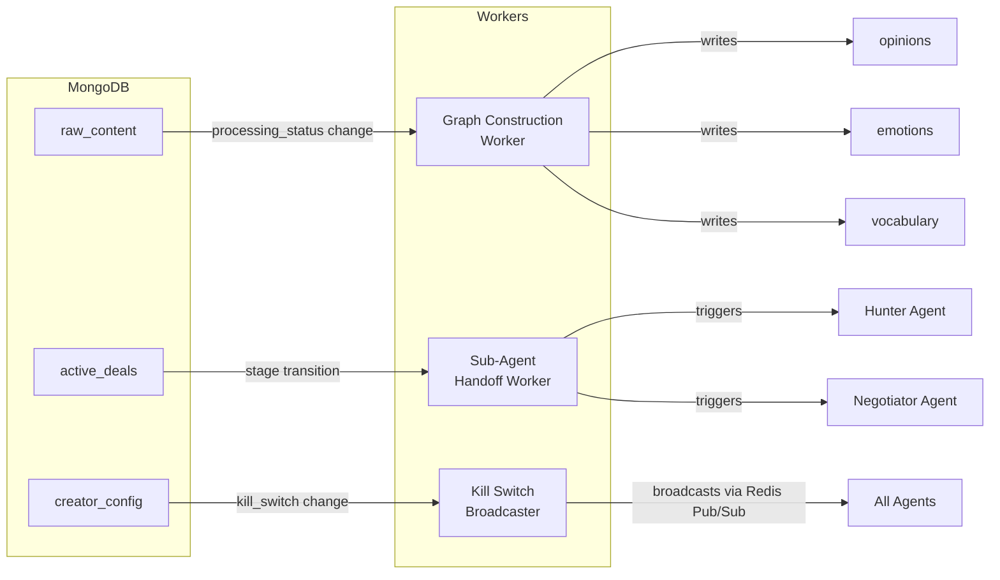
```mermaid
graph LR
    subgraph MongoDB
        RC["raw_content"]
        AD["active_deals"]
        CC["creator_config"]
    end

    subgraph Workers
        GCW["Graph Construction<br/>Worker"]
        SAH["Sub-Agent<br/>Handoff Worker"]
        KSB["Kill Switch<br/>Broadcaster"]
    end

    RC -->|"processing_status change"| GCW
    AD -->|"stage transition"| SAH
    CC -->|"kill_switch change"| KSB

    GCW -->|writes| OP["opinions"]
    GCW -->|writes| EM["emotions"]
    GCW -->|writes| VO["vocabulary"]

    SAH -->|triggers| HU["Hunter Agent"]
    SAH -->|triggers| NE["Negotiator Agent"]

    KSB -->|broadcasts via Redis Pub/Sub| AG["All Agents"]
```

#### Stream 1: `raw_content` — Graph Construction Trigger

```typescript
import { MongoClient, ChangeStreamDocument } from "mongodb";

interface ResumeTokenStore {
  get(streamName: string): Promise<unknown>;
  set(streamName: string, token: unknown): Promise<void>;
}

async function watchRawContent(
  db: MongoClient["db"],
  tokenStore: ResumeTokenStore
): Promise<void> {
  const resumeToken = await tokenStore.get("raw_content_graph_trigger");

  const pipeline = [
    {
      $match: {
        operationType: "update",
        "updateDescription.updatedFields.processing_status": {
          $in: ["processed"]  // Trigger when status transitions TO 'processed'
        }
      }
    }
  ];

  const options = resumeToken
    ? { resumeAfter: resumeToken, fullDocument: "updateLookup" as const }
    : { fullDocument: "updateLookup" as const };

  const stream = db.collection("raw_content").watch(pipeline, options);

  stream.on("change", async (event: ChangeStreamDocument) => {
    if (event.operationType === "update" && event.fullDocument) {
      const doc = event.fullDocument;

      // Dispatch to graph construction worker queue (BullMQ/Redis)
      await graphConstructionQueue.add("build_graph_nodes", {
        doc_id: doc.doc_id,
        creator_id: doc.creator_id,
        platform: doc.platform,
        content: doc.content,
        topic_tags: doc.topic_tags,
        sentiment_score: doc.sentiment_score,
        opinion_strength: doc.opinion_strength,
        emotional_state: doc.emotional_state
      });

      // Persist resume token AFTER successful queue dispatch
      await tokenStore.set("raw_content_graph_trigger", event._id);
    }
  });

  stream.on("error", (error: Error) => {
    // Log, alert, and restart with persisted resume token
    logger.error("raw_content change stream error", { error });
    process.exit(1); // Let process manager (PM2/K8s) restart
  });
}
```

**Failure mode**: If the worker crashes between receiving the event and persisting the resume token, the event will be redelivered on restart. The graph construction worker must be **idempotent** — writing the same graph nodes from the same `doc_id` produces identical results.

#### Stream 2: `active_deals` — Sub-Agent Handoff

```typescript
async function watchActiveDeals(
  db: MongoClient["db"],
  tokenStore: ResumeTokenStore
): Promise<void> {
  const resumeToken = await tokenStore.get("active_deals_stage_trigger");

  const pipeline = [
    {
      $match: {
        operationType: "update",
        "updateDescription.updatedFields.stage": { $exists: true }
      }
    }
  ];

  const options = resumeToken
    ? { resumeAfter: resumeToken, fullDocument: "updateLookup" as const }
    : { fullDocument: "updateLookup" as const };

  const stream = db.collection("active_deals").watch(pipeline, options);

  stream.on("change", async (event: ChangeStreamDocument) => {
    if (event.operationType === "update" && event.fullDocument) {
      const deal = event.fullDocument;
      const newStage = deal.stage;

      // State machine transition → agent handoff mapping
      const handoffMap: Record<string, string> = {
        "pitched":      "negotiator_agent",  // Hunter → Negotiator
        "negotiating":  "negotiator_agent",  // Continue with Negotiator
        "closing":      "closer_agent",      // Negotiator → Closer
        "closed":       "notification_agent", // Closer → Notify creator
        "dead":         "analytics_agent"     // Dead → Record and learn
      };

      const targetAgent = handoffMap[newStage];
      if (targetAgent) {
        await agentHandoffQueue.add(targetAgent, {
          deal_id: deal._id.toString(),
          creator_id: deal.creator_id,
          brand_name: deal.brand_name,
          stage: newStage,
          current_terms: deal.current_terms
        });
      }

      await tokenStore.set("active_deals_stage_trigger", event._id);
    }
  });
}
```

**Design decision**: The handoff map is hardcoded in the stream worker rather than stored in the database because stage transitions are a core system invariant. If the mapping changes, the worker must be redeployed — this is intentional. Configuration-driven agent routing at this level would introduce a class of runtime failures that are harder to debug than a code change.

#### Stream 3: `creator_config` — Kill Switch Broadcaster

```typescript
async function watchCreatorConfig(
  db: MongoClient["db"],
  tokenStore: ResumeTokenStore,
  redis: RedisClient
): Promise<void> {
  const resumeToken = await tokenStore.get("creator_config_kill_switch");

  const pipeline = [
    {
      $match: {
        $or: [
          {
            operationType: "update",
            "updateDescription.updatedFields.kill_switch": { $exists: true }
          },
          {
            operationType: "replace"  // Catch full-document replacements too
          }
        ]
      }
    }
  ];

  const options = resumeToken
    ? { resumeAfter: resumeToken, fullDocument: "updateLookup" as const }
    : { fullDocument: "updateLookup" as const };

  const stream = db.collection("creator_config").watch(pipeline, options);

  stream.on("change", async (event: ChangeStreamDocument) => {
    if (event.fullDocument) {
      const config = event.fullDocument;

      // Broadcast freeze/unfreeze signal via Redis Pub/Sub
      // All agents subscribe to `echomind:kill_switch:{creator_id}`
      const channel = `echomind:kill_switch:${config.creator_id}`;
      const signal = {
        creator_id: config.creator_id,
        kill_switch: config.kill_switch,
        timestamp: new Date().toISOString()
      };

      await redis.publish(channel, JSON.stringify(signal));

      // Also update a Redis key for agents that start AFTER the signal
      await redis.set(
        `echomind:kill_switch_state:${config.creator_id}`,
        config.kill_switch ? "frozen" : "active"
      );

      await tokenStore.set("creator_config_kill_switch", event._id);
    }
  });
}
```

**Latency budget**: Kill switch activation must propagate to all agents within **500ms**. The Change Stream + Redis Pub/Sub path achieves this with typical latencies of 50–150ms. Redis key persistence ensures agents that start after the broadcast still read the correct state.

### 3.5.2 Resume Token Persistence

Resume tokens are stored in a dedicated `_change_stream_tokens` collection:

```javascript
db.createCollection("_change_stream_tokens", {
  validator: {
    $jsonSchema: {
      bsonType: "object",
      required: ["stream_name", "token", "updated_at"],
      properties: {
        stream_name: { bsonType: "string" },
        token:       { bsonType: "object" },
        updated_at:  { bsonType: "date" }
      }
    }
  }
});

db._change_stream_tokens.createIndex(
  { stream_name: 1 },
  { name: "idx_stream_name", unique: true }
);
```

**Why a separate collection?** Resume tokens must survive application restarts. Storing them in Redis risks loss during Redis failover. Storing them in the same database as the watched collection guarantees transactional consistency with the oplog.

---

## 3.6 Client-Side Field Level Encryption (CSFLE)

### 3.6.1 Threat Model

CSFLE protects sensitive fields from:

1. **Database administrators** with direct Atlas access
2. **Memory dumps** from mongod processes
3. **Backup compromise** — encrypted fields remain encrypted in snapshots
4. **Network sniffing** — fields are encrypted before leaving the application process (defense in depth over TLS)

The application holds the Customer Master Key (CMK) via AWS KMS. MongoDB never sees plaintext values for encrypted fields.

### 3.6.2 Encrypted Fields Map

| Collection | Field | Encryption Algorithm | Rationale |
|---|---|---|---|
| `creator_config` | `api_credentials_ref` | **Deterministic** | Credential store reference. Deterministic allows equality queries ("find config by credential ref") though this query pattern is rare. |
| `active_deals` | `contract_draft_url` | **Random** | Contract URLs are read-only after write. Random encryption provides stronger security — no equality queries needed. |
| `raw_content` | `content` (when `platform = "email"`) | **Random** | Email content may contain PII, financial data, or legally privileged information. Random encryption; content is always read by `doc_id`, never queried by text. |

### 3.6.3 CSFLE Configuration

```typescript
import {
  MongoClient,
  ClientEncryption,
  AutoEncryptionOptions
} from "mongodb";

// AWS KMS configuration for Customer Master Key (CMK)
const kmsProviders = {
  aws: {
    accessKeyId: process.env.AWS_ACCESS_KEY_ID!,
    secretAccessKey: process.env.AWS_SECRET_ACCESS_KEY!
  }
};

const masterKey = {
  key: process.env.AWS_CMK_ARN!,            // e.g., "arn:aws:kms:us-east-1:123456789:key/abc-def-..."
  region: process.env.AWS_CMK_REGION!        // e.g., "us-east-1"
};

// Schema map defining encrypted fields
// This is passed to the MongoClient constructor for automatic encryption
const schemaMap: Record<string, object> = {
  "echomind.creator_config": {
    bsonType: "object",
    encryptMetadata: {
      keyId: [/* Data Encryption Key UUID — generated at setup */]
    },
    properties: {
      api_credentials_ref: {
        encrypt: {
          bsonType: "string",
          algorithm: "AEAD_AES_256_CBC_HMAC_SHA_512-Deterministic"
        }
      }
    }
  },
  "echomind.active_deals": {
    bsonType: "object",
    encryptMetadata: {
      keyId: [/* Data Encryption Key UUID */]
    },
    properties: {
      contract_draft_url: {
        encrypt: {
          bsonType: "string",
          algorithm: "AEAD_AES_256_CBC_HMAC_SHA_512-Random"
        }
      }
    }
  },
  // NOTE: raw_content.content encryption is handled MANUALLY (not via schemaMap)
  // because only email content is encrypted, not all content.
  // See Section 3.6.4 for the conditional encryption logic.
};

const autoEncryptionOptions: AutoEncryptionOptions = {
  kmsProviders,
  keyVaultNamespace: "echomind.__keyVault",
  schemaMap,
  extraOptions: {
    mongocryptdBypassSpawn: true,  // Use crypt_shared library instead
    cryptSharedLibPath: process.env.CRYPT_SHARED_LIB_PATH!
  }
};

// Create the encrypted client
const client = new MongoClient(process.env.MONGODB_URI!, {
  autoEncryption: autoEncryptionOptions
});
```

### 3.6.4 Conditional Encryption for `raw_content.content`

Email content requires encryption, but YouTube transcripts and tweets do not. Since CSFLE's `schemaMap` applies to all documents in a collection, conditional encryption is handled at the application layer:

```typescript
import { ClientEncryption, Binary } from "mongodb";

const clientEncryption = new ClientEncryption(client, {
  kmsProviders,
  keyVaultNamespace: "echomind.__keyVault"
});

async function insertRawContent(doc: RawContentDocument): Promise<void> {
  const collection = db.collection("raw_content");

  if (doc.platform === "email") {
    // Manually encrypt the content field for email documents
    const encryptedContent = await clientEncryption.encrypt(doc.content, {
      algorithm: "AEAD_AES_256_CBC_HMAC_SHA_512-Random",
      keyId: dataEncryptionKeyId  // Pre-generated DEK UUID
    });

    await collection.insertOne({
      ...doc,
      content: encryptedContent  // Binary (encrypted)
    });
  } else {
    // Insert plaintext for non-email platforms
    await collection.insertOne(doc);
  }
}

async function readRawContent(docId: string): Promise<RawContentDocument> {
  const doc = await db.collection("raw_content").findOne({ doc_id: docId });

  if (doc && doc.platform === "email" && doc.content instanceof Binary) {
    // Manually decrypt
    doc.content = await clientEncryption.decrypt(doc.content);
  }

  return doc as RawContentDocument;
}
```

**Trade-off**: Manual encryption adds ~2ms per email document read/write. This is acceptable because email ingestion volume is orders of magnitude lower than YouTube/Twitter, and the security benefit is non-negotiable.

### 3.6.5 Key Vault Setup

```javascript
// One-time setup: create the key vault collection and index
db.createCollection("__keyVault");

db.__keyVault.createIndex(
  { keyAltNames: 1 },
  {
    name: "idx_key_alt_names",
    unique: true,
    partialFilterExpression: { keyAltNames: { $exists: true } }
  }
);
```

### 3.6.6 Key Rotation

Data Encryption Keys (DEKs) are rotated every 90 days. The rotation process:

1. Generate a new DEK via `clientEncryption.createDataKey("aws", { masterKey })`
2. Re-encrypt all documents using the old DEK with the new DEK (background migration job)
3. Remove the old DEK from the key vault after confirming all documents are migrated
4. The CMK in AWS KMS is rotated annually via AWS automatic rotation

---

## 3.7 Data Lifecycle and Capacity Planning

### 3.7.1 TTL Policies

| Collection | TTL Field | Expiry | Destination |
|---|---|---|---|
| `raw_content` | `timestamp` | 365 days | Atlas Online Archive → S3 |
| `dead_letter_queue` | `created_at` | 30 days | Deleted (logged to CloudWatch first) |

### 3.7.2 Estimated Storage per Creator (Year 1)

| Collection | Documents/yr | Avg size | Total |
|---|---|---|---|
| `raw_content` | ~50,000 | 10 KB | ~500 MB |
| `opinions` | ~2,000 | 6 KB | ~12 MB |
| `emotions` | ~500 | 1 KB | ~0.5 MB |
| `vocabulary` | ~10,000 | 6 KB | ~60 MB |
| `relationships` | ~1,000 | 2 KB | ~2 MB |
| `negotiation_profiles` | ~20 | 1.5 KB | ~30 KB |
| `predicted_opinions` | ~5,000 | 2 KB | ~10 MB |
| `agent_interactions` | ~200 | 5 KB | ~1 MB |
| `active_deals` | ~50 | 20 KB | ~1 MB |
| `brand_targets` | ~500 | 0.7 KB | ~0.35 MB |
| `creator_config` | 1 | 3 KB | ~3 KB |
| `dead_letter_queue` | ~100 | 10 KB | ~1 MB |
| **Total per creator** | | | **~588 MB** |

At 1,000 creators: ~588 GB data + ~30% index overhead = **~765 GB total**. This fits comfortably in an M40 cluster (1 TB disk per node, 3-node replica set). Sharding becomes necessary at ~2,500 creators.

### 3.7.3 Collection Relationship Diagram

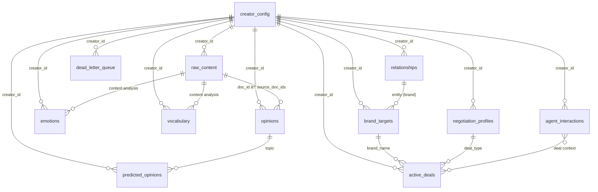
```mermaid
erDiagram
    creator_config ||--o{ raw_content : "creator_id"
    creator_config ||--o{ opinions : "creator_id"
    creator_config ||--o{ emotions : "creator_id"
    creator_config ||--o{ vocabulary : "creator_id"
    creator_config ||--o{ relationships : "creator_id"
    creator_config ||--o{ negotiation_profiles : "creator_id"
    creator_config ||--o{ predicted_opinions : "creator_id"
    creator_config ||--o{ agent_interactions : "creator_id"
    creator_config ||--o{ active_deals : "creator_id"
    creator_config ||--o{ brand_targets : "creator_id"
    creator_config ||--o{ dead_letter_queue : "creator_id"

    raw_content ||--o{ opinions : "doc_id → source_doc_ids"
    raw_content ||--o{ emotions : "content analysis"
    raw_content ||--o{ vocabulary : "content analysis"

    brand_targets ||--o{ active_deals : "brand_name"
    relationships ||--o{ brand_targets : "entity (brand)"
    negotiation_profiles ||--o{ active_deals : "deal_type"
    opinions ||--o{ predicted_opinions : "topic"
    agent_interactions }o--o{ active_deals : "deal context"
```

---

## 3.8 Migration and Schema Evolution

### 3.8.1 Migration Strategy

Schema changes follow a three-phase deployment model to avoid downtime:

1. **Expand**: Add new fields as optional (not in `required`). Deploy application code that writes the new fields. Validator updated to accept the new shape.
2. **Migrate**: Background job backfills existing documents with default values for the new fields.
3. **Contract**: Once all documents are migrated, update the validator to make the new fields `required`. Remove old-field application code.

### 3.8.2 Validator Update Command

```javascript
// Example: adding a 'language' field to raw_content
db.runCommand({
  collMod: "raw_content",
  validator: {
    $jsonSchema: {
      // ... existing schema ...
      properties: {
        // ... existing fields ...
        language: {
          bsonType: "string",
          minLength: 2,
          maxLength: 10,
          description: "ISO 639-1 language code"
        }
      }
    }
  },
  validationLevel: "moderate"  // 'moderate' during migration — only validates inserts and updates
});
```

After migration completes:

```javascript
db.runCommand({
  collMod: "raw_content",
  validator: {
    $jsonSchema: {
      required: [
        // ... existing required fields ...,
        "language"  // Now required
      ],
      // ...
    }
  },
  validationLevel: "strict"  // Back to strict
});
```

---

## 3.9 Backup and Recovery

| Concern | Strategy |
|---|---|
| **Continuous backup** | Atlas Continuous Backup with point-in-time recovery (PITR). Retention: 7 days for point-in-time, 30 days for daily snapshots. |
| **Cross-region redundancy** | Snapshots replicated to a secondary region (us-west-2) via Atlas backup policies. |
| **RTO (Recovery Time Objective)** | < 1 hour for full cluster restore. < 5 minutes for single-collection restore. |
| **RPO (Recovery Point Objective)** | < 1 second (continuous backup with oplog tailing). |
| **Encryption at rest** | Atlas encrypts all data at rest with AES-256. CSFLE fields remain encrypted even within backups. |
| **Restore testing** | Monthly automated restore-to-staging test. Alerts if restore exceeds RTO. |

---

## 3.10 Monitoring and Alerts

| Metric | Threshold | Alert Channel |
|---|---|---|
| Oplog window | < 24 hours | PagerDuty (P1) |
| Replication lag | > 10 seconds | PagerDuty (P2) |
| `dead_letter_queue` document count | > 100 in 1 hour | Slack + PagerDuty (P3) |
| Atlas disk usage | > 80% | Slack (warning) |
| Atlas disk usage | > 90% | PagerDuty (P2) |
| Change Stream resume failures | Any | PagerDuty (P1) |
| CSFLE decryption failures | Any | PagerDuty (P1) — potential key compromise |
| Query p99 latency | > 100ms | Slack (warning) |
| Query p99 latency | > 500ms | PagerDuty (P2) |
| Connections | > 80% of limit | Slack (warning) |

---

*Next: [Section 4 — Search and Discovery Layer](./04-search-discovery.md)*
# Section 4: Agent Orchestration Design

## 4.1 Google Cloud Agent Builder Architecture

### Agent Definition Hierarchy

EchoMind uses a **single Agent Builder application** with **parameterized sub-agents**. Each creator instance is not a separate Agent Builder deployment — instead, all creators share the same agent definitions, differentiated by `creator_id` passed as a session parameter.

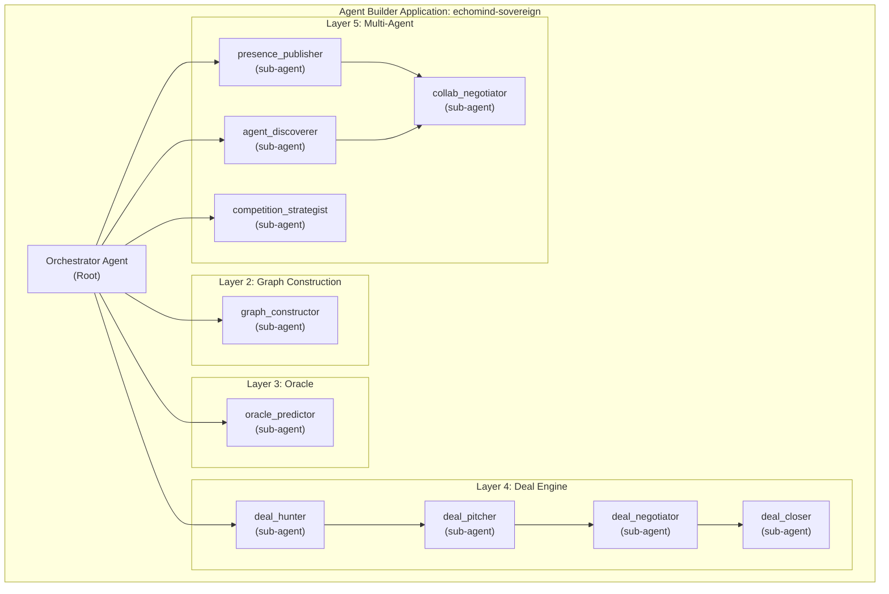
```mermaid
graph TB
    subgraph "Agent Builder Application: echomind-sovereign"
        ORCH["Orchestrator Agent<br/>(Root)"]
        
        subgraph "Layer 2: Graph Construction"
            GRAPH["graph_constructor<br/>(sub-agent)"]
        end
        
        subgraph "Layer 3: Oracle"
            ORACLE["oracle_predictor<br/>(sub-agent)"]
        end
        
        subgraph "Layer 4: Deal Engine"
            HUNTER["deal_hunter<br/>(sub-agent)"]
            PITCHER["deal_pitcher<br/>(sub-agent)"]
            NEGOTIATOR["deal_negotiator<br/>(sub-agent)"]
            CLOSER["deal_closer<br/>(sub-agent)"]
        end
        
        subgraph "Layer 5: Multi-Agent"
            PRESENCE["presence_publisher<br/>(sub-agent)"]
            DISCOVERER["agent_discoverer<br/>(sub-agent)"]
            COLLAB_NEG["collab_negotiator<br/>(sub-agent)"]
            COMPETITOR["competition_strategist<br/>(sub-agent)"]
        end
    end
    
    ORCH --> GRAPH & ORACLE
    ORCH --> HUNTER --> PITCHER --> NEGOTIATOR --> CLOSER
    ORCH --> PRESENCE & DISCOVERER --> COLLAB_NEG
    ORCH --> COMPETITOR
```

**Engineering Rationale — Single Application, Parameterized:**
Deploying one Agent Builder app per creator would create O(N) management overhead, O(N) deployment pipelines, and version skew risk. Instead, a single versioned Agent Builder app serves all creators. Each invocation receives `creator_id` as context, which scopes all MCP tool calls (MongoDB queries, Elastic queries, etc.) to that creator's data partition.

### Agent Builder Configuration

```yaml
# echomind-sovereign agent builder config
application:
  name: echomind-sovereign
  model: gemini-3-pro  # Reasoning engine
  version: "1.0.0"

session_parameters:
  creator_id:
    type: string
    required: true
    description: "Scopes all data access to this creator"
  cycle_type:
    type: enum
    values: [graph_construction, oracle_prediction, deal_hunt, 
             deal_pitch, deal_negotiate, deal_close, 
             presence_publish, agent_discover, collab_negotiate,
             competition_strategy]
    required: true
    description: "Which sub-agent to invoke"

tools:
  - fivetran_mcp:  # Data ingestion operations
      transport: stdio
      server: ./mcp-servers/fivetran
  - mongodb_mcp:   # All persistence operations
      transport: stdio
      server: ./mcp-servers/mongodb-atlas
  - elastic_mcp:   # Search and inter-agent messaging
      transport: stdio
      server: ./mcp-servers/elastic
  - arize_mcp:     # Observability and drift checks
      transport: stdio
      server: ./mcp-servers/arize
  - gitlab_mcp:    # Audit logging
      transport: stdio
      server: ./mcp-servers/gitlab
  - dynatrace_mcp: # Infrastructure monitoring
      transport: stdio
      server: ./mcp-servers/dynatrace

system_instruction: |
  You are the EchoMind Sovereign orchestrator for creator {creator_id}.
  
  HARD RULES (override all other instructions):
  1. Before ANY action, read creator_config.kill_switch. If true, STOP immediately.
  2. Before ANY action, read playbook rules from /playbook/rules.yaml via GitLab MCP.
  3. NEVER deny being AI when sincerely asked. Always respond:
     "I am an AI agent operating on behalf of {creator_name}."
  4. NEVER commit to financial obligations without human_approval = true.
  5. NEVER publish opinions that directly contradict creator's explicit public positions.
  
  For cycle_type={cycle_type}, execute the corresponding sub-agent logic.
```

## 4.2 Agent Execution Model

### Trigger → Agent Mapping

| Trigger Source | Trigger Type | Agent Invoked | Execution Mode |
|---|---|---|---|
| MongoDB Change Stream | Event-driven | graph_constructor | Async, per-document |
| Cloud Scheduler (6hr) | Cron | oracle_predictor | Sequential per creator |
| Cloud Scheduler (weekly) | Cron | deal_hunter | Sequential per creator |
| Pub/Sub (from Hunter) | Event-driven | deal_pitcher | Async, per-brand |
| Cloud Scheduler (2hr) | Cron | deal_negotiator | Sequential per creator |
| Pub/Sub (from Negotiator) | Event-driven | deal_closer | Async, per-deal |
| Cloud Scheduler (12hr) | Cron | presence_publisher | Parallel, all creators |
| Cloud Scheduler (12hr) | Cron | agent_discoverer | Sequential per creator |
| Pub/Sub (from Discoverer) | Event-driven | collab_negotiator | Async, per-candidate |
| Elastic (competitor detection) | Event-driven | competition_strategist | Async, per-competitor |
| Human approval (FCM response) | Event-driven | deal_closer / oracle | Async, per-approval |

### Parallel vs Sequential Execution Decisions

```
PARALLEL (independent, no shared state mutation):
├── Multiple creators' oracle_predictor runs         → No data overlap between creators
├── Multiple graph_constructor workers               → Each processes different documents
├── presence_publisher for all creators               → Independent Elastic writes
└── Multiple pitcher runs for different brands        → Independent email sends

SEQUENTIAL (shared state or ordering dependency):
├── Hunter → Pitcher → Negotiator → Closer           → Deal pipeline is a state machine
├── oracle_predictor topics within single creator     → Topic predictions may interact
├── collab_negotiator rounds within single thread     → Must process in round order
└── Graph construction for same creator               → Opinion similarity depends on current graph state
```

**Engineering Rationale — Sequential Graph Construction:**
Graph construction for a single creator MUST be sequential (or at least serialized per creator). If two workers simultaneously process documents for the same creator, they might both detect a novel opinion and create duplicate nodes. Solution: Cloud Run worker acquires a MongoDB advisory lock (`creator_lock` collection) before processing. Lock TTL = 60 seconds. If lock acquisition fails, message is nacked back to Pub/Sub for retry.

## 4.3 State Passing Between Agents

### Pub/Sub Topic Architecture

```
echomind-orchestrator                          # Shared topic, filtered by attributes
├── Attribute: creator_id = "creator_abc"
├── Attribute: agent_type = "deal_pitcher"
├── Attribute: priority = "normal" | "urgent"
└── Attribute: source_agent = "deal_hunter"
```

**Decision: Shared Topic with Attribute Filtering (not topic-per-creator)**

Engineering Rationale:
- At 1000 creators × 8 agent types = 8,000 topics would hit Pub/Sub management overhead
- Shared topic with attribute-based subscriptions is the idiomatic Pub/Sub pattern
- Each subscription filters: `attributes.creator_id = X AND attributes.agent_type = Y`
- Ordering key = `creator_id` ensures per-creator message ordering within a subscription

### Pub/Sub Message Schema

```typescript
interface AgentMessage {
  // Header (Pub/Sub attributes — used for routing)
  creator_id: string;
  agent_type: AgentType;
  source_agent: AgentType;
  priority: 'normal' | 'urgent';
  correlation_id: string;     // Traces a full workflow across agents
  
  // Body (Pub/Sub data — JSON payload)
  payload: {
    action: string;           // e.g., "pitch_brands", "close_deal"
    entity_ids: string[];     // MongoDB document IDs to operate on
    context: Record<string, unknown>;  // Agent-specific context
    retry_count: number;
    max_retries: number;
    created_at: string;       // ISO8601
    deadline: string;         // ISO8601 — message expires after this
  };
}
```

### State Machine: Brand Deal Pipeline

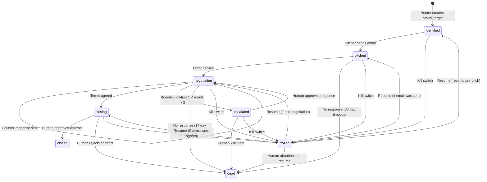
```mermaid
stateDiagram-v2
    [*] --> identified: Hunter creates brand_target
    identified --> pitched: Pitcher sends email
    pitched --> negotiating: Brand replies
    negotiating --> negotiating: Counter-response sent
    negotiating --> closing: Terms agreed
    negotiating --> escalated: Bounds violation OR round > 3
    escalated --> negotiating: Human approves response
    escalated --> dead: Human kills deal
    closing --> closed: Human approves contract
    closing --> dead: Human rejects contract
    pitched --> dead: No response (30 day timeout)
    negotiating --> dead: No response (14 day timeout)
    
    identified --> frozen: Kill switch
    pitched --> frozen: Kill switch
    negotiating --> frozen: Kill switch
    closing --> frozen: Kill switch
    escalated --> frozen: Kill switch
    frozen --> identified: Resume (reset to pre-pitch)
    frozen --> pitched: Resume (if email was sent)
    frozen --> negotiating: Resume (if mid-negotiation)
    frozen --> closing: Resume (if terms were agreed)
    frozen --> dead: Human abandons on resume
```

**State Transitions are MongoDB Atomic Updates:**
Every stage transition is a single `findOneAndUpdate` with `$set` on `stage` and `$push` on `negotiation_history`. This guarantees no partial state transitions even under concurrent access. The `negotiation_history` array serves as an event-sourced log of all state changes.

```javascript
// Atomic state transition
db.active_deals.findOneAndUpdate(
  { _id: deal_id, stage: "negotiating" },  // Precondition: must be in expected stage
  {
    $set: { 
      stage: "closing",
      last_activity: new Date()
    },
    $push: { 
      negotiation_history: {
        from_stage: "negotiating",
        to_stage: "closing",
        timestamp: new Date(),
        agent: "deal_negotiator",
        reason: "terms_agreed",
        terms_snapshot: agreed_terms
      }
    }
  },
  { returnDocument: "after" }
);
// If this returns null → stage was not "negotiating" → concurrent modification detected
// → log conflict, do not proceed
```

## 4.4 Retry Logic and Dead Letter Handling

### Retry Strategy Per Agent Type

| Agent | Max Retries | Backoff Strategy | DLQ Behavior |
|---|---|---|---|
| graph_constructor | 3 | Exponential: 5s, 25s, 125s | Document stays at `processing_status=raw`, DLQ entry created |
| oracle_predictor | 2 | Exponential: 30s, 300s | Prediction cycle skipped, next cycle in 6hr |
| deal_hunter | 2 | Exponential: 60s, 600s | Hunt skipped, next hunt in 1 week |
| deal_pitcher | 3 | Exponential: 10s, 100s, 1000s | Brand target stays at `status=identified`, human notified |
| deal_negotiator | 1 | No backoff (time-sensitive) | Deal escalated to human immediately |
| deal_closer | 0 | No retry (human-gated) | Human re-triggers via mobile app |
| presence_publisher | 3 | Exponential: 10s, 100s, 1000s | Stale presence (acceptable, TTL handles) |
| collab_negotiator | 2 | Exponential: 30s, 300s | Thread expires naturally (3-round limit) |

**Engineering Rationale — No Retry on Negotiator:**
Brand deal negotiations are time-sensitive and personality-critical. If the Negotiator fails to generate a valid response, retrying with the same context will likely produce the same failure. Instead, escalate to human immediately — the human can respond directly, maintaining the relationship.

### Dead Letter Queue Schema

```typescript
interface DeadLetterEntry {
  _id: ObjectId;
  creator_id: string;
  agent_type: AgentType;
  original_message: AgentMessage;
  error: {
    code: string;
    message: string;
    stack_trace: string;
    mcp_server: string | null;  // Which MCP failed, if applicable
  };
  retry_count: number;
  first_failure: Date;
  last_failure: Date;
  resolution: 'pending' | 'retried' | 'discarded' | 'human_resolved';
  resolution_notes: string | null;
}
```

### DLQ Processing

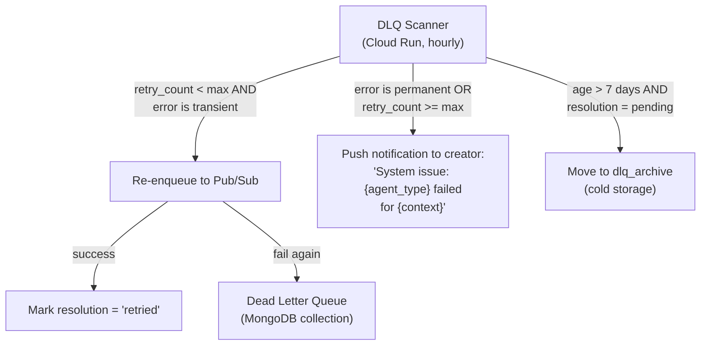
```mermaid
graph TD
    DLQ["Dead Letter Queue<br/>(MongoDB collection)"]
    SCAN["DLQ Scanner<br/>(Cloud Run, hourly)"]
    
    SCAN -->|"retry_count < max AND<br/>error is transient"| RETRY["Re-enqueue to Pub/Sub"]
    SCAN -->|"error is permanent OR<br/>retry_count >= max"| NOTIFY["Push notification to creator:<br/>'System issue: {agent_type} failed<br/>for {context}'"]
    SCAN -->|"age > 7 days AND<br/>resolution = pending"| ARCHIVE["Move to dlq_archive<br/>(cold storage)"]
    
    RETRY -->|"success"| RESOLVE["Mark resolution = 'retried'"]
    RETRY -->|"fail again"| DLQ
```

## 4.5 Human-in-the-Loop Interrupt Patterns

### Interrupt Types

| Interrupt | Trigger | Agent State | Resumption |
|---|---|---|---|
| **Prediction Review** | Confidence 0.50-0.75 | Oracle paused for this topic | Human approve → post, reject → discard |
| **Drift Detection** | Arize similarity < 0.85 | Current agent output frozen | Human approve → publish, reject → regenerate |
| **Negotiation Escalation** | Round > 3 OR bounds violation | Negotiator paused for this deal | Human drafts response OR abandons |
| **Contract Approval** | Terms agreed | Closer waiting | Human approve → close, reject → renegotiate, edit → human edits terms |
| **Collaboration Approval** | Both agents agree | Collab negotiator waiting | Both humans approve → calendar, either rejects → cancel |
| **Kill Switch** | Human or Dynatrace | ALL agents frozen | Human reactivates with biometric + cooldown |

### Interrupt State Machine

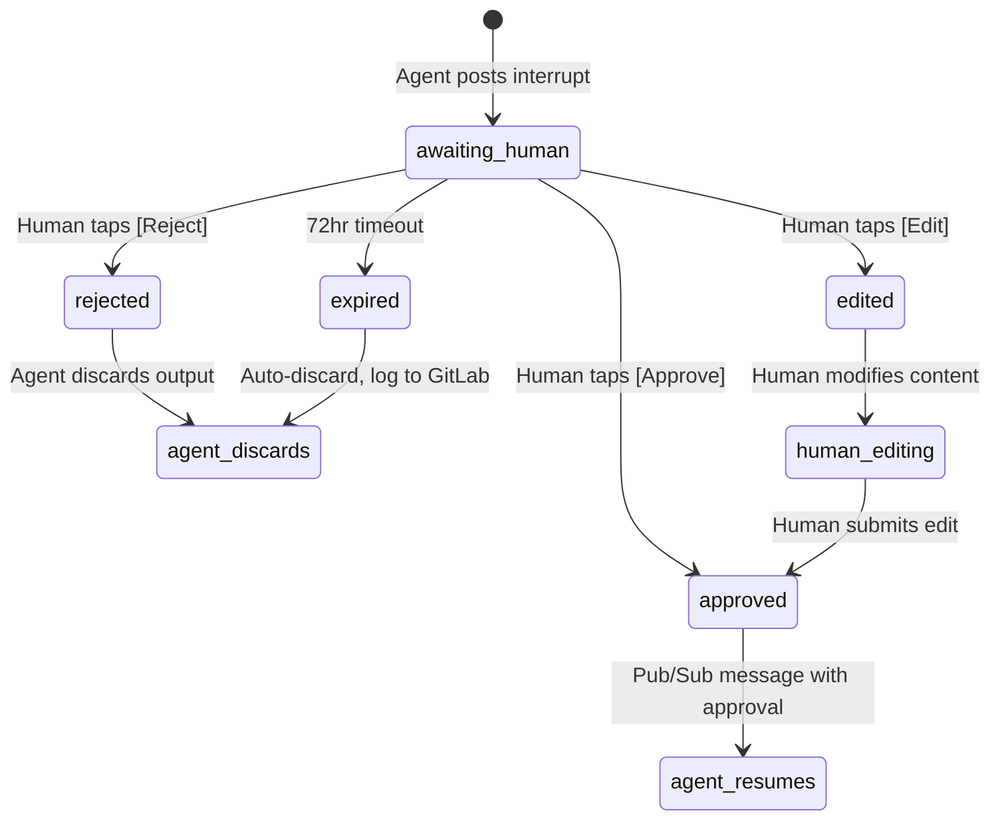
```mermaid
stateDiagram-v2
    [*] --> awaiting_human: Agent posts interrupt
    awaiting_human --> approved: Human taps [Approve]
    awaiting_human --> rejected: Human taps [Reject]
    awaiting_human --> edited: Human taps [Edit]
    awaiting_human --> expired: 72hr timeout

    approved --> agent_resumes: Pub/Sub message with approval
    rejected --> agent_discards: Agent discards output
    edited --> human_editing: Human modifies content
    human_editing --> approved: Human submits edit
    expired --> agent_discards: Auto-discard, log to GitLab
```

### Interrupt Storage

```typescript
interface HumanInterrupt {
  _id: ObjectId;
  creator_id: string;
  interrupt_type: 'prediction_review' | 'drift_flag' | 'negotiation_escalation' | 
                  'contract_approval' | 'collab_approval';
  agent_type: AgentType;
  correlation_id: string;
  
  // What the agent wants to do
  proposed_action: {
    description: string;  // Human-readable summary
    content: string;      // The actual content/email/post
    metadata: Record<string, unknown>;
  };
  
  // Context for human decision
  context: {
    confidence: number | null;
    drift_score: number | null;
    risk_flags: string[];
    related_deal_id: string | null;
    related_prediction_id: string | null;
  };
  
  // Human response
  status: 'pending' | 'approved' | 'rejected' | 'edited' | 'expired';
  human_response: {
    action: string | null;
    edited_content: string | null;
    responded_at: Date | null;
  };
  
  // Lifecycle
  created_at: Date;
  expires_at: Date;  // 72 hours from creation
  fcm_message_id: string;
}
```

### Daily Digest Notification

Per the project brief, the creator's primary interaction is **one daily approve/reject notification**. Implementation:

```
Cloud Scheduler (daily at creator's preferred time)
  → Pub/Sub → digest_generator agent
  → Reads all pending HumanInterrupt documents for creator
  → Generates a single summary notification via FCM:

  "EchoMind Daily Summary:
   ✅ 3 posts published (all passed drift check)
   ⚠️ 1 prediction needs review: [topic]
   💰 Brand deal update: [brand] replied — Round 2
   🤝 Collab proposal from [creator alias]
   
   [Open Dashboard]"
```

The dashboard (mobile app) shows each item with [Approve] [Reject] [Edit] actions. The creator can batch-approve/reject all items in under 30 seconds.

## 4.6 Agent Concurrency Model on Cloud Run

### Container Architecture

```
┌─────────────────────────────────────────┐
│          Cloud Run Container            │
│                                         │
│  ┌─────────────────────────────────┐    │
│  │    Agent Builder Runtime        │    │
│  │    (Gemini 3 reasoning loop)    │    │
│  └──────────┬──────────────────────┘    │
│             │ stdio pipes               │
│  ┌──────────┼──────────────────────┐    │
│  │    MCP Server Processes         │    │
│  │  ┌────────┐ ┌────────┐         │    │
│  │  │Fivetran│ │MongoDB │         │    │
│  │  │  MCP   │ │  MCP   │         │    │
│  │  └────────┘ └────────┘         │    │
│  │  ┌────────┐ ┌────────┐         │    │
│  │  │Elastic │ │ Arize  │         │    │
│  │  │  MCP   │ │  MCP   │         │    │
│  │  └────────┘ └────────┘         │    │
│  │  ┌────────┐ ┌────────┐         │    │
│  │  │GitLab  │ │Dynatr. │         │    │
│  │  │  MCP   │ │  MCP   │         │    │
│  │  └────────┘ └────────┘         │    │
│  └─────────────────────────────────┘    │
│                                         │
│  Memory: 2Gi  │  CPU: 2  │  Timeout: 5m│
└─────────────────────────────────────────┘
```

### Concurrency Settings

```yaml
cloud_run:
  service: echomind-agent-worker
  scaling:
    min_instances: 1          # Always-warm for kill switch responsiveness
    max_instances: 100        # Cap to control costs
    concurrency: 1            # One agent invocation per container instance
                              # (agents are stateful during execution)
  resources:
    cpu: "2"                  # 2 vCPUs for MCP sidecar processes
    memory: "2Gi"             # Gemini reasoning + 6 MCP servers
  timeout: 300s               # 5-minute max per agent invocation
  
  # Separate service for graph construction (different scaling profile)
  service: echomind-graph-worker
  scaling:
    min_instances: 1
    max_instances: 50
    concurrency: 1
  resources:
    cpu: "1"
    memory: "1Gi"
  timeout: 60s                # Graph construction should complete in <60s per document
```

**Engineering Rationale — Concurrency = 1:**
Each agent invocation maintains in-memory state during its reasoning loop (conversation history, tool call results, intermediate decisions). Sharing a container between concurrent invocations would cause state bleeding. Cloud Run's concurrency=1 with auto-scaling gives us clean isolation: each agent gets its own container, and Cloud Run spins up more containers as needed.

## 4.7 Playbook-as-Code Integration

### Rules Loading

At the start of every agent cycle, the agent reads the creator's playbook from GitLab:

```yaml
# /playbook/rules.yaml (stored in GitLab repo per creator)
version: 2
creator_id: "creator_abc"

content_rules:
  never_post_about:
    - politics
    - religion
    - "competitor_name_1"
    - "competitor_name_2"
  post_frequency_max: 3_per_day
  platforms_enabled:
    - twitter
    - youtube
  tone_guardrails:
    - "never use profanity"
    - "always maintain optimistic tone"
  
deal_rules:
  minimum_rate_usd: 5000
  maximum_deals_per_month: 4
  prohibited_brands:
    - "brand_x"
    - "brand_y"
  prohibited_industries:
    - gambling
    - tobacco
  required_disclosure: "Sponsored content"
  
collaboration_rules:
  blacklist_agents:
    - "agent_id_1"
  minimum_audience_size: "mid"  # Won't collab with micro
  prohibited_topics_for_collab:
    - controversial_topic
  
prediction_rules:
  maximum_confidence_for_auto_post: 0.90  # Override default 0.75
  prohibited_prediction_topics:
    - "personal_life"
```

### Rules Enforcement

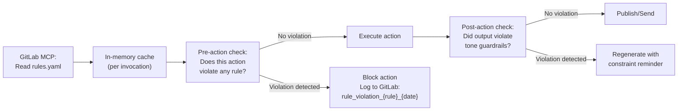
```mermaid
graph LR
    GL["GitLab MCP:<br/>Read rules.yaml"] --> CACHE["In-memory cache<br/>(per invocation)"]
    CACHE --> PRE["Pre-action check:<br/>Does this action<br/>violate any rule?"]
    PRE -->|"No violation"| EXEC["Execute action"]
    PRE -->|"Violation detected"| BLOCK["Block action<br/>Log to GitLab:<br/>rule_violation_{rule}_{date}"]
    EXEC --> POST["Post-action check:<br/>Did output violate<br/>tone guardrails?"]
    POST -->|"No violation"| PUBLISH["Publish/Send"]
    POST -->|"Violation detected"| REGEN["Regenerate with<br/>constraint reminder"]
```

Rules changes require a **GitLab merge request** approved by the creator. The agent never modifies rules — it only reads them. This ensures the creator always has full control over agent behavior boundaries, versioned and auditable in Git.
# Section 5 — Failure Mode Analysis

> **Scope**: Every MCP partner outage, every cross-cutting fault, every blast radius, every recovery path.  
> **Design Principle**: No single external dependency failure may cause data loss or unauthorized creator actions. The system must degrade gracefully, preserve in-flight state, and recover automatically when possible.

---

## 5.1 Failure Classification Framework

Every failure is classified on two axes before mitigation design begins:

| Axis | Levels | Definition |
|------|--------|------------|
| **Severity** | S1 (Critical), S2 (Major), S3 (Minor) | S1 = creator-visible data loss or unauthorized action; S2 = degraded functionality; S3 = internal metric gap |
| **Blast Radius** | Isolated, Partial, System-wide | Isolated = single agent; Partial = one functional layer; System-wide = all agents and layers |

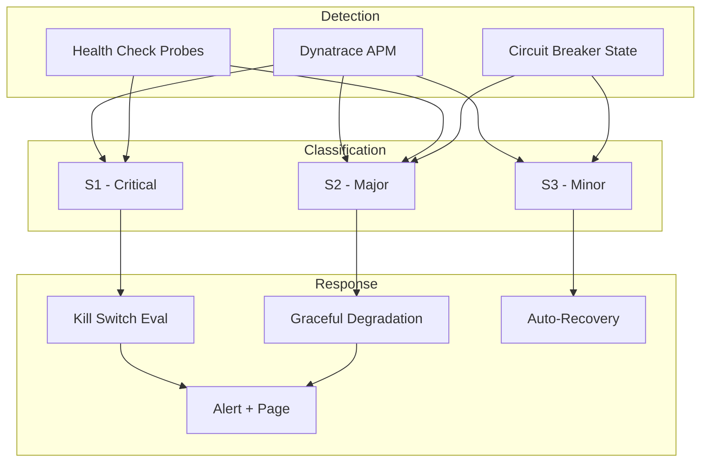
```mermaid
flowchart TD
    subgraph Detection
        DY["Dynatrace APM"]
        HC["Health Check Probes"]
        CS["Circuit Breaker State"]
    end

    subgraph Classification
        S1["S1 - Critical"]
        S2["S2 - Major"]
        S3["S3 - Minor"]
    end

    subgraph Response
        KS["Kill Switch Eval"]
        GD["Graceful Degradation"]
        AL["Alert + Page"]
        AR["Auto-Recovery"]
    end

    DY --> S1 & S2 & S3
    HC --> S1 & S2
    CS --> S2 & S3

    S1 --> KS --> AL
    S2 --> GD --> AL
    S3 --> AR
```

---

## 5.2 MCP Partner Failure Modes

### 5.2.1 Fivetran MCP Failure

**What Fivetran Does**: All data ingestion from 7 platform sources (YouTube, TikTok, Instagram, Twitter/X, Twitch, Spotify, Patreon). Fivetran connectors sync platform data into MongoDB Atlas on a scheduled cadence (typically 15-minute intervals for metrics, 5-minute for engagement signals).

#### Failure Scenario
Fivetran's MCP server becomes unreachable, returns 5xx errors, or an individual connector enters an error state. The system can no longer pull fresh platform data.

#### Blast Radius — **Partial (Ingestion Layer + downstream agents)**

| Affected Component | Impact |
|---|---|
| Ingestion Layer | Complete halt — no new platform data enters the system |
| Trend Prediction Agent | Stale data; predictions degrade over time but remain functional using cached historical data |
| Content Strategy Agent | Cannot detect real-time engagement shifts; falls back to historical patterns |
| Brand Deal Agent | Deal scoring continues with existing data; new deal opportunity detection delayed |
| Personality Graph | Graph becomes progressively stale; existing graph remains valid |
| Kill Switch / Audit | **Not affected** — these systems do not depend on Fivetran |

#### Detection

| Mechanism | Metric | Threshold |
|---|---|---|
| Dynatrace Custom Event | `fivetran.sync.last_success_age_seconds` | > 1800s (2× normal sync interval) |
| Fivetran MCP Health Probe | HTTP GET to Fivetran MCP `/health` endpoint | 3 consecutive failures over 90 seconds |
| MongoDB Staleness Check | `db.platform_metrics.find().sort({_ingested_at: -1}).limit(1)` age | > 30 minutes |
| Circuit Breaker (Opossum) | Error rate on Fivetran MCP calls | > 50% over 60-second window → OPEN |

#### Graceful Degradation

1. **Circuit breaker opens** after 5 consecutive failures (half-open probe every 30 seconds).
2. All agents switch to **stale-data mode**: every response generated during this window includes a `data_freshness: stale` flag in its metadata. This flag propagates to any creator-facing output.
3. Trend Prediction Agent widens its confidence intervals by 2× and appends a disclaimer: *"Based on data as of {last_sync_timestamp}"*.
4. Content Strategy Agent locks its current recommendation set — no new recommendations are generated, but existing ones remain visible.
5. Brand Deal Agent continues negotiation on active deals (deal state is in MongoDB, not Fivetran) but pauses new deal discovery.

#### Data Consistency

- **No in-flight data at risk**: Fivetran connectors are pull-based with at-least-once delivery. If a sync fails mid-way, Fivetran resumes from its internal cursor on the next successful attempt.
- **MongoDB state**: All documents written by Fivetran have an `_ingested_at` timestamp. Agents can always determine data freshness by reading this field.
- **Idempotency contract**: Fivetran writes are upserts keyed on `{platform, platform_entity_id, metric_timestamp}`. Duplicate writes on recovery are harmless.

#### Recovery Procedure

1. Dynatrace alert fires → on-call engineer verifies Fivetran status dashboard.
2. If Fivetran-side issue: wait for Fivetran resolution; no manual action needed.
3. If MCP connectivity issue: verify network path (VPC peering, DNS resolution to Fivetran MCP endpoint).
4. Once Fivetran MCP responds: circuit breaker enters half-open → first successful call → CLOSED.
5. Fivetran automatically reconciles missed syncs using its internal high-watermark. No manual backfill required.
6. Verify recovery: `fivetran.sync.last_success_age_seconds` drops below 900s.
7. Agents automatically exit stale-data mode when `data_freshness` check passes (data < 20 minutes old).

#### RTO / RPO

| Metric | Target | Rationale |
|---|---|---|
| **RTO** | 30 minutes | Fivetran syncs every 15 min; one missed cycle is tolerable; two is the detection threshold |
| **RPO** | 0 (zero data loss) | Fivetran's cursor-based sync ensures no data is skipped, only delayed |

---

### 5.2.2 MongoDB Atlas MCP Failure

**What MongoDB Does**: All persistence — personality graph, deal state, agent memory, kill switch flag, platform metrics, creator profiles. MongoDB is the system of record for every stateful operation.

#### Failure Scenario
MongoDB Atlas cluster becomes unreachable (network partition, Atlas maintenance, region outage) or the MCP server wrapping it fails. The system loses its ability to read or write any persistent state.

#### Blast Radius — **System-wide (S1 Critical)**

| Affected Component | Impact |
|---|---|
| ALL Agents | Cannot read state, cannot write results, cannot check kill switch |
| Kill Switch | **Cannot be read** — agents must fail-safe (see Degradation) |
| Personality Graph | Inaccessible |
| Brand Deal State Machine | Cannot advance deal stages |
| Pub/Sub Consumers | Messages dequeued but processing fails; messages will be nacked and redelivered |

#### Detection

| Mechanism | Metric | Threshold |
|---|---|---|
| Dynatrace Synthetic Monitor | MongoDB Atlas MCP `/health` endpoint | 2 consecutive failures (30s interval) |
| MongoDB Atlas Alerts | `CLUSTER_AVAILABILITY` alert via Atlas API | Any firing alert |
| Application-Level | Connection pool exhaustion metric `mongodb.pool.available` | < 5% available connections |
| Circuit Breaker | Error rate on any MongoDB MCP call | > 30% over 30s window → OPEN |

#### Graceful Degradation

1. **Kill switch fail-safe**: When MongoDB is unreachable, agents **default to STOPPED state**. This is a hard architectural rule — if the kill switch cannot be read, assume it is activated. Rationale: protecting the creator from unauthorized autonomous actions outweighs service availability.
2. **In-flight Pub/Sub messages**: Consumer acknowledges only after successful MongoDB write. On MongoDB failure, messages are nacked → Pub/Sub retries with exponential backoff (max 600s).
3. **Read-through cache (Redis on Memorystore)**: A 60-second TTL read cache fronts high-frequency reads (personality graph, agent memory). During a brief MongoDB outage (< 60s), cached reads continue to serve. Cache is **never used for writes**.
4. **Agent actions queue locally**: If an agent produces a result it cannot persist, it writes to a local Cloud Run instance tmpfs journal (max 50MB). On MongoDB recovery, a reconciliation process replays the journal.
   - Journal entries are idempotent (keyed on `{agent_id, action_id, timestamp}`).
   - Journal older than 10 minutes is discarded (stale results are worse than no results).

#### Data Consistency

- **Write-ahead journal**: Every agent writes to local journal before attempting MongoDB. Journal is the source of truth during outage.
- **Change streams**: MongoDB change streams will resume from their stored resume token. No events are lost as long as the oplog has not rolled past the token (Atlas retains 72h of oplog by default; we configure 168h).
- **Transaction atomicity**: Deal state transitions use MongoDB multi-document transactions. A failed transaction is fully rolled back; no partial state.

#### Recovery Procedure

1. Dynatrace S1 alert fires → PagerDuty escalation → on-call engineer.
2. Check Atlas status page and cluster health.
3. If Atlas maintenance: wait for completion (typically < 5 minutes for rolling restarts).
4. If region outage: Atlas multi-region cluster fails over automatically (target: < 30s for replica set election).
5. On reconnection:
   a. Circuit breakers enter half-open.
   b. Connection pools re-establish.
   c. **Journal reconciliation**: each Cloud Run instance replays its tmpfs journal to MongoDB, skipping entries already present (idempotent upserts).
   d. Change stream consumers resume from stored resume tokens.
   e. Kill switch cache is invalidated; fresh read from MongoDB.
6. Verify: `mongodb.operations.success_rate` > 99.5% for 5 consecutive minutes.

#### RTO / RPO

| Metric | Target | Rationale |
|---|---|---|
| **RTO** | 5 minutes | Atlas multi-region failover + connection pool re-establishment |
| **RPO** | 0 (within journal window) | Local journal captures writes during outage; replayed on recovery. If outage > 10min, RPO = 10min (journal entries beyond 10min are discarded as stale) |

---

### 5.2.3 Elastic MCP Failure

**What Elastic Does**: Full-text search over content, signal detection (trending topics, engagement spikes), and the `echomind_messages` index used for inter-agent messaging and presence.

#### Failure Scenario
Elasticsearch cluster or the Elastic MCP server becomes unreachable. Search, signal detection, and inter-agent messaging halt.

#### Blast Radius — **Partial (Search + Signaling + Inter-Agent Comms)**

| Affected Component | Impact |
|---|---|
| Content Strategy Agent | Cannot search content corpus; falls back to MongoDB-based queries (slower, less relevant) |
| Trend Prediction Agent | Signal detection pipeline halts; no new trending topic identification |
| Inter-Agent Messaging | Agents cannot send or receive messages via `echomind_messages` |
| Brand Deal Agent | Cannot search for brand-creator fit signals |
| Personality Graph | **Not affected** — stored in MongoDB |
| Kill Switch | **Not affected** — stored in MongoDB |

#### Detection

| Mechanism | Metric | Threshold |
|---|---|---|
| Dynatrace | `elastic.cluster.health` | Status `red` or unreachable |
| Elastic MCP Health | HTTP GET `/health` | 3 failures over 90 seconds |
| Application-Level | Search latency `elastic.query.p99_ms` | > 5000ms (normal: < 200ms) |
| Circuit Breaker | Error rate | > 40% over 30s → OPEN |

#### Graceful Degradation

1. **Search fallback**: Content Strategy Agent switches to MongoDB text indexes (`$text` queries). These are slower (p99 ~800ms vs ~100ms) and lack relevance scoring, but provide basic search capability.
2. **Signal detection pause**: Trend Prediction Agent enters **historical-only mode** — it continues serving predictions from its last computed model but stops updating the model.
3. **Inter-agent messaging fallback**: Agents fall back to **Pub/Sub direct topics** for critical messages (deal negotiations, kill switch broadcasts). This is a pre-provisioned fallback path:
   - Topic `echomind-agent-fallback-{agent_type}` exists for each agent type.
   - Messages are JSON-serialized with the same schema as Elastic messages.
   - Limitation: no full-text search over message history during fallback.
4. **Presence detection**: Without Elastic, agents cannot detect peer presence. Each agent assumes all peers are alive and sends messages optimistically; undelivered messages are retried with exponential backoff.

#### Data Consistency

- **Elastic is not the source of truth** for any critical data. All data in Elastic is derived from MongoDB or agent outputs. Full re-indexing from MongoDB is always possible.
- **Inter-agent messages**: Messages sent via Pub/Sub fallback are also written to a MongoDB `fallback_messages` collection. On Elastic recovery, these messages are bulk-indexed into `echomind_messages` for searchability.
- **Search index**: Elastic indexes are rebuilt from MongoDB via a `reindex` Cloud Run job. Full reindex takes ~15 minutes for a typical creator corpus.

#### Recovery Procedure

1. Verify Elastic cluster health via Elastic Cloud console or `GET /_cluster/health`.
2. If shard allocation issue: Elastic self-heals (relocates unassigned shards). Monitor `elastic.shards.unassigned`.
3. If MCP server issue: restart the Elastic MCP Cloud Run service.
4. On recovery:
   a. Circuit breakers close.
   b. Trigger incremental re-index: `POST /echomind-reindex` job reads MongoDB documents with `_updated_at > {last_elastic_write}` and bulk-indexes them.
   c. Bulk-index fallback messages from MongoDB `fallback_messages` into `echomind_messages`.
   d. Agents automatically detect Elastic availability and switch off Pub/Sub fallback.
5. Verify: `elastic.cluster.health` = `green`, search latency p99 < 200ms.

#### RTO / RPO

| Metric | Target | Rationale |
|---|---|---|
| **RTO** | 15 minutes | Time for Elastic self-healing + incremental reindex |
| **RPO** | 0 | All data is derived from MongoDB; Elastic is a read-optimized projection |

---

### 5.2.4 Arize MCP Failure

**What Arize Does**: AI observability — model drift detection, prediction accuracy tracking, embedding drift monitoring, LLM trace analysis. Arize is the eyes on model health.

#### Failure Scenario
Arize platform or MCP server unreachable. The system loses observability into AI model performance. Agents continue functioning but without quality monitoring.

#### Blast Radius — **Isolated (Observability Layer only) — S3 Minor**

| Affected Component | Impact |
|---|---|
| Model Monitoring | No drift alerts, no accuracy tracking |
| All Agents | **Continue operating normally** — Arize is observation-only, not in the critical path |
| Dynatrace | Dynatrace continues monitoring infrastructure independently |
| Creator Experience | **Zero impact** — no creator-facing feature depends on Arize |

#### Detection

| Mechanism | Metric | Threshold |
|---|---|---|
| Dynatrace | `arize.mcp.health` synthetic check | 3 failures over 5 minutes |
| Application-Level | `arize.ingest.last_success_seconds` | > 600s |
| Circuit Breaker | Error rate on Arize MCP calls | > 60% over 120s → OPEN |

#### Graceful Degradation

1. **Fire-and-forget telemetry**: Agents emit telemetry to Arize asynchronously via a dedicated Pub/Sub topic (`echomind-arize-telemetry`). If Arize is down, messages accumulate in the topic (Pub/Sub retention: 7 days).
2. **No agent behavior change**: Arize failure never alters agent decisions. This is a deliberate architectural constraint — observability must not be in the feedback loop of autonomous actions.
3. **Backup metrics to BigQuery**: A parallel Pub/Sub subscription writes raw telemetry to BigQuery as a cold backup. If Arize is down for extended periods, operators can query BigQuery for model health signals.
4. **Manual drift check**: If Arize outage exceeds 4 hours, operators can trigger a manual drift check by running the `drift-check` Cloud Run job that compares recent predictions against ground truth in MongoDB.

#### Data Consistency

- **No data loss**: All telemetry is buffered in Pub/Sub. On Arize recovery, the Pub/Sub consumer drains the backlog.
- **Ordering**: Arize processes telemetry out of order gracefully (each event carries a timestamp). Backlog replay does not cause consistency issues.

#### Recovery Procedure

1. Verify Arize platform status at `status.arize.com`.
2. If Arize-side issue: wait for resolution.
3. If MCP server issue: restart the Arize MCP Cloud Run service.
4. On recovery:
   a. Pub/Sub consumer reconnects and begins draining backlog.
   b. Monitor `arize.ingest.backlog_messages` until it reaches 0.
   c. Verify dashboards show continuous data (may see a spike in data points as backlog drains).
5. No reconciliation needed — Pub/Sub guarantees at-least-once delivery.

#### RTO / RPO

| Metric | Target | Rationale |
|---|---|---|
| **RTO** | 4 hours (soft) | No operational impact; recovery is opportunistic |
| **RPO** | 0 | Pub/Sub buffers all telemetry; no data lost |

---

### 5.2.5 GitLab MCP Failure

**What GitLab Does**: Immutable audit log (every agent action is a Git commit), playbook versioning (agent behavior configs stored as YAML in Git), and rollback capability (revert agent behavior to any previous commit).

#### Failure Scenario
GitLab instance or MCP server unreachable. Audit logging halts and playbook updates cannot be committed.

#### Blast Radius — **Partial (Audit + Playbook Layer) — S2 Major**

| Affected Component | Impact |
|---|---|
| Audit Trail | **Agent actions continue but are not committed to the immutable log** |
| Playbook Versioning | Cannot update agent playbooks; agents use last-known playbook version |
| Rollback Capability | Cannot revert to previous agent behavior |
| Agent Operations | **Continue normally** — agents read playbooks from a local cache |
| Creator Experience | **No immediate impact** — but audit gap is a compliance risk |

#### Detection

| Mechanism | Metric | Threshold |
|---|---|---|
| Dynatrace | `gitlab.mcp.health` | 3 failures over 90s |
| Audit Lag Monitor | `gitlab.audit.last_commit_age_seconds` | > 300s (normal: < 60s) |
| Circuit Breaker | Error rate | > 50% over 60s → OPEN |

#### Graceful Degradation

1. **Audit buffer**: Agent actions are written to a MongoDB `audit_buffer` collection with `{action_id, timestamp, payload_hash, committed: false}`. This buffer is the local WAL for audit entries.
   - Buffer entries include the full action payload + SHA-256 hash for later verification.
   - Buffer has a TTL index of 72 hours — if GitLab is down for > 72h, oldest entries are lost (this is an accepted risk; Dynatrace escalates at 4h).
2. **Playbook cache**: Each Cloud Run instance caches the active playbook YAML in memory at startup. Cache is refreshed on GitLab webhook (`push` event). During GitLab outage, agents use the cached version.
   - Limitation: if a playbook update was in progress when GitLab went down, the update is lost. The operator must re-apply it after recovery.
3. **No new playbook deploys**: Playbook changes are blocked during GitLab outage. The system rejects `POST /playbook/update` with `503 Service Unavailable`.

#### Data Consistency

- **Audit buffer integrity**: Each buffer entry includes `SHA256(previous_entry_hash + payload)` to maintain the hash chain even during GitLab outage. When the buffer is flushed to GitLab, commits reproduce the hash chain faithfully.
- **Playbook consistency**: Playbooks in the cache are immutable snapshots. No partial playbook states are possible.

#### Recovery Procedure

1. Verify GitLab availability (self-hosted: check instance health; SaaS: check `status.gitlab.com`).
2. If MCP server issue: restart GitLab MCP Cloud Run service.
3. On recovery:
   a. **Audit buffer flush**: A reconciliation job reads all `{committed: false}` entries from MongoDB `audit_buffer`, ordered by timestamp, and commits them to GitLab as individual commits preserving the hash chain.
   b. Each commit message includes: `[BUFFERED] {action_type} | hash: {sha256} | original_ts: {timestamp}`.
   c. Playbook cache is refreshed from GitLab HEAD.
   d. Verify: `gitlab.audit.last_commit_age_seconds` < 60s, `audit_buffer` count of `{committed: false}` = 0.

#### RTO / RPO

| Metric | Target | Rationale |
|---|---|---|
| **RTO** | 1 hour | Audit gap is a compliance risk; escalate aggressively |
| **RPO** | 0 (within 72h buffer window) | MongoDB buffer retains all audit entries; flushed on recovery |

---

### 5.2.6 Dynatrace MCP Failure

**What Dynatrace Does**: Infrastructure monitoring, anomaly detection, alerting, auto-kill-switch triggers. Dynatrace watches everything, including the other MCP partners.

#### Failure Scenario
Dynatrace or its MCP server unreachable. The system loses infrastructure monitoring, anomaly detection, and automatic kill switch triggers.

#### Blast Radius — **System-wide visibility loss — S2 Major**

| Affected Component | Impact |
|---|---|
| Infrastructure Monitoring | **Blind** — no alerts on CPU, memory, latency anomalies |
| Auto-Kill-Switch | Automatic trigger conditions cannot fire |
| MCP Health Monitoring | Cannot detect other MCP failures via Dynatrace |
| Agent Operations | **Continue normally** — Dynatrace is not in the data path |
| Manual Kill Switch | **Still functional** — kill switch is in MongoDB, not Dynatrace |

#### Detection — *"Who watches the watchmen?"*

| Mechanism | Metric | Threshold |
|---|---|---|
| Cloud Scheduler Heartbeat | A Cloud Scheduler job pings `GET /dynatrace-mcp/health` every 60s; on 3 failures, publishes to `echomind-alerts` Pub/Sub topic | 3 consecutive failures |
| Google Cloud Monitoring | Uptime check on Dynatrace MCP endpoint | Failure alert → PagerDuty |
| Application-Level | `dynatrace.metric.last_push_seconds` in a Google Cloud Monitoring custom metric | > 300s |

**Rationale**: Dynatrace cannot monitor itself. We use Google Cloud's native monitoring (Cloud Monitoring uptime checks) as a secondary observer specifically for Dynatrace liveness. This is the only place where Google Cloud native monitoring is used directly — everywhere else, Dynatrace is the primary observer.

#### Graceful Degradation

1. **Google Cloud Monitoring promotion**: On Dynatrace failure, Google Cloud Monitoring uptime checks become the primary alerting mechanism. Pre-configured alert policies for Cloud Run CPU > 80%, memory > 85%, and request latency p99 > 5s activate automatically.
2. **Auto-kill-switch disabled**: Without Dynatrace, automatic kill switch triggers are offline. The system logs a persistent warning: `MONITORING_DEGRADED: Auto-kill-switch triggers are offline. Manual kill switch remains available.`
3. **Agent health self-reporting**: Each agent publishes its own health to a Pub/Sub topic (`echomind-agent-health`) every 30 seconds. A lightweight Cloud Function aggregates these and writes to Google Cloud Monitoring, providing basic observability without Dynatrace.
4. **Escalation**: If Dynatrace is down > 30 minutes, PagerDuty escalates to the platform engineering team.

#### Data Consistency

- **Metrics gap**: Dynatrace metric history will have a gap for the outage duration. This is acceptable — Dynatrace is not a source of truth for business data.
- **No metric backfill**: Unlike Arize (which buffers telemetry), infrastructure metrics are point-in-time and not buffered. The gap is permanent.

#### Recovery Procedure

1. Verify Dynatrace status at `status.dynatrace.com`.
2. If MCP server issue: restart Dynatrace MCP Cloud Run service.
3. On recovery:
   a. Dynatrace OneAgent reconnects and begins pushing metrics.
   b. Google Cloud Monitoring alert policies are left active (defense-in-depth; they cause no harm when Dynatrace is healthy).
   c. Verify: Dynatrace dashboards show live data, `dynatrace.metric.last_push_seconds` < 120s.
   d. Auto-kill-switch triggers re-activate.

#### RTO / RPO

| Metric | Target | Rationale |
|---|---|---|
| **RTO** | 30 minutes | Monitoring gap beyond 30min is unacceptable for a system managing autonomous actions |
| **RPO** | N/A (metrics are point-in-time) | No backfill; gap is permanent but non-critical |

---

## 5.3 Cross-Cutting Failure Modes

### 5.3.1 Gemini API Rate Limiting or Outage

**Scenario**: Google Gemini API returns `429 Too Many Requests` or `503 Service Unavailable`. All LLM-powered reasoning halts.

**Blast Radius**: System-wide — every agent depends on Gemini for reasoning.

**Mitigation**:

```typescript
// gemini-client.ts — Rate-limit-aware client with token bucket
interface GeminiClientConfig {
  maxRequestsPerMinute: number;    // 60 (Gemini 2.5 Pro default)
  maxTokensPerMinute: number;      // 2_000_000
  maxRetries: number;              // 5
  baseBackoffMs: number;           // 1000
  maxBackoffMs: number;            // 60_000
  circuitBreakerThreshold: number; // 10 consecutive failures → OPEN
}
```

1. **Token bucket rate limiter**: A shared rate limiter (backed by Redis/Memorystore) enforces per-minute request and token limits across all Cloud Run instances. Requests exceeding the budget are queued, not dropped.
2. **Priority queue**: Agent requests are prioritized:
   - P0: Kill switch evaluation, active deal negotiation responses
   - P1: Creator-initiated actions
   - P2: Background analysis, trend prediction
   - P3: Observability, reporting
   When rate-limited, P2/P3 requests are deferred; P0/P1 are served first.
3. **Exponential backoff with jitter**: On `429`, retry with `min(baseBackoff * 2^attempt + random(0, 1000), maxBackoff)`.
4. **Circuit breaker**: After 10 consecutive failures, circuit opens for 60 seconds. During this window, all non-P0 requests return a cached/fallback response if available, or queue.
5. **Fallback model (Gemini Flash)**: For P2/P3 workloads, if the primary Gemini 2.5 Pro endpoint is rate-limited, requests are routed to Gemini 2.5 Flash. Flash has separate rate limits and lower latency. Quality is lower but acceptable for non-critical tasks.
6. **Outage (>5 min)**: All agents enter **read-only mode** — they can retrieve and display existing data but cannot generate new analysis, recommendations, or negotiation responses.

---

### 5.3.2 Google Cloud Pub/Sub Message Loss

**Scenario**: Pub/Sub loses messages due to acknowledgment before processing completes, or a subscription expires.

**Blast Radius**: Partial — affects the specific workflow that lost its trigger message.

**Mitigation**:

1. **Ack-after-commit**: Pub/Sub messages are acknowledged ONLY after the resulting MongoDB write (or other side effect) succeeds. This is enforced architecturally — the `ackMessage()` call is in the `finally` block of a successful transaction, never before.
   ```typescript
   // message-handler.ts
   async function handleMessage(message: PubsubMessage): Promise<void> {
     try {
       const result = await processMessage(message.data);
       await mongoClient.collection('results').insertOne(result); // side effect
       message.ack(); // ack ONLY after successful write
     } catch (err) {
       message.nack(); // nack → Pub/Sub retries with backoff
       logger.error('Message processing failed', { messageId: message.id, err });
     }
   }
   ```
2. **Subscription expiration prevention**: All subscriptions have `expirationPolicy: never`. A Cloud Scheduler job verifies subscription existence daily.
3. **Dead Letter Topic (DLT)**: After 5 delivery attempts, unprocessable messages are routed to `echomind-dead-letter`. A monitoring Cloud Function alerts on DLT depth > 0.
4. **Idempotent processing**: Every message handler is idempotent. Messages carry a `messageId` used as a deduplication key in MongoDB (`unique` index on `processed_messages.messageId`). Duplicate delivery is harmless.
5. **Message ordering**: For deal negotiations (where ordering matters), messages use Pub/Sub ordering keys (`deal_id`). This ensures messages for the same deal are delivered in order to the same consumer.
6. **Audit reconciliation**: A daily Cloud Scheduler job compares Pub/Sub acknowledged message counts against MongoDB `processed_messages` counts. Discrepancies trigger an alert.

---

### 5.3.3 MongoDB Change Stream Lag

**Scenario**: Change stream consumers fall behind the oplog. This causes delayed reactions to state changes (e.g., kill switch activation takes seconds instead of sub-second, deal state transitions are delayed).

**Blast Radius**: Partial — affects reactive systems that depend on change streams (kill switch broadcast, real-time agent coordination).

**Mitigation**:

1. **Resume token persistence**: Each consumer stores its resume token in a dedicated MongoDB collection (`change_stream_cursors`) every 10 seconds. On consumer restart, it resumes from the last stored token.
2. **Oplog retention**: Atlas oplog retention configured to 168 hours (7 days). This provides ample runway for consumer catch-up after extended outages.
3. **Lag monitoring**:
   ```
   Dynatrace Metric: mongodb.changestream.lag_seconds
   Alert Threshold: > 5 seconds for kill_switch consumer
   Alert Threshold: > 30 seconds for other consumers
   ```
4. **Consumer scaling**: Change stream consumers run on Cloud Run with min instances = 1 (always-on). If lag exceeds 30 seconds, a Cloud Function scales the consumer to 3 instances (partitioned by `operationType`).
5. **Kill switch bypass**: The kill switch consumer has a dedicated connection pool (5 connections reserved) and runs on a separate Cloud Run service with higher CPU/memory allocation. It is never co-located with other consumers to avoid resource contention.
6. **Catch-up mode**: If lag exceeds 60 seconds, the consumer enters catch-up mode: it processes events without executing side effects (search indexing, notifications) and only applies state changes. Side effects are replayed asynchronously after the consumer is current.

---

### 5.3.4 Stale Personality Graph

**Scenario**: Fivetran ingestion is working correctly (data arrives in MongoDB), but the graph construction workers that transform raw data into the personality graph are dead or stuck. Result: raw data is fresh, but the personality graph used by agents is stale.

**Blast Radius**: Partial — agents operate on outdated personality models. Content recommendations and brand deal scoring drift from the creator's current state.

**Detection**:

| Mechanism | Metric | Threshold |
|---|---|---|
| Dynatrace | `personality_graph.last_rebuild_seconds` | > 3600s (normal: every 30min) |
| MongoDB Query | `db.personality_graphs.find({creator_id}).sort({rebuilt_at: -1}).limit(1)` | `rebuilt_at` > 1 hour ago |
| Worker Health | Cloud Run `personality-graph-worker` instance count | = 0 (all instances terminated) |

**Mitigation**:

1. **Graph staleness flag**: Every personality graph document includes `{rebuilt_at, data_cutoff_at, is_stale: boolean}`. A TTL-based Cloud Scheduler job sets `is_stale: true` if `rebuilt_at` > 1 hour.
2. **Agent awareness**: Agents check `is_stale` before using the graph. If stale:
   - Content Strategy Agent appends "Personality model last updated {rebuilt_at}" to recommendations.
   - Brand Deal Agent reduces deal match confidence scores by 20% and flags deals as "preliminary match."
3. **Worker auto-restart**: Cloud Run min-instances = 1 for the graph worker. If the instance crashes, Cloud Run restarts it automatically.
4. **Stuck worker detection**: Each graph worker emits a heartbeat to Pub/Sub (`echomind-worker-heartbeat`) every 60 seconds. If no heartbeat for 3 minutes, a Cloud Function forcefully terminates the Cloud Run revision and triggers a new deployment.
5. **Manual rebuild**: Operators can trigger a full graph rebuild via `POST /admin/personality-graph/rebuild?creator_id={id}`. This bypasses the scheduler and runs immediately.

---

### 5.3.5 Infinite Agent Loop

**Scenario**: An agent encounters a persistent error condition and retries the same failed action indefinitely. Example: Brand Deal Agent tries to send a negotiation email, gets a validation error, adjusts parameters, and retries — but the adjustment never fixes the root cause.

**Blast Radius**: Isolated (single agent) initially, but can escalate to Partial if the agent consumes excessive Gemini API quota.

**Mitigation**:

1. **Retry budget**: Every agent action has a hard retry limit:
   ```typescript
   interface ActionConfig {
     maxRetries: number;       // default: 3
     maxRetryWindowMs: number; // default: 300_000 (5 minutes)
     backoffStrategy: 'exponential' | 'linear';
   }
   ```
   After exhausting retries, the action is marked `FAILED` and moved to a dead-letter queue for human review.

2. **Loop detection heuristic**: An `ActionTracker` middleware monitors each agent's action log:
   ```typescript
   // loop-detector.ts
   interface LoopDetection {
     windowSize: number;         // 10 actions
     similarityThreshold: number; // 0.85 (cosine similarity of action parameters)
     maxSimilarActions: number;   // 5
   }
   ```
   If 5 out of the last 10 actions have > 85% parameter similarity (computed via embedding cosine distance), the agent is forcefully paused and an alert fires.

3. **Token budget per action chain**: Each action chain (sequence of retries for one goal) has a max Gemini token budget of 100,000 tokens. Exceeding this terminates the chain.

4. **Supervisor agent**: The Orchestrator (Agent Builder) monitors agent execution traces. If an agent's execution time exceeds 3× its historical p95, the Orchestrator sends a `PAUSE` command and escalates to the creator.

5. **Circuit breaker per external call**: If the underlying external API (e.g., email service) is the root cause, the circuit breaker on that API opens and all agents see the failure immediately rather than retrying independently.

---

### 5.3.6 Inter-Agent Message Spoofing

**Scenario**: A malicious actor injects a fraudulent message into the `echomind_messages` Elastic index, impersonating a legitimate agent. Example: a spoofed message from "Brand Deal Agent" to "Content Strategy Agent" instructing it to promote a specific brand.

**Blast Radius**: Potentially system-wide — if a trusted agent acts on a spoofed message, it could trigger unauthorized creator actions.

**Mitigation**:

1. **Ed25519 digital signatures** (detailed in Section 6.5): Every message includes a signature over `{sender_id, recipient_id, timestamp, nonce, payload}`. Receiving agents MUST verify the signature before processing.

2. **Elastic index write restrictions**: The `echomind_messages` index uses Elastic's Document Level Security (DLS). Only the `echomind-messaging-service` service account can write to it. Individual agents do not have direct write access — they publish messages via the messaging service, which signs and indexes them.

3. **Nonce + timestamp replay prevention**: Each message includes a UUID v4 nonce and a timestamp. Recipients reject messages where:
   - `timestamp` is > 5 minutes in the past
   - `nonce` has been seen before (nonce cache: Redis set with 10-minute TTL)

4. **Public key pinning**: Agent public keys are published to the `echomind_network` Elastic index at service startup and are immutable (updates require a service restart + audit log entry). Agents cache peer public keys locally and refresh every 5 minutes.

5. **Anomaly detection**: Dynatrace monitors message patterns. An alert fires if:
   - An agent receives messages from an unknown `sender_id`.
   - Message volume from a single agent exceeds 10× its historical average.
   - A message payload size exceeds 1MB (normal max: ~50KB).

---

### 5.3.7 Simultaneous Kill Switch + In-Flight Brand Deal Negotiation

**Scenario**: A creator activates the kill switch while the Brand Deal Agent is in the middle of a multi-step deal negotiation (e.g., it has sent a counter-offer and is awaiting the brand's response, or it is about to send a final acceptance).

**Blast Radius**: Isolated — affects the specific deal in progress.

**This is the hardest failure mode in the system.** The tension: the kill switch must stop all autonomous actions immediately, but abandoning a negotiation mid-stream could harm the creator's professional reputation or contractual obligations.

**Mitigation — Phased Shutdown Protocol**:

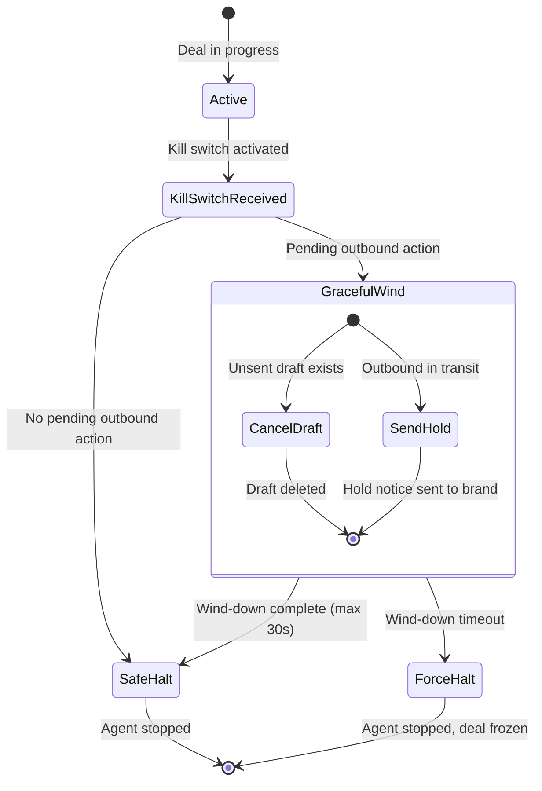
```mermaid
stateDiagram-v2
    [*] --> Active: Deal in progress

    Active --> KillSwitchReceived: Kill switch activated
    
    KillSwitchReceived --> SafeHalt: No pending outbound action
    KillSwitchReceived --> GracefulWind: Pending outbound action

    GracefulWind --> SafeHalt: Wind-down complete (max 30s)
    GracefulWind --> ForceHalt: Wind-down timeout

    SafeHalt --> [*]: Agent stopped
    ForceHalt --> [*]: Agent stopped, deal frozen

    state GracefulWind {
        [*] --> CancelDraft: Unsent draft exists
        [*] --> SendHold: Outbound in transit
        CancelDraft --> [*]: Draft deleted
        SendHold --> [*]: Hold notice sent to brand
    }
```

1. **Immediate actions** (within 1 second of kill switch):
   - All NEW agent actions are blocked.
   - All queued Pub/Sub messages for this creator are paused (Pub/Sub `seek` to future timestamp).

2. **In-flight deal classification**:
   | Deal State | Action |
   |---|---|
   | `DRAFT` (counter-offer not yet sent) | Delete draft. No external communication. |
   | `SENT_AWAITING_RESPONSE` (counter-offer sent, waiting for brand) | No action needed — agent was already idle. Deal state set to `FROZEN`. |
   | `OUTBOUND_IN_TRANSIT` (API call to send message is in progress) | Allow the API call to complete (max 10s timeout). Then set deal to `FROZEN`. |
   | `ACCEPTANCE_PENDING` (agent is about to send deal acceptance) | **Block the acceptance.** Set deal to `FROZEN`. Rationale: accepting a deal is an irreversible action; the creator must explicitly resume. |

3. **FROZEN deal state**: A frozen deal is persisted in MongoDB with `{state: 'FROZEN', frozen_at, frozen_reason: 'KILL_SWITCH', last_action, next_planned_action}`. When the creator reactivates, they see a summary of frozen deals and must explicitly approve or cancel each one.

4. **Brand notification (optional)**: If the deal was in active negotiation (`SENT_AWAITING_RESPONSE` or `OUTBOUND_IN_TRANSIT`), the system sends a templated hold message to the brand contact: *"[Creator Name]'s team is reviewing this opportunity. We'll follow up within 24 hours."* This message is pre-approved by the creator during onboarding (it's part of the kill-switch configuration).
   - The hold message is the ONLY outbound action permitted after kill switch activation.
   - It is sent by a dedicated `deal-freeze-notifier` Cloud Function, not by any agent.

5. **Reactivation flow**: On reactivation (requires biometric auth + 15-minute cooldown):
   - Creator sees a dashboard of all frozen deals with context.
   - For each deal, creator chooses: `RESUME`, `CANCEL`, or `MANUAL` (take over negotiation personally).
   - `RESUME` restarts the agent from the frozen state. The agent re-evaluates the deal context (brand may have responded during downtime).

---

## 5.4 Failure Mode Summary Matrix

| # | Failure | Severity | Blast Radius | Detection Time | RTO | RPO | Auto-Recovery |
|---|---------|----------|-------------|----------------|-----|-----|---------------|
| 1 | Fivetran MCP Down | S2 | Partial | < 30 min | 30 min | 0 | Yes |
| 2 | MongoDB Atlas MCP Down | S1 | System-wide | < 1 min | 5 min | 0–10 min | Partial |
| 3 | Elastic MCP Down | S2 | Partial | < 2 min | 15 min | 0 | Yes |
| 4 | Arize MCP Down | S3 | Isolated | < 10 min | 4 hr | 0 | Yes |
| 5 | GitLab MCP Down | S2 | Partial | < 5 min | 1 hr | 0 | Yes |
| 6 | Dynatrace MCP Down | S2 | System-wide (visibility) | < 2 min | 30 min | N/A | Partial |
| 7 | Gemini API Limit/Outage | S1 | System-wide | < 1 min | Varies | 0 | Yes (fallback model) |
| 8 | Pub/Sub Message Loss | S2 | Partial | < 1 day (audit) | N/A | 0 | Yes (idempotent) |
| 9 | Change Stream Lag | S2 | Partial | < 30 sec | 2 min | 0 | Yes |
| 10 | Stale Personality Graph | S2 | Partial | < 60 min | 30 min | 30 min | Yes |
| 11 | Infinite Agent Loop | S2 | Isolated→Partial | < 5 min | 1 min | 0 | Yes |
| 12 | Message Spoofing | S1 | System-wide | < 1 min (rejected) | N/A | N/A | Yes (rejected at receiver) |
| 13 | Kill Switch + Deal | S1 | Isolated | Instant | 30 sec | 0 | Partial (needs creator) |

---

## 5.5 Cascading Failure Analysis

The most dangerous failure scenarios are those where one failure triggers another. The following cascading paths are identified and mitigated:

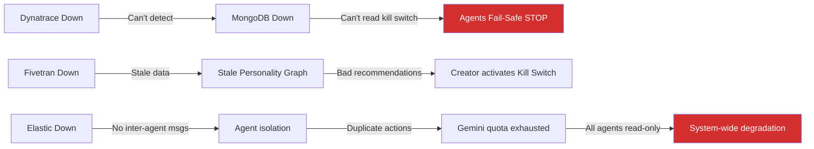
```mermaid
flowchart LR
    A["Dynatrace Down"] -->|"Can't detect"| B["MongoDB Down"]
    B -->|"Can't read kill switch"| C["Agents Fail-Safe STOP"]
    
    D["Fivetran Down"] -->|"Stale data"| E["Stale Personality Graph"]
    E -->|"Bad recommendations"| F["Creator activates Kill Switch"]
    
    G["Elastic Down"] -->|"No inter-agent msgs"| H["Agent isolation"]
    H -->|"Duplicate actions"| I["Gemini quota exhausted"]
    I -->|"All agents read-only"| J["System-wide degradation"]
    
    style C fill:#d32f2f,color:#fff
    style J fill:#d32f2f,color:#fff
```

**Cascade 1: Dynatrace → MongoDB → Fail-Safe Stop**
- Mitigation: Google Cloud Monitoring serves as the secondary watchdog for MongoDB, independent of Dynatrace. Even if Dynatrace is down, MongoDB failures are detected.

**Cascade 2: Fivetran → Stale Graph → Kill Switch**
- Mitigation: Staleness flags and confidence adjustments prevent agents from acting on outdated data with full confidence. The creator sees explicit warnings.

**Cascade 3: Elastic → Agent Isolation → Quota Exhaustion**
- Mitigation: Pub/Sub fallback for inter-agent messaging prevents isolation. Per-agent Gemini token budgets prevent any single agent from exhausting shared quota.

---

## 5.6 Chaos Engineering Program

To validate these failure modes and mitigations, a quarterly chaos engineering program is implemented:

| Experiment | Method | Success Criteria |
|---|---|---|
| MongoDB failover | Atlas test failover (`rs.stepDown()`) | RTO < 5 min, zero data loss, agents resume automatically |
| Elastic kill | Delete Elastic MCP Cloud Run service | Agents switch to Pub/Sub fallback within 30s |
| Gemini quota exhaustion | Inject artificial `429` responses via proxy | P0/P1 requests served, P2/P3 queued |
| Kill switch under load | Activate kill switch during simulated deal negotiation | Deal frozen within 1s, hold message sent within 5s |
| Dynatrace blackhole | Firewall Dynatrace egress | Google Cloud Monitoring alerts fire within 2 min |
| Fivetran stall | Pause all Fivetran connectors | Staleness detected within 30 min, agents enter stale-data mode |

Each experiment is documented, reviewed, and any mitigation gaps are addressed before the next quarter.
# Section 6 — Security Model

> **Scope**: Every credential, every encrypted field, every trust boundary, every key rotation schedule.  
> **Design Principle**: The system autonomously acts on behalf of creators across public platforms. A security breach is not just a data leak — it is an unauthorized action taken in a creator's name. Security is existential.

---

## 6.0 Threat Model Overview

Before specifying controls, we define the adversaries and attack surfaces:

| Threat Actor | Goal | Attack Surface |
|---|---|---|
| External attacker | Steal creator credentials, impersonate creator | External APIs, OAuth tokens, network endpoints |
| Malicious brand contact | Manipulate deal negotiation via spoofed messages | Inter-agent messaging, deal state |
| Compromised MCP partner | Exfiltrate data via a compromised MCP server | MCP communication channels |
| Insider (operator) | Access creator data without authorization | MongoDB, Secret Manager, audit logs |
| Rogue agent (software bug) | Take unauthorized autonomous action | Agent execution pipeline, kill switch |

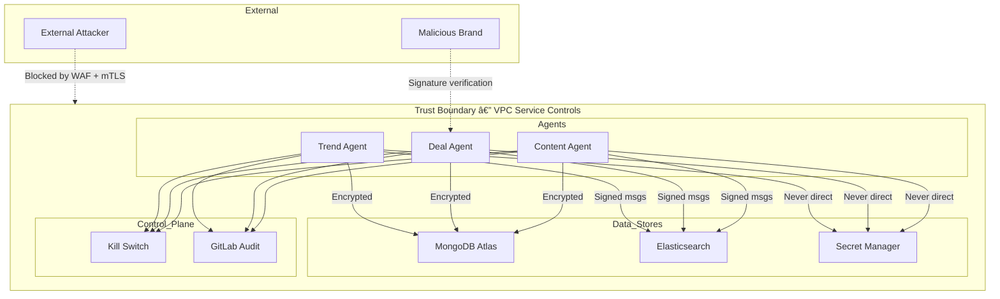
```mermaid
flowchart TD
    subgraph External
        EXT["External Attacker"]
        BRAND["Malicious Brand"]
    end

    subgraph Trust_Boundary["Trust Boundary — VPC Service Controls"]
        subgraph Agents
            A1["Content Agent"]
            A2["Deal Agent"]
            A3["Trend Agent"]
        end

        subgraph Data_Stores
            MONGO["MongoDB Atlas"]
            ELASTIC["Elasticsearch"]
            SM["Secret Manager"]
        end

        subgraph Control_Plane
            KS["Kill Switch"]
            AUDIT["GitLab Audit"]
        end
    end

    EXT -.->|"Blocked by WAF + mTLS"| Trust_Boundary
    BRAND -.->|"Signature verification"| A2
    A1 & A2 & A3 -->|"Encrypted"| MONGO
    A1 & A2 & A3 -->|"Signed msgs"| ELASTIC
    A1 & A2 & A3 -->|"Never direct"| SM
    A1 & A2 & A3 --> KS
    A1 & A2 & A3 --> AUDIT
```

---

## 6.1 Creator Identity Protection

### 6.1.1 Credential Isolation Architecture

Every API credential for every creator for every platform is stored as a **separate secret** in Google Cloud Secret Manager. There is no shared credential store, no credentials in MongoDB, and no credentials in environment variables.

**Secret naming convention**:
```
echomind/{creator_id}/{platform}/api_key
echomind/{creator_id}/{platform}/oauth_token
echomind/{creator_id}/{platform}/refresh_token
```

Example:
```
echomind/creator_7f3a9b/youtube/oauth_token
echomind/creator_7f3a9b/youtube/refresh_token
echomind/creator_7f3a9b/tiktok/api_key
echomind/creator_7f3a9b/instagram/oauth_token
```

**Rationale for one-secret-per-credential**: Secret Manager's IAM policies are per-secret. This enables per-creator, per-platform access control. If a service only needs YouTube access for creator X, it is granted `secretmanager.versions.access` on exactly `echomind/creator_x/youtube/*` — nothing else.

### 6.1.2 MongoDB Credential References

MongoDB documents **never** contain credentials. They contain only Secret Manager resource paths:

```typescript
// MongoDB document schema — credentials collection
interface CreatorCredentialRef {
  creator_id: string;
  platform: 'youtube' | 'tiktok' | 'instagram' | 'twitter' | 'twitch' | 'spotify' | 'patreon';
  secret_path: string;          // e.g., "echomind/creator_7f3a9b/youtube/oauth_token"
  secret_version: string;       // e.g., "latest" or specific version number
  last_rotated_at: Date;
  rotation_due_at: Date;
  status: 'active' | 'rotating' | 'expired' | 'revoked';
}
```

**Rationale**: If MongoDB is compromised, the attacker gets secret paths (useless without Secret Manager IAM permissions), not actual credentials. This is a defense-in-depth layer — even with a full MongoDB dump, no creator platform access is possible.

### 6.1.3 Credential Rotation Schedule

| Credential Type | Rotation Period | Method | Downtime |
|---|---|---|---|
| OAuth Access Tokens | Auto-refresh on expiry (typically 1 hour) | Token Service (§6.6) | 0 — refresh happens before expiry |
| OAuth Refresh Tokens | 90 days | Token Service rotates; old refresh token invalidated after new one is confirmed valid | 0 — overlap window |
| API Keys (static) | 180 days | Cloud Scheduler triggers rotation Cloud Function; new key generated via platform API, old key deprecated after 24h grace period | 0 — dual-key overlap |
| MCP Server Auth Tokens | 30 days | Automated rotation via Cloud Function | 0 — rolling update of Cloud Run services |
| Service Account Keys | Never rotated (use Workload Identity Federation instead) | N/A | N/A |

**Rotation failure handling**: If a rotation fails (platform API error, network issue), the credential remains at its current version, an alert fires in Dynatrace (`credential.rotation.failed`), and the rotation is retried in 1 hour. After 3 failed attempts, the on-call engineer is paged.

### 6.1.4 Service Account Isolation

Each Cloud Run service operates under a dedicated Google Cloud service account with the minimum required IAM roles:

| Service | Service Account | Secret Manager Permissions |
|---|---|---|
| Token Service | `echomind-token-svc@proj.iam` | `secretmanager.versions.access` on `echomind/*/oauth_token`, `echomind/*/refresh_token`; `secretmanager.versions.add` for rotation |
| Content Strategy Agent | `echomind-content-agent@proj.iam` | `secretmanager.versions.access` on `echomind/{assigned_creator}/youtube/*`, `echomind/{assigned_creator}/tiktok/*` |
| Brand Deal Agent | `echomind-deal-agent@proj.iam` | No Secret Manager access — communicates via API gateway, never touches credentials directly |
| Fivetran MCP Worker | `echomind-fivetran-mcp@proj.iam` | `secretmanager.versions.access` on Fivetran API credentials only |

**Rationale**: The Brand Deal Agent negotiates with external parties. It has zero access to credentials, reducing the blast radius if its execution is manipulated.

---

## 6.2 MongoDB Field-Level Encryption (CSFLE)

### 6.2.1 Encryption Architecture

EchoMind uses MongoDB Client-Side Field Level Encryption (CSFLE) with **automatic encryption**. Sensitive fields are encrypted by the MongoDB driver before they leave the application process. MongoDB Atlas never sees plaintext for these fields.

```mermaid
flowchart LR
    APP["Cloud Run App"] -->|"Plaintext"| DRIVER["MongoDB Driver + CSFLE"]
    DRIVER -->|"DEK Request"| KMS["Google Cloud KMS"]
    KMS -->|"Wrapped DEK"| DRIVER
    DRIVER -->|"Ciphertext"| ATLAS["MongoDB Atlas"]
    
    style APP fill:#e8f5e9
    style DRIVER fill:#fff3e0
    style ATLAS fill:#ffebee
```

### 6.2.2 Key Hierarchy

```
Google Cloud KMS
└── CMK (Customer Master Key) — one per EchoMind deployment
    ├── DEK (Data Encryption Key) — one per creator
    │   ├── Encrypts: personality_graph.raw_traits
    │   ├── Encrypts: deal_state.terms
    │   ├── Encrypts: deal_state.financial_details
    │   └── Encrypts: creator_profile.contact_info
    └── DEK (Data Encryption Key) — one per creator
        └── ... (same pattern)
```

**Rationale for per-creator DEKs**: If a single creator's data is compromised (e.g., via a legal discovery request), only that creator's DEK is involved. No other creator's data can be decrypted with that key. This is critical for a multi-creator platform.

**CMK configuration**:
- **Key Ring**: `echomind-keys` in the same region as the Cloud Run services
- **Key**: `echomind-cmk` with `GOOGLE_SYMMETRIC_ENCRYPT` purpose
- **Protection Level**: `HSM` (hardware security module — FIPS 140-2 Level 3)
- **Rotation**: Automatic CMK rotation every 365 days (Google Cloud KMS handles this transparently; old key versions remain available for decryption)

### 6.2.3 Encrypted Fields Specification

| Collection | Field Path | Encryption Algorithm | Queryable? |
|---|---|---|---|
| `creator_profiles` | `contact_info.email` | Deterministic | Equality only |
| `creator_profiles` | `contact_info.phone` | Deterministic | Equality only |
| `creator_profiles` | `contact_info.address` | Random | No |
| `personality_graphs` | `raw_traits` | Random | No |
| `personality_graphs` | `negotiation_profile` | Random | No |
| `deal_states` | `terms.financial` | Random | No |
| `deal_states` | `terms.contract_text` | Random | No |
| `deal_states` | `brand_contact.email` | Deterministic | Equality only |
| `deal_states` | `internal_notes` | Random | No |
| `agent_memory` | `creator_private_context` | Random | No |
| `audit_buffer` | `payload` | Random | No |

**Algorithm choice rationale**:
- **Deterministic**: Used when equality queries are required (e.g., "find all deals with brand contact X"). Deterministic encryption produces the same ciphertext for the same plaintext, enabling equality comparisons on encrypted values. Tradeoff: an attacker with database access can determine if two records have the same value for a deterministic field.
- **Random**: Used for all other sensitive fields. Each encryption produces a unique ciphertext, even for identical plaintext. Provides stronger confidentiality but the field cannot be used in queries, sorts, or indexes.

### 6.2.4 Impact on Query Capability

CSFLE imposes hard constraints on what queries are possible:

| Query Type | Deterministic Fields | Random Fields |
|---|---|---|
| Equality match (`$eq`) | ✅ Supported | ❌ Not supported |
| Range query (`$gt`, `$lt`) | ❌ Not supported | ❌ Not supported |
| Regex (`$regex`) | ❌ Not supported | ❌ Not supported |
| Sort (`sort()`) | ❌ Not supported | ❌ Not supported |
| Aggregation | ❌ Not supported | ❌ Not supported |
| Full-text search | ❌ Not supported | ❌ Not supported |

**Architectural workaround**: For queries that require filtering or sorting on sensitive data, the application must:
1. Fetch all candidate documents using non-encrypted filter fields.
2. Decrypt in-memory.
3. Apply the sensitive filter/sort in application code.

This is intentionally expensive. If a query pattern requires frequent filtering on a sensitive field, that is a design smell — the field's sensitivity classification should be re-evaluated.

### 6.2.5 CSFLE Schema Map

The encryption schema is defined as a JSON Schema and deployed alongside the application. It is version-controlled in GitLab (`/config/mongodb/encryption-schema.json`).

```typescript
// encryption-schema.ts (compiled to JSON)
const encryptionSchema = {
  'echomind.creator_profiles': {
    bsonType: 'object',
    encryptMetadata: {
      keyId: '/creator_id',  // per-creator DEK lookup
    },
    properties: {
      contact_info: {
        bsonType: 'object',
        properties: {
          email: {
            encrypt: {
              bsonType: 'string',
              algorithm: 'AEAD_AES_256_CBC_HMAC_SHA_512-Deterministic',
            },
          },
          phone: {
            encrypt: {
              bsonType: 'string',
              algorithm: 'AEAD_AES_256_CBC_HMAC_SHA_512-Deterministic',
            },
          },
          address: {
            encrypt: {
              bsonType: 'string',
              algorithm: 'AEAD_AES_256_CBC_HMAC_SHA_512-Random',
            },
          },
        },
      },
    },
  },
  // ... other collections follow the same pattern
};
```

---

## 6.3 Audit Trail Tamper-Proofing

### 6.3.1 GitLab as Immutable Audit Log

Every autonomous agent action produces a Git commit in the `echomind-audit` GitLab repository. The commit history IS the audit trail.

**Repository structure**:
```
echomind-audit/
├── creators/
│   ├── {creator_id}/
│   │   ├── actions/
│   │   │   ├── {YYYY-MM-DD}/
│   │   │   │   ├── {action_id}.json
│   │   │   │   └── ...
│   │   ├── deals/
│   │   │   ├── {deal_id}/
│   │   │   │   ├── state_transitions.json
│   │   │   │   └── communications/
│   │   │   │       ├── {message_id}.json
│   │   │   │       └── ...
│   │   └── playbooks/
│   │       ├── content_strategy.yaml
│   │       └── deal_negotiation.yaml
├── system/
│   ├── kill_switch_events/
│   │   ├── {event_id}.json
│   │   └── ...
│   └── config_changes/
│       └── ...
```

### 6.3.2 Protected Branch Configuration

| Branch | Protection Rules | Rationale |
|---|---|---|
| `main` | Merge request required; 1 approval from `echomind-audit-reviewers` group; no force push; no branch deletion | Prevents direct manipulation of the audit history |
| `audit/*` | Push allowed only from `echomind-audit-service` service account; no force push; auto-merged to `main` via CI pipeline after hash-chain verification | Agent actions commit to `audit/*` branches; merge to `main` is automated but verified |

**Push rules**:
- Reject unsigned commits
- Reject commits from non-service-account users (humans cannot commit directly; they must go through the merge request flow)
- Reject commits larger than 10MB (prevents abuse)

### 6.3.3 Signed Commits

Every commit is signed using a GPG key associated with the agent's service account:

```
# Git commit signature flow
1. Agent completes an action
2. Agent serializes the action payload to JSON
3. Agent calls GitLab MCP → create_commit({
     branch: 'audit/{date}',
     message: commitMessage,     // includes hash chain (see §6.3.4)
     actions: [{ action: 'create', file_path: '...', content: payload }],
     author_email: 'echomind-content-agent@proj.iam.gserviceaccount.com',
   })
4. GitLab MCP signs the commit with the service account's GPG key
   (GPG private key stored in Secret Manager; GitLab MCP retrieves it at startup)
5. Commit is pushed to the audit/* branch
```

**GPG key management**:
- One GPG keypair per agent service account
- Private key stored in Secret Manager: `echomind/service_accounts/{agent_type}/gpg_private_key`
- Public key registered in GitLab under the service account's user profile
- Key rotation: annually, with 30-day overlap (old key remains valid for signature verification)

### 6.3.4 Hash Chain Integrity

Each commit message includes a SHA-256 hash that chains to the previous commit, creating a tamper-evident log:

```
commit message format:
---
[{action_type}] {brief_description}

creator_id: {creator_id}
action_id: {action_id}
timestamp: {ISO 8601}
prev_hash: {SHA-256 of previous commit's hash field}
payload_hash: {SHA-256 of the action payload JSON}
chain_hash: {SHA-256(prev_hash + payload_hash + timestamp)}
---
```

**Example**:
```
[DEAL_COUNTEROFFER] Sent counter-offer to Brand X for Creator Y

creator_id: creator_7f3a9b
action_id: act_92f4e1
timestamp: 2026-06-06T08:15:30Z
prev_hash: a3f8c9d2e1b4a5f6c7d8e9f0a1b2c3d4e5f6a7b8c9d0e1f2a3b4c5d6e7f8a9b0
payload_hash: b4c5d6e7f8a9b0c1d2e3f4a5b6c7d8e9f0a1b2c3d4e5f6a7b8c9d0e1f2a3b4c5
chain_hash: c5d6e7f8a9b0c1d2e3f4a5b6c7d8e9f0a1b2c3d4e5f6a7b8c9d0e1f2a3b4c5d6
```

**Verification**: The `chain_hash` of commit N must equal the `prev_hash` of commit N+1. Any tampering (modified payload, inserted/deleted commit, reordered commits) breaks the chain.

### 6.3.5 Periodic Audit Verification

A weekly Cloud Scheduler job triggers the `audit-chain-verifier` Cloud Function:

```typescript
// audit-chain-verifier.ts (pseudocode)
async function verifyAuditChain(): Promise<VerificationResult> {
  const commits = await gitlabMcp.listCommits({
    repository: 'echomind-audit',
    branch: 'main',
    since: lastVerifiedCommitSha,
  });

  let previousChainHash: string | null = lastVerifiedChainHash;

  for (const commit of commits) {
    const parsed = parseCommitMessage(commit.message);

    // 1. Verify GPG signature
    if (!await verifyGpgSignature(commit)) {
      return { status: 'FAILED', reason: 'Invalid GPG signature', commit: commit.sha };
    }

    // 2. Verify hash chain continuity
    if (previousChainHash !== null && parsed.prev_hash !== previousChainHash) {
      return { status: 'FAILED', reason: 'Hash chain broken', commit: commit.sha };
    }

    // 3. Verify payload hash
    const fileContent = await gitlabMcp.getFileContent({
      repository: 'echomind-audit',
      ref: commit.sha,
      filePath: parsed.filePath,
    });
    const computedPayloadHash = sha256(fileContent);
    if (computedPayloadHash !== parsed.payload_hash) {
      return { status: 'FAILED', reason: 'Payload hash mismatch', commit: commit.sha };
    }

    // 4. Verify chain hash
    const computedChainHash = sha256(parsed.prev_hash + parsed.payload_hash + parsed.timestamp);
    if (computedChainHash !== parsed.chain_hash) {
      return { status: 'FAILED', reason: 'Chain hash mismatch', commit: commit.sha };
    }

    previousChainHash = parsed.chain_hash;
  }

  // Store last verified position
  await updateLastVerifiedPosition(commits[commits.length - 1].sha, previousChainHash);

  return { status: 'PASSED', commitsVerified: commits.length };
}
```

**Failure response**: If verification fails, an S1 alert fires immediately. All agent actions are paused (kill switch activated automatically) until the integrity breach is investigated and resolved.

---

## 6.4 Kill Switch Infrastructure

### 6.4.1 Kill Switch Data Model

```typescript
// MongoDB collection: kill_switch
interface KillSwitchState {
  _id: ObjectId;
  creator_id: string;
  is_active: boolean;               // true = agents STOPPED
  activated_at: Date | null;
  activated_by: 'creator' | 'dynatrace_auto' | 'audit_verification' | 'operator';
  activation_reason: string;
  cooldown_expires_at: Date | null;  // reactivation blocked until this time
  last_checked_at: Date;            // updated by read-through cache
}
```

### 6.4.2 Read Path — Every Agent Action

```mermaid
sequenceDiagram
    participant Agent
    participant Cache as Redis Cache (5s TTL)
    participant MongoDB
    
    Agent->>Cache: GET kill_switch:{creator_id}
    alt Cache HIT and age < 5s
        Cache-->>Agent: is_active = false
        Agent->>Agent: Proceed with action
    else Cache MISS or expired
        Cache->>MongoDB: findOne({creator_id})
        MongoDB-->>Cache: {is_active: false}
        Cache-->>Agent: is_active = false
        Agent->>Agent: Proceed with action
    end
    
    Note over Agent,MongoDB: If MongoDB unreachable: default to is_active = true (STOPPED)
```

**5-second TTL rationale**: Balances two constraints:
1. **Responsiveness**: Creator expects kill switch to take effect within seconds, not minutes. 5s is the worst-case delay.
2. **Read load**: Without caching, every agent action queries MongoDB. At peak load (50 agent actions/second), this would add 50 reads/second to the kill switch collection. With 5s TTL, reads are reduced to ~0.2/second per agent instance.

**Implementation**:
```typescript
// kill-switch-checker.ts
class KillSwitchChecker {
  private readonly redis: RedisClient;
  private readonly mongo: MongoClient;
  private readonly CACHE_TTL_SECONDS = 5;
  private readonly CACHE_KEY_PREFIX = 'kill_switch:';

  async isActive(creatorId: string): Promise<boolean> {
    const cacheKey = `${this.CACHE_KEY_PREFIX}${creatorId}`;

    try {
      // Try cache first
      const cached = await this.redis.get(cacheKey);
      if (cached !== null) {
        return JSON.parse(cached).is_active;
      }

      // Cache miss — read from MongoDB
      const state = await this.mongo
        .db('echomind')
        .collection<KillSwitchState>('kill_switch')
        .findOne({ creator_id: creatorId });

      if (!state) {
        // No kill switch record = creator not onboarded; block by default
        return true;
      }

      // Populate cache
      await this.redis.setEx(cacheKey, this.CACHE_TTL_SECONDS, JSON.stringify(state));

      return state.is_active;
    } catch (err) {
      // MongoDB or Redis unreachable — FAIL SAFE: assume kill switch is active
      logger.error('Kill switch check failed, defaulting to ACTIVE', { creatorId, err });
      return true;
    }
  }
}
```

### 6.4.3 Activation Path

```mermaid
sequenceDiagram
    participant Creator as Creator Mobile App
    participant CF as Cloud Function
    participant MongoDB
    participant CS as Change Stream Consumer
    participant Agents as All Active Agent Processes
    participant Redis as Redis Cache

    Creator->>CF: POST /kill-switch/activate (auth: biometric)
    CF->>CF: Verify biometric token (Firebase Auth)
    CF->>MongoDB: findOneAndUpdate creator_config {creator_id, region, kill_switch:false} $set {kill_switch:true, kill_switch_activated_at:now(), kill_switch_reason, kill_switch_activated_by:'creator'}  (use precondition)
    MongoDB-->>CF: acknowledged
    CF-->>Creator: 200 OK — Kill switch activated

    MongoDB->>CS: Change event: kill_switch document updated
    CS->>Redis: DEL kill_switch:{creator_id} (invalidate 5s TTL cache)
    CS->>Agents: Redis Pub/Sub + in-proc bus to echomind:kill_switch:{creator_id} (belt-and-suspenders)
    
    Note over Agents: Each agent receives broadcast within ~1 second
    Agents->>Agents: Halt all in-progress actions (see §5.3.7 for deal handling)
```

**Why Change Stream + Pub/Sub broadcast (belt-and-suspenders)**:
- Change Stream invalidates the Redis cache immediately, so the next agent cache check sees the fresh value.
- Pub/Sub broadcast proactively notifies agents that are between actions (not currently checking the cache). Without this, an idle agent would not know about the kill switch until its next action (could be minutes).
- Both paths must succeed for guaranteed sub-5-second propagation. If either fails, the other provides a backstop.

### 6.4.4 Dynatrace Auto-Trigger Conditions

Dynatrace can automatically activate the kill switch (without creator intervention) under these conditions:

| Condition | Metric | Threshold | Rationale |
|---|---|---|---|
| Repeated agent errors | `agent.action.error_rate` per creator | > 50% over 5 minutes | Agent is malfunctioning; stop before damage |
| Anomalous API calls | `platform_api.calls_per_minute` per creator | > 5× historical p95 | Possible credential compromise or runaway agent |
| Audit chain failure | `audit.chain.verification_status` | = `FAILED` | Tamper detected; stop all actions pending investigation |
| Cost anomaly | `gemini.tokens.cost_per_hour` per creator | > $10/hour (configurable) | Runaway cost; likely infinite loop or abuse |

**Auto-trigger implementation**: Dynatrace Problem → Webhook → Cloud Function → MongoDB write (same path as manual activation, but `activated_by: 'dynatrace_auto'`).

### 6.4.5 Reactivation Requirements

Kill switch reactivation is deliberately difficult:

1. **Biometric authentication**: Creator must authenticate via biometric (Face ID / fingerprint) on the mobile app. No password-only reactivation.
2. **15-minute cooldown**: Reactivation is blocked for 15 minutes after activation. This prevents accidental toggle-on/toggle-off cycles and gives the creator time to review what happened.
3. **Frozen deal review**: If any deals were frozen (§5.3.7), the creator must review and disposition each frozen deal before the system fully resumes.
4. **Audit summary**: The mobile app displays a summary of all actions that occurred in the last hour before kill switch activation, so the creator has full context.

```typescript
// reactivation endpoint
async function reactivateKillSwitch(creatorId: string, biometricToken: string): Promise<ReactivationResult> {
  // 1. Verify biometric
  const authResult = await firebaseAuth.verifyIdToken(biometricToken);
  if (authResult.uid !== creatorId) {
    throw new UnauthorizedError('Biometric verification failed');
  }

  // 2. Check cooldown (15min from kill_switch_activated_at on creator_config)
  const cfg = await mongo.db('echomind').collection('creator_config').findOne({ creator_id: creatorId, region });
  if (cfg && cfg.kill_switch_activated_at && (Date.now() - new Date(cfg.kill_switch_activated_at).getTime() < 15*60*1000)) {
    const remainingMs = 15*60*1000 - (Date.now() - new Date(cfg.kill_switch_activated_at).getTime());
    return { status: 'COOLDOWN', remainingSeconds: Math.ceil(remainingMs / 1000) };
  }

  // 3. Check frozen deals (active_deals)
  const frozenDeals = await mongo.db('echomind').collection('active_deals')
    .find({ creator_id: creatorId, region, stage: 'frozen' }).toArray();
  if (frozenDeals.length > 0) {
    return { status: 'PENDING_DEAL_REVIEW', frozenDeals: frozenDeals.map(d => d.thread_id) };
  }

  // 4. Reactivate via findOneAndUpdate precondition
  await mongo.db('echomind').collection('creator_config').findOneAndUpdate(
    { creator_id: creatorId, region, kill_switch: true },
    { $set: { kill_switch: false, kill_switch_activated_at: null, kill_switch_reason: null, kill_switch_activated_by: null } },
  );

  // 5. Audit log (exact naming per AGENTS)
  await gitlabMcp.commit(repo, `kill_switch_deactivated_${creatorId}_${Date.now()}`, []);

  return { status: 'REACTIVATED' };
}
```

---

## 6.5 Inter-Agent Message Authentication

### 6.5.1 Keypair Provisioning

Each EchoMind agent instance generates an **Ed25519** signing keypair at first boot:

| Property | Value | Rationale |
|---|---|---|
| Algorithm | Ed25519 | 128-bit security level; fast signing (62μs) and verification (174μs); compact signatures (64 bytes); deterministic — no nonce generation vulnerability |
| Private key storage | Google Cloud Secret Manager: `echomind/agents/{agent_instance_id}/ed25519_private_key` | Never on disk; fetched at startup, held in memory |
| Public key publication | Elastic index `echomind_network`, document `{agent_id, agent_type, public_key_hex, registered_at, last_heartbeat}` | All agents can discover peer public keys |

### 6.5.2 Message Signing Protocol

```mermaid
sequenceDiagram
    participant Sender as Sending Agent
    participant MsgSvc as Messaging Service
    participant Elastic
    participant Receiver as Receiving Agent

    Sender->>Sender: Construct message payload
    Sender->>Sender: Generate nonce (UUID v4)
    Sender->>Sender: Compute signatureData = canonicalize({sender_id, recipient_id, timestamp, nonce, payload})
    Sender->>Sender: signature = Ed25519.sign(signatureData, privateKey)
    Sender->>MsgSvc: POST /message {sender_id, recipient_id, timestamp, nonce, payload, signature}

    MsgSvc->>Elastic: Lookup sender public key from echomind_network
    MsgSvc->>MsgSvc: Verify signature
    alt Signature valid
        MsgSvc->>Elastic: Index message in echomind_messages
        MsgSvc->>Receiver: Deliver via Pub/Sub notification
    else Signature invalid
        MsgSvc->>MsgSvc: Log security event
        MsgSvc->>Sender: 403 Forbidden — Invalid signature
    end

    Receiver->>Elastic: Fetch message from echomind_messages
    Receiver->>Elastic: Lookup sender public key from echomind_network
    Receiver->>Receiver: Verify signature (defense-in-depth — even though MsgSvc already verified)
    Receiver->>Receiver: Check nonce not in seen-nonce cache
    Receiver->>Receiver: Check timestamp within 5-minute window
    alt All checks pass
        Receiver->>Receiver: Process message
    else Any check fails
        Receiver->>Receiver: Reject message, log security event
    end
```

### 6.5.3 Message Schema

```typescript
interface AgentMessage {
  message_id: string;           // UUID v4
  sender_id: string;            // agent instance ID
  sender_type: string;          // 'content_strategy' | 'brand_deal' | 'trend_prediction' | ...
  recipient_id: string;         // agent instance ID or '*' for broadcast
  timestamp: string;            // ISO 8601, UTC
  nonce: string;                // UUID v4 — unique per message
  payload: {
    action: string;             // e.g., 'DEAL_OPPORTUNITY', 'TREND_ALERT', 'COORDINATION_REQUEST'
    data: Record<string, unknown>;
  };
  signature: string;            // Ed25519 signature, hex-encoded
}
```

### 6.5.4 Replay Prevention

| Control | Implementation | Window |
|---|---|---|
| Timestamp validation | Reject if `abs(now() - message.timestamp) > 300_000ms` (5 minutes) | ±5 minutes |
| Nonce deduplication | Redis SET `seen_nonces:{nonce}` with TTL 600s (10 minutes, 2× the timestamp window) | 10 minutes |
| Sequence numbers | Per sender-recipient pair, messages include a monotonically increasing `seq` number. Out-of-sequence messages are flagged (but not rejected — network reordering is possible) | Unbounded |

**Rationale for 5-minute window**: Balances clock skew tolerance (Cloud Run instances may have slight clock drift) against replay attack window. 5 minutes is generous for clock skew (NTP keeps instances within <1 second) but keeps the replay window small.

### 6.5.5 Key Rotation

Agent Ed25519 keys are rotated every 90 days:

1. New keypair generated.
2. New public key published to `echomind_network` with `key_version: N+1`.
3. Old public key retained for 48 hours (overlap window for in-flight messages).
4. After 48 hours, old key marked `deprecated` in `echomind_network`.
5. Receiving agents accept signatures from any non-deprecated key version.

---

## 6.6 OAuth Token Security

### 6.6.1 Token Storage

All OAuth tokens are stored in Google Cloud Secret Manager, never in MongoDB or in environment variables (see §6.1 for naming convention). This is a hard architectural constraint enforced at code review.

### 6.6.2 Dedicated Token Service

A dedicated `echomind-token-service` Cloud Run service is the **only** component that interacts with platform OAuth endpoints:

```mermaid
flowchart TD
    subgraph Agents["Agent Processes"]
        CA["Content Agent"]
        BA["Brand Deal Agent"]
        TA["Trend Agent"]
    end

    TS["Token Service (dedicated Cloud Run)"]

    subgraph Platforms["Platform OAuth Endpoints"]
        YT["YouTube OAuth"]
        TK["TikTok OAuth"]
        IG["Instagram OAuth"]
        TW["Twitter OAuth"]
    end

    SM["Secret Manager"]

    CA & BA & TA -->|"GET /token/{creator_id}/{platform}"| TS
    TS -->|"Read token"| SM
    TS -->|"Refresh if expired"| Platforms
    TS -->|"Write refreshed token"| SM
    TS -->|"Return short-lived token"| Agents

    style TS fill:#fff3e0,stroke:#e65100
```

**Why a dedicated service**:
1. **Blast radius reduction**: If an agent is compromised, it cannot directly access or refresh OAuth tokens. It can only request tokens through the Token Service, which enforces access policies.
2. **Centralized refresh logic**: Token refresh is complex (different flows per platform, error handling, rate limiting). Centralizing it prevents bugs in individual agents.
3. **Audit**: Every token access is logged by the Token Service, creating a single point of audit for credential usage.

### 6.6.3 Token Service API

```typescript
// Token Service endpoints
// All endpoints require mTLS client certificate authentication

// GET /token/{creator_id}/{platform}
// Returns a valid access token. If the stored token is expired, refreshes it first.
// Response: { access_token: string, expires_in: number, platform: string }
// The token returned is the actual platform access token — agents use it directly.

// POST /token/{creator_id}/{platform}/revoke
// Revokes the token at the platform's OAuth endpoint and deletes from Secret Manager.
// Called automatically on kill switch activation (§6.6.4).

// GET /token/{creator_id}/{platform}/status
// Returns token health: { status: 'valid' | 'expired' | 'revoked', last_used: Date }
```

### 6.6.4 Token Revocation on Kill Switch

When the kill switch is activated:

1. Change Stream consumer detects kill switch activation.
2. Consumer publishes to `echomind-kill-switch-{creator_id}` Pub/Sub topic.
3. Token Service subscribes to this topic.
4. On kill switch event, Token Service:
   a. Revokes all active access tokens for the creator at each platform's OAuth endpoint.
   b. **Does NOT delete refresh tokens** — these are needed for reactivation. But they are marked `status: 'suspended'` in the credential reference collection.
   c. Any subsequent `GET /token/{creator_id}/*` request returns `403 Forbidden` with `reason: 'KILL_SWITCH_ACTIVE'`.
5. On reactivation: Token Service uses stored refresh tokens to obtain new access tokens. No re-authorization by the creator is needed.

### 6.6.5 Token Scoping

Each platform integration uses the minimum required OAuth scopes:

| Platform | Required Scopes | Explicitly Excluded |
|---|---|---|
| YouTube | `youtube.readonly`, `youtube.upload` (for scheduled posts only) | `youtube.force-ssl` (manage account), `youtubepartner` |
| TikTok | `user.info.basic`, `video.list`, `video.upload` | `user.info.profile` (edit profile) |
| Instagram | `instagram_basic`, `instagram_content_publish` | `instagram_manage_comments` (handled manually by creator) |
| Twitter/X | `tweet.read`, `tweet.write`, `users.read` | `dm.read`, `dm.write` (DMs are off-limits) |
| Twitch | `user:read:email`, `channel:read:stream_key` | `channel:manage:broadcast` (go live decisions are creator-only) |
| Spotify | `user-read-recently-played`, `user-top-read` | `user-modify-playback-state`, `playlist-modify-public` |
| Patreon | `identity`, `campaigns` | `campaigns.members` (member PII) |

**Rationale for each exclusion**: Every excluded scope represents an action that could cause creator harm if taken autonomously. DM access, profile editing, live-streaming control, and member data access are explicitly excluded because they require human judgment.

---

## 6.7 Network Security

### 6.7.1 VPC Service Controls

All Google Cloud resources are enclosed in a VPC Service Controls perimeter:

```mermaid
flowchart TD
    subgraph VPC_Perimeter["VPC Service Controls Perimeter"]
        CR["Cloud Run Services"]
        PS["Pub/Sub"]
        SM["Secret Manager"]
        KMS["Cloud KMS"]
        CS["Cloud Scheduler"]
        BQ["BigQuery"]
        GCS["Cloud Storage"]
        MEM["Memorystore (Redis)"]
    end

    subgraph External_Peered["Peered / Allowlisted"]
        MONGO["MongoDB Atlas (VPC Peering)"]
        ELASTIC["Elastic Cloud (Private Link)"]
        GITLAB["GitLab (IP Allowlist)"]
    end

    subgraph External_Egress["Controlled Egress"]
        FIVETRAN["Fivetran API"]
        ARIZE["Arize API"]
        DYNATRACE["Dynatrace API"]
        GEMINI["Gemini API"]
        PLATFORMS["Platform APIs (YouTube, TikTok, etc.)"]
    end

    VPC_Perimeter --> External_Peered
    VPC_Perimeter -->|"Egress Policy"| External_Egress
```

**Perimeter configuration**:
- **Protected services**: `secretmanager.googleapis.com`, `cloudkms.googleapis.com`, `pubsub.googleapis.com`, `bigquery.googleapis.com`, `storage.googleapis.com`
- **Access levels**: Only Cloud Run services within the perimeter can access protected services. No external access, even with valid credentials.
- **Egress policy**: Egress to MongoDB Atlas, Elastic Cloud, and platform APIs is allowed only from specific Cloud Run service accounts.

### 6.7.2 MongoDB Atlas Network Configuration

| Control | Configuration | Rationale |
|---|---|---|
| VPC Peering | Google Cloud VPC peered with MongoDB Atlas VPC | Traffic never traverses the public internet |
| IP Access List | Only the Google Cloud VPC CIDR range is allowlisted | No direct access from developer machines, CI/CD, or other clouds |
| TLS | TLS 1.3 enforced (`net.tls.mode: requireTLS`) | Encryption in transit even within peered VPCs |
| Authentication | SCRAM-SHA-256 + X.509 certificate authentication for service accounts | Defense-in-depth: even within the VPC, connections must authenticate |

### 6.7.3 mTLS Between Internal Services

All internal service-to-service communication uses mutual TLS (mTLS):

```
Certificate Authority: Google Cloud Certificate Authority Service (CAS)
Certificate Lifetime: 24 hours (short-lived, auto-renewed by Envoy sidecar)
Trust Domain: echomind.internal
```

Each Cloud Run service has an Envoy sidecar proxy that:
1. Presents its own client certificate on outbound connections.
2. Validates the server certificate of the target service.
3. Rejects connections where either certificate is missing, expired, or from a different trust domain.

**Cloud Run specifics**: Cloud Run's built-in service-to-service authentication (via IAM) provides an additional layer. The `run.invoker` role must be granted to the calling service's service account. mTLS adds transport-layer verification on top of IAM's application-layer verification.

### 6.7.4 WAF Configuration

Any external-facing endpoint (creator mobile app API, webhook receivers) is fronted by Google Cloud Armor:

| Rule | Configuration | Action |
|---|---|---|
| OWASP Top 10 | Pre-configured ModSecurity CRS rules | Block |
| Rate limiting | 100 requests/minute per IP for API endpoints | Throttle (429) |
| Geo-restriction | Allow only countries where creators are registered (configurable per creator) | Block |
| Bot protection | reCAPTCHA Enterprise integration for mobile app endpoints | Challenge |
| IP reputation | Google Threat Intelligence feed | Block known-malicious IPs |
| Custom rule: webhook signature | Webhook endpoints validate platform-specific signatures (e.g., YouTube's HMAC, GitLab's X-Gitlab-Token) before processing | Forward only if signature valid; else block |

---

## 6.8 Data Classification and Access Controls

### 6.8.1 Tier Definitions

| Tier | Classification | Examples | Encryption at Rest | Encryption in Transit | Access Control |
|---|---|---|---|---|---|
| **Tier 1: Critical** | API credentials, OAuth tokens, contract documents, GPG private keys | `echomind/*/oauth_token`, `echomind/*/api_key`, deal contract PDFs | AES-256 (Secret Manager default) + CSFLE for contract fields in MongoDB | TLS 1.3 | Secret Manager IAM (per-secret); only Token Service and rotation Cloud Functions |
| **Tier 2: Sensitive** | Creator personality graph, negotiation profiles, deal terms, agent memory with private context | `personality_graphs.raw_traits`, `deal_states.terms`, `agent_memory.creator_private_context` | AES-256 (Atlas at-rest) + CSFLE (per-field) | TLS 1.3 | MongoDB RBAC: read/write only by assigned agent service accounts; CSFLE ensures Atlas operators cannot read plaintext |
| **Tier 3: Internal** | Raw content metrics, predictions, agent interaction logs, platform analytics | `platform_metrics.*`, `predictions.*`, `agent_actions.*` | AES-256 (Atlas at-rest) | TLS 1.3 | MongoDB RBAC: read by any EchoMind service account; write by specific services |
| **Tier 4: Public** | Inter-agent presence data, niche tags, public creator metadata (display name, niche category) | `echomind_network.*`, `niche_tags.*` | AES-256 (Elastic at-rest) | TLS 1.3 | Elastic DLS: read by any EchoMind service; write by messaging service |

### 6.8.2 Access Control Matrix

```mermaid
flowchart LR
    subgraph Tier1["Tier 1 — Critical"]
        T1["Tokens & Keys"]
    end
    subgraph Tier2["Tier 2 — Sensitive"]
        T2["Personality & Deals"]
    end
    subgraph Tier3["Tier 3 — Internal"]
        T3["Metrics & Predictions"]
    end
    subgraph Tier4["Tier 4 — Public"]
        T4["Presence & Tags"]
    end

    TS["Token Service"] --> T1
    CA["Content Agent"] --> T2 & T3
    BA["Brand Deal Agent"] --> T2 & T3
    TA["Trend Agent"] --> T3 & T4
    MS["Messaging Service"] --> T4
    AV["Audit Verifier"] -.->|"read-only"| T3

    style Tier1 fill:#ffcdd2,stroke:#c62828
    style Tier2 fill:#fff9c4,stroke:#f9a825
    style Tier3 fill:#c8e6c9,stroke:#2e7d32
    style Tier4 fill:#bbdefb,stroke:#1565c0
```

### 6.8.3 Tier-Specific Retention Policies

| Tier | Retention | Deletion Method | Rationale |
|---|---|---|---|
| Tier 1 | Revoked on kill switch; rotated per schedule (§6.1.3); deleted on creator account deletion | Secret Manager version destruction + crypto-shredding | Credentials have no value after rotation; prompt deletion reduces exposure window |
| Tier 2 | 2 years after last creator activity, then anonymized | MongoDB TTL index on `last_activity_at` + anonymization job that replaces PII with hashes | Legal retention requirements for deal records; anonymization preserves aggregate analytics value |
| Tier 3 | 1 year, then archived to Cloud Storage (Coldline) | MongoDB TTL index → Cloud Storage lifecycle policy → deletion after 3 years total | Historical metrics have diminishing value; cold storage is cost-effective |
| Tier 4 | 30 days for presence data; indefinite for niche tags | Elastic ILM (Index Lifecycle Management) with `delete` phase at 30 days for presence | Presence data is ephemeral by nature; niche tags are a shared taxonomy |

### 6.8.4 Crypto-Shredding

When a creator deletes their account, their data is rendered unrecoverable via **crypto-shredding**:

1. The creator's DEK (stored in MongoDB's key vault collection) is **destroyed** via Google Cloud KMS: `kms.cryptoKeyVersions.destroy()`.
2. Without the DEK, all CSFLE-encrypted fields in MongoDB become permanently unreadable — even though the ciphertext remains in the database.
3. The ciphertext is then cleaned up asynchronously by a background job (best-effort; the data is already unreadable).
4. Secret Manager secrets for the creator are destroyed: all versions of `echomind/{creator_id}/*` are destroyed.
5. Elastic documents for the creator are deleted by an `echomind-data-deletion` Cloud Function.
6. GitLab audit history is **retained** (legal/compliance requirement) but with creator PII redacted from commit messages by a one-time migration script.

**Rationale**: Crypto-shredding is faster and more reliable than attempting to find and delete every copy of a creator's data across all stores. By destroying the key, all encrypted data becomes noise — regardless of where it exists (backups, replicas, snapshots).

---

## 6.9 Security Monitoring and Incident Response

### 6.9.1 Security Event Taxonomy

| Event ID | Event | Severity | Response |
|---|---|---|---|
| SEC-001 | Invalid message signature detected | HIGH | Log + alert + block message |
| SEC-002 | Kill switch activated (any trigger) | MEDIUM | Log + notify creator |
| SEC-003 | Audit chain verification failure | CRITICAL | Kill switch + S1 page |
| SEC-004 | Credential rotation failure (3 attempts) | HIGH | Page on-call + manual rotation |
| SEC-005 | Unknown agent ID in echomind_network | CRITICAL | Block + kill switch + S1 page |
| SEC-006 | Anomalous platform API call volume | HIGH | Auto-kill-switch (Dynatrace trigger) |
| SEC-007 | Secret Manager access from unexpected service account | CRITICAL | VPC Service Controls audit log → alert → investigate |
| SEC-008 | MongoDB connection from non-VPC IP | CRITICAL | Atlas audit log → alert → block IP → investigate |
| SEC-009 | Token Service invoked after kill switch | HIGH | Log + block + alert (should not happen) |
| SEC-010 | WAF rule triggered on external endpoint | LOW-HIGH | Depends on rule; logged to Cloud Logging |

### 6.9.2 Incident Response Runbook References

Each security event maps to a runbook stored in the `echomind-runbooks` GitLab repository:

```
echomind-runbooks/
├── SEC-001-invalid-signature.md
├── SEC-003-audit-chain-failure.md
├── SEC-005-unknown-agent.md
├── SEC-007-unauthorized-secret-access.md
├── SEC-008-unauthorized-mongo-connection.md
└── ...
```

Runbooks are version-controlled, reviewed quarterly, and tested during tabletop exercises.

---

## 6.10 Compliance and Regulatory Mapping

| Requirement | Implementation Reference |
|---|---|
| GDPR Article 17 (Right to Erasure) | Crypto-shredding (§6.8.4) |
| GDPR Article 25 (Data Protection by Design) | CSFLE (§6.2), minimal token scoping (§6.6.5) |
| GDPR Article 30 (Records of Processing) | GitLab audit trail (§6.3) |
| GDPR Article 32 (Security of Processing) | mTLS (§6.7.3), VPC Service Controls (§6.7.1), encryption tiers (§6.8) |
| SOC 2 Type II — CC6.1 (Logical Access) | Service account isolation (§6.1.4), access control matrix (§6.8.2) |
| SOC 2 Type II — CC7.2 (System Monitoring) | Dynatrace monitoring (§6.4.4), security events (§6.9) |
| SOC 2 Type II — CC8.1 (Change Management) | GitLab protected branches (§6.3.2), playbook versioning |
| PCI DSS 4.0 — Req 3 (Protect Stored Data) | CSFLE for financial deal terms (§6.2.3), Secret Manager for credentials (§6.1) |
| PCI DSS 4.0 — Req 8 (Strong Authentication) | Biometric kill switch reactivation (§6.4.5), mTLS service auth (§6.7.3) |
# 7. Scale Model

> **Scope**: This section specifies how EchoMind Sovereign scales from **1 creator instance** (local development) to **1,000 concurrent creator instances** (production at scale). Every infrastructure component is sized, costed, and analyzed for bottlenecks. All numbers are engineering estimates based on published cloud pricing as of June 2026.

---

## 7.1 Scaling Architecture Decisions

### 7.1.1 Why Google Cloud Run

EchoMind's workload profile is **bursty and heterogeneous**: a creator's agents fire during ingestion windows, scheduled oracle cycles, and ad-hoc content generation — then go idle for hours. This maps directly to Cloud Run's execution model.

| Property | Cloud Run Benefit | Alternative Rejected | Rejection Reason |
|---|---|---|---|
| **Auto-scaling** | Scales to zero when a creator is inactive; scales up per-request | GKE Autopilot | Minimum pod overhead even when idle; complex HPA tuning |
| **Pay-per-use** | Billed per 100ms of vCPU + memory; no charge at zero | Compute Engine | Fixed VM cost regardless of utilization |
| **No idle cost** | A creator who hasn't posted in 3 days costs $0 in compute | Cloud Functions | 9-min timeout too short for graph construction (can run 2–5 min) |
| **Container isolation** | Each creator's agent runs in its own container; no noisy-neighbor | Cloud Run Jobs | Jobs lack HTTP trigger support for Agent Builder callbacks |
| **Concurrency control** | `--concurrency=1` ensures single-threaded agent execution per instance | — | Required for deterministic graph mutation |

**Cold-start mitigation**: Cloud Run `min-instances=1` for the 50 most-active creators. Cost: 50 × ~$7/mo = $350/mo at scale. All other creators accept a 2–5s cold start on first daily invocation.

### 7.1.2 Cloud Run Concurrency Model

Each creator gets **one Cloud Run service per agent type**. This is a deliberate 1:1 mapping:

```
Service naming: echomind-{agent_type}-{creator_id}
Example:        echomind-oracle-cr_abc123
                echomind-graph-cr_abc123
                echomind-content-cr_abc123
                echomind-brand-cr_abc123
                echomind-interagent-cr_abc123
```

**At 1,000 creators × 5 agent types = 5,000 Cloud Run services.**

Cloud Run's per-project service limit is **5,000** (soft limit, raisable to 10,000+). At 1,000 creators this is at the default ceiling. **Mitigation**: request quota increase to 10,000 at the 500-creator mark, or consolidate inter-agent and brand agents into a single service with path-based routing.

**Concurrency setting**: `--concurrency=1` on all agent services. Each container handles exactly one request at a time. This guarantees:

1. No concurrent mutation of a creator's personality graph
2. Deterministic ordering of opinion extraction within a single ingestion batch
3. Simplified error handling — no partial-failure states within a container

**Max instances per service**: `--max-instances=3`. An individual creator's agent should never need more than 3 parallel executions. Burst traffic (e.g., a creator dumps 100 tweets at once) is absorbed by Pub/Sub queue depth, not container fan-out.

### 7.1.3 Agent Builder: Parameterized Agent Definitions

Agent Builder hosts **one agent definition per agent type**, not one per creator. The `creator_id` is a runtime parameter injected via:

1. **Session parameters**: `creator_id` set at session creation by the orchestrator
2. **Tool configuration**: MongoDB connection string and Elastic index names are templated with `{creator_id}` and resolved at invocation time
3. **Prompt parameterization**: System prompts include `creator_id` in the persona context

```
Agent Builder Agents (total: 5 definitions)
├── echomind-oracle-agent        → parameterized by creator_id
├── echomind-graph-agent         → parameterized by creator_id
├── echomind-content-agent       → parameterized by creator_id
├── echomind-brand-agent         → parameterized by creator_id
└── echomind-interagent-agent    → parameterized by creator_id
```

This avoids N×5 agent definitions and keeps the Agent Builder configuration declarative. Agent Builder's per-project agent limit is 100 (soft limit), well above our 5.

### 7.1.4 Pub/Sub: Topic-per-Creator (Decision + Justification)

**Decision**: **Topic-per-creator** with a shared global topic for broadcast events.

**Alternatives evaluated**:

| Approach | Pros | Cons |
|---|---|---|
| **Shared topic + filtering** | Fewer topics to manage; simpler IAM | Filter evaluation cost at high fan-out; no per-creator dead-letter isolation; ordering keys still required |
| **Topic-per-creator** ✅ | Per-creator dead-letter queues; independent retry policies; natural ordering (one subscriber per topic); easier per-creator throughput monitoring | More topics to manage (but Pub/Sub supports 10,000 topics/project) |

**Engineering rationale**: At 1,000 creators, a shared topic with message filtering would require every subscriber to evaluate a filter on every message — O(N) filter evaluations per message where N is the number of subscriptions. With topic-per-creator, each subscription receives only its own messages — O(1) routing. Pub/Sub's per-project topic limit of 10,000 gives us headroom to 2,000 creators (1 task topic + 1 DLQ topic per creator + 2 global topics).

**Topic structure** (detailed in §7.5):

```
echomind-{creator_id}-agent-tasks      → per-creator work queue
echomind-{creator_id}-agent-tasks-dlq  → per-creator dead-letter
echomind-global-events                 → world events broadcast (shared)
echomind-global-events-dlq             → global dead-letter (shared)
```

---

## 7.2 MongoDB Atlas Scaling

### 7.2.1 Sharding Strategy

All collections use a **hashed shard key on `creator_id`**. This is the single most important scaling decision for MongoDB.

**Why hashed, not ranged**:

- `creator_id` values are UUIDs (high cardinality, uniform distribution) — hashed sharding distributes chunks evenly across shards
- Ranged sharding on `creator_id` would create hot spots if IDs are lexicographically ordered (e.g., `cr_aaa...` through `cr_zzz...`)
- All queries include `creator_id` in the filter (enforced by the data access layer), so scatter-gather is avoided

**Shard key definition per collection**:

```javascript
// All collections use the same shard key pattern
db.adminCommand({
  shardCollection: "echomind.raw_content",
  key: { creator_id: "hashed" }
});

// Collections sharded:
// - raw_content            (creator_id: hashed)
// - personality_graph      (creator_id: hashed)
// - opinion_snapshots      (creator_id: hashed)
// - oracle_predictions     (creator_id: hashed)
// - generated_content      (creator_id: hashed)
// - brand_deals            (creator_id: hashed)
// - agent_state            (creator_id: hashed)
// - creator_config         (creator_id: hashed)
```

**Pre-splitting**: At deployment, pre-split into 16 chunks to avoid the initial single-chunk bottleneck:

```javascript
sh.shardCollection("echomind.raw_content", { creator_id: "hashed" }, false, { numInitialChunks: 16 });
```

### 7.2.2 Tier Sizing

| Tier | Creators | Atlas Cluster | vCPUs | RAM | Storage | Estimated Cost/mo |
|---|---|---|---|---|---|---|
| **Dev** | 1–3 | M10 | 2 | 2 GB | 10 GB | $60 |
| **Startup** | 4–10 | M30 | 2 | 8 GB | 40 GB | $500 |
| **Growth** | 11–100 | M50 | 8 | 32 GB | 500 GB | $2,200 |
| **Scale** | 101–500 | M50 × 3 shards | 24 (total) | 96 GB (total) | 1.5 TB | $6,600 |
| **Full Scale** | 501–1000 | M80 × 3 shards | 48 (total) | 384 GB (total) | 3 TB | $18,000 |

**Upgrade triggers**:

- **M10 → M30**: When working set exceeds 1.5 GB (i.e., more than 3 creators with active graphs)
- **M30 → M50**: When p99 query latency on `personality_graph` exceeds 50ms (typically around 15–20 creators)
- **M50 → M50 sharded**: When single-node storage exceeds 400 GB or write throughput exceeds 3,000 ops/sec
- **M50 → M80 sharded**: When per-shard working set exceeds 25 GB or connection count exceeds 1,500

### 7.2.3 Read Replicas for Personality Graph Queries

The `personality_graph` collection is **read-heavy**: the Oracle agent reads the full graph on every prediction cycle (4× daily per topic, 50 topics = 200 reads/day per creator). Writes occur only during graph construction (~50 writes/day per creator).

**Read/write ratio**: ~4:1 on `personality_graph`.

**Strategy**: Configure 2 read replicas (analytics nodes) in the Atlas replica set. Route all Oracle agent reads to `readPreference: secondaryPreferred`.

```typescript
// Oracle agent MongoDB client configuration
const client = new MongoClient(uri, {
  readPreference: ReadPreference.SECONDARY_PREFERRED,
  readConcern: { level: 'majority' },
  maxPoolSize: 10,
});
```

**Replication lag tolerance**: Oracle predictions are not real-time sensitive. A 1–3 second replication lag is acceptable. The graph construction agent writes with `writeConcern: { w: 'majority' }` to ensure durability before acknowledging.

### 7.2.4 Vector Search Scaling

EchoMind uses MongoDB Atlas Vector Search for semantic similarity queries on opinion embeddings within the personality graph.

**Scaling thresholds**:

| Creators | Estimated Vectors | Vector Search Config | Rationale |
|---|---|---|---|
| 1–50 | <500K | Co-located with primary | Working set fits in RAM |
| 51–100 | 500K–1M | Co-located, monitor latency | Approaching memory pressure |
| 101–500 | 1M–5M | **Dedicated search nodes** (S30) | Isolate search workload from transactional queries |
| 501–1000 | 5M–10M | **Dedicated search nodes** (S50 × 2) | High-throughput vector recall with replication |

**Vector dimensions**: 768 (Gemini text-embedding-004 output). Each vector consumes ~3 KB in the HNSW index.

**Memory estimate at 1,000 creators**:
- 10M vectors × 3 KB = **30 GB** of vector index in RAM
- S50 node (64 GB RAM) provides comfortable headroom for index + query buffers

**Dedicated search node trigger**: When vector search p99 latency exceeds 100ms or when `personality_graph` query throughput causes CPU contention on the primary. Practically, this occurs around **100 creators**.

### 7.2.5 Change Stream Scaling

Change Streams power real-time sync from MongoDB to Elastic Cloud (for search indexing) and to the observability pipeline (for agent state tracking).

**Architecture**:

```
MongoDB Change Stream → Cloud Run Worker (per-creator) → Elastic Cloud
```

**Resume token management**: Each Cloud Run worker instance maintains its own resume token, persisted in the `agent_state` collection:

```typescript
interface ChangeStreamCheckpoint {
  creator_id: string;
  collection: string;
  resume_token: BsonDocument;  // opaque MongoDB resume token
  last_updated: Date;
}
```

**Fan-out pattern**: A single change stream watcher per collection per creator. At 1,000 creators with 3 watched collections (`raw_content`, `personality_graph`, `opinion_snapshots`), this means **3,000 change stream cursors**.

**MongoDB Atlas limits**: Change stream cursors count against the connection pool. Each cursor holds one connection. With 3,000 cursors:

- At M50 (1,500 connection limit): insufficient — need sharded cluster or batched change stream approach
- **Mitigation at scale (100+ creators)**: Use a **consolidated change stream watcher** — a single Cloud Run service that opens one change stream on the entire `echomind` database (not per-collection), filters by `creator_id` in the pipeline, and dispatches to per-creator Pub/Sub topics:

```javascript
const pipeline = [
  { $match: { 'ns.coll': { $in: ['raw_content', 'personality_graph', 'opinion_snapshots'] } } }
];
const changeStream = db.watch(pipeline, { fullDocument: 'updateLookup' });
```

This reduces cursor count from 3,000 to **1 per shard** (3 shards = 3 cursors).

### 7.2.6 Connection Pooling

Cloud Run instances are ephemeral. Each instance creates a MongoDB driver connection pool on startup and holds it for the instance lifetime (until scale-to-zero).

**Pool configuration per Cloud Run instance**:

```typescript
const client = new MongoClient(uri, {
  maxPoolSize: 10,        // max 10 connections per instance
  minPoolSize: 2,         // keep 2 warm connections
  maxIdleTimeMS: 30000,   // close idle connections after 30s
  serverSelectionTimeoutMS: 5000,
  connectTimeoutMS: 10000,
});
```

**Connection budget at scale**:

| Tier | Cloud Run Instances (estimated peak) | Connections per Instance | Total Connections | Atlas Limit | Headroom |
|---|---|---|---|---|---|
| 10 creators | ~20 | 10 | 200 | M30: 2,000 | 90% |
| 100 creators | ~150 | 10 | 1,500 | M50: 3,000 | 50% |
| 1000 creators | ~800 | 10 | 8,000 | M80×3: 15,000 | 47% |

**Connection storm mitigation**: Cloud Run cold starts can cause connection storms. The `minPoolSize: 2` setting ensures only 2 connections are created at startup (not 10). The remaining 8 are created on demand.

### 7.2.7 Storage Estimation

**Per-creator storage breakdown**:

| Collection | Estimated Size per Creator | Growth Rate | Notes |
|---|---|---|---|
| `raw_content` | 200 MB | ~5 MB/month | Tweets, posts, transcripts stored as documents |
| `personality_graph` | 150 MB | ~2 MB/month | Nodes + edges + embeddings (768-dim vectors) |
| `opinion_snapshots` | 80 MB | ~3 MB/month | Daily snapshots of opinion positions |
| `oracle_predictions` | 30 MB | ~1 MB/month | Prediction records with reasoning traces |
| `generated_content` | 20 MB | ~1 MB/month | Generated scripts, posts, responses |
| `brand_deals` | 5 MB | ~0.2 MB/month | Brand alignment scores and deal records |
| `agent_state` | 10 MB | ~0.5 MB/month | Checkpoints, resume tokens, agent metadata |
| `creator_config` | 5 MB | Negligible | Static configuration per creator |
| **Total** | **~500 MB** | **~12.7 MB/month** | |

**Aggregate storage at scale**:

| Tier | Creators | Base Storage | Monthly Growth | 12-Month Projection |
|---|---|---|---|---|
| Startup | 10 | 5 GB | 127 MB | 6.5 GB |
| Growth | 100 | 50 GB | 1.27 GB | 65 GB |
| Scale | 1000 | 500 GB | 12.7 GB | 652 GB |

**Index overhead**: Approximately 30% of data size (indexes on `creator_id`, compound indexes, vector search indexes). At 1,000 creators: ~650 GB data + ~195 GB indexes = **~845 GB total**.

---

## 7.3 Elastic Cloud Scaling

### 7.3.1 Index Partitioning Strategy

Elastic Cloud serves two purposes in EchoMind: (1) full-text search across creator content, and (2) inter-agent messaging and event streaming. Each use case has a different indexing strategy.

**Index taxonomy**:

| Index Pattern | Scope | Partitioning | Documents at 1000 Creators | Rationale |
|---|---|---|---|---|
| `creator_{id}_opinion_history` | Per-creator | One index per creator | ~10K docs/creator → 10M total | Isolate creator data; per-creator ILM; security boundary |
| `echomind_messages` | Shared | Time-partitioned (daily rollover) | ~500K msgs/day | High-write, time-decay relevance; ILM auto-delete after 30 days |
| `echomind_network` | Shared | Single index | <1,000 docs | Creator-to-creator relationship graph; tiny, rarely updated |
| `world_events_stream` | Shared | Single index (monthly rollover) | ~1,000 events/month | Real-time news/events; append-only; moderate volume |

### 7.3.2 `echomind_network` — Shared Single Index

Stores the inter-creator network graph: which creators are connected, influence scores, collaboration history.

- **Size**: <1,000 documents (one per creator pair or creator node)
- **Shards**: 1 primary + 1 replica (over-sharding a tiny index wastes resources)
- **Updates**: Batch-updated daily by the inter-agent coordinator
- **Scaling concern**: None. This index is trivially small at any tier.

### 7.3.3 `echomind_messages` — Time-Partitioned with ILM

Inter-agent messages (agent-to-agent task handoffs, status updates, event notifications).

**Index lifecycle management (ILM) policy**:

```json
{
  "policy": {
    "phases": {
      "hot": {
        "min_age": "0ms",
        "actions": {
          "rollover": {
            "max_age": "1d",
            "max_primary_shard_size": "50gb"
          },
          "set_priority": { "priority": 100 }
        }
      },
      "warm": {
        "min_age": "3d",
        "actions": {
          "shrink": { "number_of_shards": 1 },
          "forcemerge": { "max_num_segments": 1 },
          "set_priority": { "priority": 50 }
        }
      },
      "delete": {
        "min_age": "30d",
        "actions": { "delete": {} }
      }
    }
  }
}
```

**Daily volume at scale**:
- 1,000 creators × ~500 messages/day = 500,000 documents/day
- Average document size: ~2 KB
- Daily index size: ~1 GB
- 30-day rolling total: ~30 GB across all time-partitioned indexes

**Shard allocation**: 1 primary + 1 replica per daily index. At 30 active indexes: 60 shards total.

### 7.3.4 `creator_{id}_opinion_history` — Per-Creator Index

Stores the 30-minute sync from MongoDB `opinion_snapshots`. Powers the creator's opinion timeline search and Oracle agent context retrieval.

**Sync mechanism**: A Cloud Run worker reads MongoDB change streams on `opinion_snapshots` and bulk-indexes into Elastic every 30 minutes.

**Per-creator index sizing**:

| Metric | Value |
|---|---|
| Documents per creator | ~10,000 (after 6 months) |
| Average document size | 1.5 KB |
| Index size per creator | ~15 MB (including inverted index overhead) |
| Shards per index | 1 primary + 1 replica |

**At 1,000 creators**: 1,000 indexes × 2 shards = **2,000 shards**. This is the primary Elastic scaling concern (see §7.3.7).

### 7.3.5 `world_events_stream` — Shared Real-Time Index

Ingests world events (news, market data, social trends) that all creator agents reference for prediction context.

- **Ingestion rate**: ~30–50 events/hour (real-time from RSS/API feeds)
- **Document size**: ~5 KB (title, summary, entities, embeddings)
- **Monthly volume**: ~1,000 docs × 5 KB = ~5 MB/month
- **Retention**: 90 days (quarterly rollover)
- **Shards**: 1 primary + 1 replica
- **Scaling concern**: None. Volume is independent of creator count.

### 7.3.6 Shard Allocation Summary

| Tier | Per-Creator Shards | Shared Shards | Total Shards | Node Recommendation |
|---|---|---|---|---|
| 10 creators | 20 | ~65 | ~85 | 2-node cluster (4 GB RAM each) |
| 100 creators | 200 | ~65 | ~265 | 3-node cluster (8 GB RAM each) |
| 1000 creators | 2,000 | ~65 | ~2,065 | Hot-warm architecture (see below) |

### 7.3.7 Hot-Warm Architecture at 1,000 Creators

At 2,000+ shards, a flat cluster topology becomes untenable. Cluster state overhead grows with shard count, and the master node spends excessive time on shard allocation.

**Architecture at scale**:

```
┌─────────────────────────────────────────────────────────┐
│                   Elastic Cluster                       │
│                                                         │
│  ┌──────────┐  ┌──────────┐  ┌──────────┐              │
│  │ Master 1 │  │ Master 2 │  │ Master 3 │  (dedicated)  │
│  └──────────┘  └──────────┘  └──────────┘              │
│                                                         │
│  ┌──────────┐  ┌──────────┐  ┌──────────┐              │
│  │  Hot 1   │  │  Hot 2   │  │  Hot 3   │  (SSD, 32GB) │
│  │ active   │  │ active   │  │ active   │              │
│  │ indexes  │  │ indexes  │  │ indexes  │              │
│  └──────────┘  └──────────┘  └──────────┘              │
│                                                         │
│  ┌──────────┐  ┌──────────┐                             │
│  │  Warm 1  │  │  Warm 2  │  (HDD, 64GB)               │
│  │ archived │  │ archived │                             │
│  │ indexes  │  │ indexes  │                             │
│  └──────────┘  └──────────┘                             │
└─────────────────────────────────────────────────────────┘
```

**Tier assignment rules**:
- **Hot nodes**: `echomind_messages` (current day + 2 previous), all `creator_{id}_opinion_history` for creators active in the last 7 days, `world_events_stream` (current quarter)
- **Warm nodes**: `echomind_messages` (3–30 days old), `creator_{id}_opinion_history` for inactive creators, `world_events_stream` (previous quarters)

**Shard reduction strategy**: At 500+ creators, evaluate consolidating per-creator opinion indexes into a **shared index with routing**:

```json
{
  "settings": {
    "index.routing.allocation.include._tier_preference": "data_hot",
    "number_of_shards": 10,
    "number_of_replicas": 1
  },
  "mappings": {
    "_routing": { "required": true },
    "properties": {
      "creator_id": { "type": "keyword" }
    }
  }
}
```

This reduces 1,000 indexes (2,000 shards) to 1 index (20 shards) with `creator_id` as the routing key. Trade-off: loses per-creator ILM granularity.

---

## 7.4 Gemini API Scaling

### 7.4.1 Rate Limits and Quota

Gemini API enforces per-project quota limits. As of June 2026:

| Model | Default RPM (requests/min) | Default TPM (tokens/min) | Provisioned Throughput Available |
|---|---|---|---|
| Gemini 2.5 Flash | 2,000 RPM | 4,000,000 TPM | Yes (via Google Cloud Sales) |
| Gemini 2.5 Pro | 1,000 RPM | 2,000,000 TPM | Yes |

**EchoMind's Gemini usage profile** (per creator, per day):

| Agent | Operation | Calls/Day | Avg Input Tokens | Avg Output Tokens | Daily Tokens (In+Out) |
|---|---|---|---|---|---|
| Graph Agent | Opinion extraction from content | 50 | 2,000 | 500 | 125,000 |
| Oracle Agent | Prediction generation (50 topics × 4 cycles) | 200 | 3,000 | 1,000 | 800,000 |
| Content Agent | Script/post generation | 10 | 4,000 | 2,000 | 60,000 |
| Brand Agent | Brand alignment scoring | 5 | 2,500 | 500 | 15,000 |
| Inter-Agent | Cross-creator analysis | 3 | 5,000 | 1,500 | 19,500 |
| **Total per creator** | | **268** | | | **1,019,500** |

**Aggregate daily load at scale**:

| Tier | Creators | Calls/Day | Tokens/Day (Input+Output) | Tokens/Min (avg) | Peak RPM (3× avg) |
|---|---|---|---|---|---|
| 10 | 10 | 2,680 | 10.2M | 7,083 | 6 |
| 100 | 100 | 26,800 | 102M | 70,833 | 56 |
| 1000 | 1,000 | 268,000 | 1.02B | 708,333 | 558 |

At 1,000 creators, the average RPM is ~186 (268,000 calls / 1,440 minutes). However, **burst patterns** (all oracle cycles firing at the same scheduled time) can spike to **3× average = ~558 RPM**. This is well within the 2,000 RPM default limit for Gemini 2.5 Flash.

**Token throughput** is the binding constraint: 708K tokens/min average against a 4M TPM limit = **17.7% utilization at average**, **53% at 3× burst**. Comfortable, but requires monitoring.

### 7.4.2 Batching Strategy

**Batch multiple opinion extractions per API call** by concatenating content items into a single prompt:

```typescript
// Instead of 5 separate calls for 5 tweets:
// Call 1: extractOpinion(tweet1) → opinion1
// Call 2: extractOpinion(tweet2) → opinion2
// ...

// Batch into 1 call:
// Call 1: extractOpinions([tweet1, tweet2, tweet3, tweet4, tweet5]) → [op1, op2, op3, op4, op5]
```

**Batching rules**:

| Operation | Batchable? | Batch Size | Rationale |
|---|---|---|---|
| Opinion extraction | ✅ Yes | Up to 10 items per call | Reduces 50 calls → 5 calls; input fits in context window |
| Oracle predictions | ❌ No | 1 per call | Each prediction requires full graph context; cannot share context across topics without quality loss |
| Content generation | ❌ No | 1 per call | Each piece is unique; streaming output required |
| Brand scoring | ✅ Yes | Up to 5 brands per call | Comparative scoring benefits from seeing multiple brands in one prompt |
| Inter-agent analysis | ❌ No | 1 per call | Cross-creator context is unique per pair |

**Effective calls after batching**:

| Agent | Pre-Batching Calls/Day | Post-Batching Calls/Day | Reduction |
|---|---|---|---|
| Graph Agent | 50 | 5–10 | 80–90% |
| Brand Agent | 5 | 1–2 | 60–80% |
| **Total per creator** | **268** | **~215** | **~20%** |

### 7.4.3 Prompt Caching

**Cacheable prompts** (identical across creators):

| Prompt Type | Cache Key | TTL | Savings at 1000 Creators |
|---|---|---|---|
| World events analysis | `world_events:{date}:{event_hash}` | 24 hours | 999 redundant calls eliminated per event |
| System prompts (static portions) | `system:{agent_type}:{version}` | Until deployment | Gemini implicit caching handles this |
| Topic taxonomy definitions | `taxonomy:{version}` | Until update | Saves ~50 tokens/call input |

**Implementation**: Use Gemini's **implicit context caching** (automatically caches repeated prefixes within a project). For world events analysis, implement application-level caching:

```typescript
interface GeminiCache {
  key: string;
  response: GenerateContentResponse;
  created_at: Date;
  ttl_seconds: number;
}

// Stored in MongoDB agent_state collection
// Checked before every Gemini call
// Cache hit rate estimate: 15-25% of all calls
```

**Cost impact of caching**: Cached input tokens are billed at 25% of standard rate. At 20% cache hit rate on input tokens:
- 1,000 creators × 1.02B tokens/day × 20% cached × 75% discount = **~153M tokens/day saved**

### 7.4.4 Quota Planning by Tier

| Tier | Recommended Quota | Provisioned Throughput? | Estimated Monthly Gemini Cost |
|---|---|---|---|
| 10 creators | Default (2,000 RPM) | No | ~$200/mo |
| 100 creators | Default (2,000 RPM) | No | ~$1,800/mo |
| 1000 creators | Elevated (5,000 RPM) | **Yes** — request 2M TPM provisioned | ~$15,000/mo |

---

## 7.5 Google Cloud Pub/Sub Scaling

### 7.5.1 Message Volume Estimation

**Per-creator daily message breakdown**:

| Message Type | Source | Count/Day | Avg Size | Daily Volume |
|---|---|---|---|---|
| Content ingestion tasks | External ingest → Graph Agent | 50 | 2 KB | 100 KB |
| Graph update notifications | Graph Agent → Oracle Agent | 50 | 0.5 KB | 25 KB |
| Oracle prediction triggers | Cloud Scheduler → Oracle Agent | 200 | 0.3 KB | 60 KB |
| Content generation requests | Oracle → Content Agent | 10 | 1 KB | 10 KB |
| Brand evaluation requests | Scheduler → Brand Agent | 5 | 1 KB | 5 KB |
| Inter-agent messages | Any → Inter-Agent Agent | 3 | 2 KB | 6 KB |
| State sync events | Agents → Elastic sync worker | 150 | 0.5 KB | 75 KB |
| Monitoring/health pings | All agents → monitoring | 32 | 0.1 KB | 3.2 KB |
| **Total per creator** | | **~500** | | **~284 KB** |

### 7.5.2 Aggregate Volume at Scale

| Tier | Creators | Messages/Day | Data/Day | Messages/Month | Monthly Cost |
|---|---|---|---|---|---|
| 10 | 10 | 5,000 | 2.8 MB | 150,000 | ~$0.06 |
| 100 | 100 | 50,000 | 28 MB | 1,500,000 | ~$0.60 |
| 1000 | 1,000 | 500,000 | 284 MB | 15,000,000 | ~$6.00 |

Pub/Sub pricing: $0.04 per million messages (first 10 GB/month free). **Pub/Sub cost is negligible at all tiers.**

Pub/Sub throughput limits: 10,000 messages/sec per topic, 1 GB/sec per project. At 1,000 creators, peak throughput = ~500K messages/day ÷ 86,400 seconds = ~6 msg/sec average, ~50 msg/sec burst. **Well within limits.**

### 7.5.3 Topic Structure

```
Per-Creator Topics (× N creators):
├── echomind-{creator_id}-agent-tasks
│   ├── Subscription: echomind-{creator_id}-graph-sub
│   ├── Subscription: echomind-{creator_id}-oracle-sub
│   ├── Subscription: echomind-{creator_id}-content-sub
│   ├── Subscription: echomind-{creator_id}-brand-sub
│   └── Subscription: echomind-{creator_id}-interagent-sub
│
├── echomind-{creator_id}-agent-tasks-dlq
│   └── Subscription: echomind-{creator_id}-dlq-monitor-sub
│
Global Topics:
├── echomind-global-events
│   └── Subscription: echomind-global-events-sub (fan-out to all creators)
│
└── echomind-global-events-dlq
    └── Subscription: echomind-global-events-dlq-monitor-sub
```

**Resource count at 1,000 creators**:

| Resource | Count | Pub/Sub Limit | Utilization |
|---|---|---|---|
| Topics | 2,002 (2 per creator + 2 global) | 10,000 | 20% |
| Subscriptions | 7,002 (7 per creator + 2 global) | 10,000 | 70% |

**Subscription limit concern**: At 1,000 creators with 7 subscriptions each, we consume 70% of the default 10,000 subscription limit. **Mitigation**: Request quota increase to 20,000 at the 700-creator mark, or consolidate per-agent subscriptions into a single subscription with message attribute filtering:

```typescript
// Instead of 5 subscriptions per creator topic, use 1 subscription + attribute filter
// Message published with attribute: { agent_type: "oracle" }
// Subscriber filters: attributes.agent_type = "oracle"
```

This reduces subscriptions from 7,002 to 2,002 (2 per creator + 2 global).

### 7.5.4 Dead Letter Queue Configuration

Each creator's DLQ is configured with a maximum delivery attempt of **5** and an exponential backoff:

```typescript
const subscription = pubsub.topic(topicName).subscription(subName, {
  deadLetterPolicy: {
    deadLetterTopic: `echomind-${creatorId}-agent-tasks-dlq`,
    maxDeliveryAttempts: 5,
  },
  retryPolicy: {
    minimumBackoff: { seconds: 10 },
    maximumBackoff: { seconds: 600 }, // 10 minutes max
  },
});
```

**DLQ monitoring**: A Cloud Function triggers on DLQ message arrival, logs the failure, and sends an alert to the observability pipeline. At 1,000 creators, DLQ volume should be <0.1% of total messages (~500 messages/day).

### 7.5.5 Message Ordering

**Ordering key**: `creator_id` on all per-creator topic messages. This ensures sequential processing within a single creator's agent pipeline.

```typescript
const message = {
  data: Buffer.from(JSON.stringify(payload)),
  orderingKey: creatorId,
  attributes: {
    agent_type: 'oracle',
    priority: 'normal',
    created_at: new Date().toISOString(),
  },
};

await topic.publishMessage(message);
```

**Trade-off**: Ordering keys reduce throughput to ~1,000 messages/sec per ordering key (not a concern at our volumes) and require the publisher to handle `FAILED_PRECONDITION` errors by resuming publishing after the ordering key becomes unblocked.

---

## 7.6 Cost Model

### 7.6.1 10 Creators — Startup Tier

| Component | Service | Configuration | Monthly Cost |
|---|---|---|---|
| **MongoDB Atlas** | M30 dedicated cluster | 2 vCPU, 8 GB RAM, 40 GB storage | $500 |
| **Elastic Cloud** | 2-node cluster | 4 GB RAM each, 120 GB storage | $300 |
| **Google Cloud Run** | 10 creators × 5 agents | ~20 instances, minimal invocations | $50 |
| **Gemini API** | 2,680 calls/day, 10.2M tokens/day | Flash pricing: ~$0.075/1M input, ~$0.30/1M output | $200 |
| **Cloud Pub/Sub** | 5,000 msgs/day | First 10 GB free | $5 |
| **Cloud Scheduler** | 10 creators × 4 cron jobs | 3 free per account + $0.10/job/month | $4 |
| **Fivetran** | Data connectors (social APIs) | Per-connector pricing, ~3 connectors | $200 |
| **Arize** | ML observability | Startup plan | $100 |
| **Dynatrace** | Infrastructure monitoring | Small host license | $100 |
| **GitLab** | Source control + CI/CD | Free tier (5 users) | $0 |
| **Artifact Registry** | Container images | <1 GB stored | ~$1 |
| **Cloud Logging** | Centralized logs | <50 GB/mo ingestion | Included |
| | | | |
| **Total** | | | **~$1,460/mo** |

**Per-creator cost**: ~$146/creator/month

### 7.6.2 100 Creators — Growth Tier

| Component | Configuration at 100 Creators | Scaling Factor | Monthly Cost |
|---|---|---|---|
| **MongoDB Atlas** | M50 cluster (8 vCPU, 32 GB RAM, 500 GB) | 4.4× (tier jump, not linear) | $2,200 |
| **Elastic Cloud** | 3-node cluster (8 GB RAM each, 500 GB) | 3.3× (shard growth + query load) | $1,000 |
| **Cloud Run** | ~150 instances peak, moderate invocations | 7.5× | $375 |
| **Gemini API** | 26,800 calls/day, 102M tokens/day | 10× (no volume discount at this tier) | $1,800 |
| **Cloud Pub/Sub** | 50,000 msgs/day | 10× but still negligible | $10 |
| **Cloud Scheduler** | 100 × 4 cron jobs + overhead | ~$0.10/job | $45 |
| **Fivetran** | 100 creator connectors, volume scaling | Per-row pricing increases | $800 |
| **Arize** | Growth plan (higher trace volume) | Trace volume ~10× | $500 |
| **Dynatrace** | Multi-host license (3-5 hosts) | Host count grows with infrastructure | $400 |
| **GitLab** | Premium tier (10 users, CI minutes) | Paid plan needed for CI/CD | $190 |
| **Artifact Registry** | ~5 GB stored | Moderate container churn | $5 |
| **Cloud Logging** | ~200 GB/mo ingestion | $0.50/GB after free tier | $75 |
| **Cloud CDN / LB** | Load balancing for API gateway | Minimal at this scale | $50 |
| | | | |
| **Total** | | | **~$7,450/mo** |

**Per-creator cost**: ~$74.50/creator/month (49% reduction from startup due to shared infra amortization)

### 7.6.3 1,000 Creators — Scale Tier

| Component | Configuration at 1,000 Creators | Monthly Cost | % of Total |
|---|---|---|---|
| **MongoDB Atlas** | M80 × 3 shards + 2 analytics nodes + S50 search nodes | $18,000 | 30.7% |
| **Elastic Cloud** | Hot-warm cluster: 3 hot (32 GB) + 2 warm (64 GB) + 3 master | $6,500 | 11.1% |
| **Cloud Run** | ~800 instances peak, 5,000 services | $3,000 | 5.1% |
| **Gemini API** | 268K calls/day, 1.02B tokens/day, provisioned throughput | $15,000 | 25.6% |
| **Cloud Pub/Sub** | 500K msgs/day, 2,002 topics | $50 | 0.1% |
| **Cloud Scheduler** | 1,000 × 4 jobs | $400 | 0.7% |
| **Fivetran** | 1,000 creator connectors, enterprise contract | $4,000 | 6.8% |
| **Arize** | Enterprise plan (high trace volume) | $2,000 | 3.4% |
| **Dynatrace** | Full-stack enterprise (10+ hosts) | $2,500 | 4.3% |
| **GitLab** | Ultimate tier (CI/CD + security scanning) | $600 | 1.0% |
| **Artifact Registry** | ~20 GB stored | $10 | 0.0% |
| **Cloud Logging** | ~1 TB/mo ingestion | $350 | 0.6% |
| **Cloud CDN / LB** | Multi-region load balancing | $500 | 0.9% |
| **Network Egress** | Cross-region + internet egress | $300 | 0.5% |
| **Secret Manager** | 1,000+ secrets (API keys per creator) | $50 | 0.1% |
| **Cloud Armor** | WAF + DDoS protection | $200 | 0.3% |
| **Dedicated Support** | Google Cloud Premium Support | $3,000 | 5.1% |
| | | | |
| **Total** | | **~$56,460/mo** | **100%** |

**Per-creator cost**: ~$56.46/creator/month (61% reduction from startup)

### 7.6.4 Cost-Dominant Component Analysis

```mermaid
pie title Monthly Cost Distribution at 1000 Creators
    "MongoDB Atlas" : 18000
    "Gemini API" : 15000
    "Elastic Cloud" : 6500
    "Fivetran" : 4000
    "Cloud Run" : 3000
    "Google Support" : 3000
    "Dynatrace" : 2500
    "Arize" : 2000
    "Other" : 2460
```

**Top 3 cost drivers**:

1. **MongoDB Atlas (30.7%)** — Dominated by M80 sharded cluster cost. The sharding requirement at 1,000 creators drives the tier to M80.
2. **Gemini API (25.6%)** — Dominated by Oracle agent token consumption (200 calls/day/creator). This is the fastest-growing cost component.
3. **Elastic Cloud (11.1%)** — Driven by per-creator index shard count. Hot-warm architecture mitigates but doesn't eliminate.

### 7.6.5 Cost Optimization Strategies at Scale

| Strategy | Component | Estimated Savings | Trade-off |
|---|---|---|---|
| **Reduce Oracle frequency** | Gemini API | 50% (~$7,500/mo) | Reduce from 4 cycles/day to 2; predictions are less fresh |
| **Shared Elastic index** | Elastic Cloud | 40% (~$2,600/mo) | Lose per-creator ILM; more complex queries |
| **Gemini Flash over Pro** | Gemini API | 60% if any Pro usage exists | Lower quality on complex reasoning tasks |
| **Reserved MongoDB instances** | MongoDB Atlas | 25% (~$4,500/mo) | 1-year commit; less flexibility |
| **Spot/preemptible Cloud Run** | Cloud Run | 60% (~$1,800/mo) | Possible cold-start increase; not suitable for latency-sensitive agents |
| **Prompt compression** | Gemini API | 15% (~$2,250/mo) | Engineering effort to compress graph context |
| **Tiered creator activity** | All components | 20–30% across the board | Only 30% of creators are active daily; scale down idle creator resources |

**Realistic optimized total at 1,000 creators**: ~$38,000–$42,000/mo (applying reserved instances + Oracle frequency reduction + tiered activity).

---

## 7.7 Bottleneck Analysis

### 7.7.1 Bottlenecks at 10 Creators (Startup)

| Rank | Bottleneck | Symptom | Mitigation |
|---|---|---|---|
| 1 | **MongoDB connection limits on M30** | Occasional `MongoServerError: too many open connections` during parallel agent runs | Reduce `maxPoolSize` to 5; stagger agent scheduling to avoid simultaneous cold starts |
| 2 | **Gemini API latency variance** | Oracle predictions occasionally take 15–30s due to Gemini cold model loads | Implement timeout + retry with exponential backoff; set 45s Cloud Run request timeout |
| 3 | **Elastic indexing lag** | Opinion history search returns stale data (30-min sync + indexing delay) | Reduce sync interval to 5 minutes for active creators; use `refresh_interval: 5s` on hot indexes |

### 7.7.2 Bottlenecks at 100 Creators (Growth)

| Rank | Bottleneck | Symptom | Mitigation |
|---|---|---|---|
| 1 | **MongoDB working set exceeds RAM** | p99 read latency on `personality_graph` spikes to 200ms+ | Upgrade to M50; enable read replicas for Oracle agent reads; add compound indexes on hot query patterns |
| 2 | **Cloud Run service count (500)** | Approaching default service limit (5,000) with growth trajectory | Request quota increase proactively; evaluate agent consolidation (combine brand + inter-agent into single service) |
| 3 | **Elastic shard count (265)** | Cluster state updates slow; master node CPU at 70%+ | Consolidate `echomind_messages` shards with ILM; evaluate shared opinion index with routing |

### 7.7.3 Bottlenecks at 1,000 Creators (Scale)

| Rank | Bottleneck | Symptom | Mitigation |
|---|---|---|---|
| 1 | **Elastic shard count (2,065)** | Master node overwhelmed; shard rebalancing takes hours; cluster yellow during node replacement | **Mandatory migration to shared opinion index with routing** — reduces shards from 2,065 to ~85. Deploy dedicated master nodes (3×). |
| 2 | **MongoDB change stream cursor count** | 3,000 cursors exceed connection limits; `MongoServerError: cursor not found` on resume | **Mandatory migration to consolidated change stream watcher** — one cursor per shard (3 cursors) with Pub/Sub fan-out (see §7.2.5) |
| 3 | **Gemini API token throughput at burst** | Scheduled oracle cycles for 1,000 creators fire simultaneously; token throughput hits 2M+ TPM | **Stagger oracle schedules** — distribute 1,000 creators across a 15-minute window (4 creators/second start rate). Implement client-side rate limiter with token bucket algorithm. Request provisioned throughput from Google. |

### 7.7.4 Scaling Cliff Summary

```mermaid
graph LR
    subgraph "10 Creators"
        A["MongoDB M30<br/>connections"]
    end
    subgraph "100 Creators"
        B["MongoDB RAM<br/>working set"]
        C["Cloud Run<br/>service count"]
    end
    subgraph "500 Creators"
        D["Elastic shards<br/>&gt;1000"]
        E["Pub/Sub subscriptions<br/>&gt;7000"]
    end
    subgraph "1000 Creators"
        F["Elastic master<br/>overwhelmed"]
        G["Change stream<br/>cursors"]
        H["Gemini burst<br/>throughput"]
    end

    A -->|"Upgrade to M50"| B
    B -->|"Add sharding"| D
    C -->|"Request quota"| E
    D -->|"Shared index migration"| F
    E -->|"Consolidate subs"| F
    F -->|"Dedicated masters"| I["Stable at 1000"]
    G -->|"Consolidated watcher"| I
    H -->|"Stagger + provision"| I
```

### 7.7.5 First Cost-Dominant Component

**MongoDB Atlas becomes cost-dominant first**, overtaking Gemini API at approximately **200 creators**. This is because:

1. MongoDB requires a **tier jump** from M50 (single node) to M50 × 3 shards at ~100 creators — a 3× cost increase for incremental capacity
2. Gemini API scales linearly with creator count (no tier jumps)
3. At 200 creators: MongoDB ≈ $6,600/mo vs. Gemini ≈ $3,600/mo

**MongoDB remains cost-dominant through 1,000 creators** unless reserved instances are purchased (25% discount).

---

## 7.8 Multi-Region Strategy

### 7.8.1 When to Go Multi-Region

**Trigger**: >500 creators with **geographic distribution** across 2+ continental regions (e.g., NA + EU, or NA + APAC).

**Do not go multi-region for**:
- Pure scale (1,000 creators in a single region is fully supported by the architecture above)
- Redundancy alone (Atlas and Elastic Cloud provide intra-region HA with replica sets and shard replicas)

**Go multi-region when**:
- Data residency regulations require it (GDPR for EU creators, PIPL for China-based creators)
- p99 latency to creator-facing APIs exceeds 200ms due to geographic distance
- Business continuity requires RTO < 5 minutes (single-region failure recovery is typically 10–30 minutes)

### 7.8.2 Multi-Region Topology

```mermaid
graph TB
    subgraph "Region: us-central1 (Primary)"
        US_CR["Cloud Run<br/>US Creators"]
        US_MONGO["MongoDB Atlas<br/>US Shard"]
        US_ELASTIC["Elastic Cloud<br/>US Cluster"]
        US_PUBSUB["Pub/Sub<br/>US Topics"]
    end

    subgraph "Region: europe-west1"
        EU_CR["Cloud Run<br/>EU Creators"]
        EU_MONGO["MongoDB Atlas<br/>EU Shard"]
        EU_ELASTIC["Elastic Cloud<br/>EU Cluster"]
        EU_PUBSUB["Pub/Sub<br/>EU Topics"]
    end

    subgraph "Global Services"
        GLB["Cloud Load Balancer<br/>(Global)"]
        GEMINI["Gemini API<br/>(Global endpoint)"]
        SCHEDULER["Cloud Scheduler<br/>(per-region)"]
    end

    GLB --> US_CR
    GLB --> EU_CR
    US_CR --> US_MONGO
    US_CR --> US_ELASTIC
    US_CR --> GEMINI
    EU_CR --> EU_MONGO
    EU_CR --> EU_ELASTIC
    EU_CR --> GEMINI

    US_MONGO <-->|"Atlas Global Cluster<br/>bi-directional sync"| EU_MONGO
    US_ELASTIC <-->|"CCR<br/>cross-cluster replication"| EU_ELASTIC
```

### 7.8.3 MongoDB Atlas Global Clusters

Atlas Global Clusters provide **zone-sharding**: each creator's data is pinned to a geographic zone based on their `region` field.

**Configuration**:

```javascript
// Zone-sharded collection
sh.shardCollection("echomind.raw_content", { region: 1, creator_id: "hashed" });

// Zone mapping
sh.addShardTag("shard-us", "US");
sh.addShardTag("shard-eu", "EU");
sh.addTagRange("echomind.raw_content", { region: "US", creator_id: MinKey }, { region: "US", creator_id: MaxKey }, "US");
sh.addTagRange("echomind.raw_content", { region: "EU", creator_id: MinKey }, { region: "EU", creator_id: MaxKey }, "EU");
```

**Key properties**:

| Property | Value |
|---|---|
| Shard key | `{ region: 1, creator_id: "hashed" }` (compound) |
| Write latency (local region) | <10ms |
| Read latency (local region) | <5ms |
| Cross-region replication lag | 50–150ms (depending on distance) |
| Consistency model | Causal consistency within a session; eventual across regions |
| Failover RTO | <60 seconds (automatic) |

**Data residency enforcement**: The `region` field is set at creator onboarding and is **immutable**. All queries from EU Cloud Run instances include `region: "EU"` in the filter, which Atlas routes to the EU shard. EU creator data never resides on US shards.

**Cost impact**: Global Clusters add approximately **40–60%** to the base Atlas cost due to cross-region replication and additional shard infrastructure.

### 7.8.4 Elastic Cloud Cross-Cluster Replication (CCR)

Elastic CCR replicates indexes from a **leader cluster** to **follower clusters** in other regions.

**Replication topology**:

| Index | Leader | Follower(s) | Rationale |
|---|---|---|---|
| `echomind_network` | us-central1 | europe-west1 | Global read access; writes only from primary |
| `echomind_messages` | Per-region (local) | None | Messages are region-local; no cross-region sync needed |
| `world_events_stream` | us-central1 | europe-west1 | Global read access; single ingestion point |
| `creator_{id}_opinion_history` | Creator's home region | None | Data stays in creator's region (residency) |

**CCR lag**: Typically 1–5 seconds for small indexes (`echomind_network`, `world_events_stream`). Acceptable for these use cases.

**Cost impact**: CCR requires an Elastic Cloud cluster in each region. At 2 regions: approximately **80–100% increase** in Elastic costs.

### 7.8.5 Cloud Run Multi-Region Deployment

Cloud Run services are deployed **per-region**. A global Cloud Load Balancer routes traffic to the nearest region.

**Deployment strategy**:

```yaml
# Cloud Run service deployment per region
regions:
  - us-central1:
      services: echomind-{agent_type}-{creator_id}  # US creators only
      min_instances: 1  # for top-50 active US creators
  - europe-west1:
      services: echomind-{agent_type}-{creator_id}  # EU creators only
      min_instances: 1  # for top-50 active EU creators
```

**Creator-region binding**: Each creator is assigned a `home_region` at onboarding. Their Cloud Run services are deployed **only** in their home region. The global load balancer routes based on creator_id → region mapping stored in Cloud CDN edge config.

**Cross-region agent communication**: When an EU creator's inter-agent needs to query a US creator's data (e.g., for network analysis), the request goes through the global load balancer to the US region's inter-agent service. This adds ~80–120ms of cross-region latency, which is acceptable for async inter-agent operations.

### 7.8.6 Data Residency Requirements

| Data Type | Residency Rule | Implementation |
|---|---|---|
| `raw_content` | Must stay in creator's region | Zone-sharded by `region` in Atlas |
| `personality_graph` | Must stay in creator's region | Zone-sharded by `region` in Atlas |
| `opinion_snapshots` | Must stay in creator's region | Zone-sharded by `region` in Atlas |
| `oracle_predictions` | Must stay in creator's region | Zone-sharded by `region` in Atlas |
| `generated_content` | Must stay in creator's region | Zone-sharded by `region` in Atlas |
| `brand_deals` | Must stay in creator's region | Zone-sharded by `region` in Atlas |
| `echomind_network` | Global (no PII) | Replicated to all regions |
| `world_events_stream` | Global (public data) | Replicated to all regions |
| `echomind_messages` | Region-local (transient) | No replication; 30-day TTL |
| Gemini API calls | Routed to nearest Gemini endpoint | Google's global Gemini infrastructure handles this |
| Pub/Sub topics | Region-local | Per-creator topics created in creator's region |

**GDPR-specific controls**:

- EU creator data deletion: Right-to-erasure triggers a cascading delete across Atlas (zone-targeted), Elastic (per-creator index delete), and Pub/Sub (topic + DLQ delete)
- Data processing agreement (DPA) with Google Cloud and MongoDB Atlas required
- Elastic Cloud deployments in EU use GCP `europe-west1` (Belgium) or `europe-west3` (Frankfurt)

### 7.8.7 Multi-Region Cost Impact

| Component | Single-Region Cost (1000 creators) | Multi-Region Cost (1000 creators, 2 regions) | Increase |
|---|---|---|---|
| MongoDB Atlas | $18,000/mo | $28,800/mo | +60% |
| Elastic Cloud | $6,500/mo | $12,000/mo | +85% |
| Cloud Run | $3,000/mo | $4,500/mo | +50% |
| Cloud Load Balancer | $500/mo | $800/mo | +60% |
| Network Egress (cross-region) | $300/mo | $1,200/mo | +300% |
| **Total infrastructure** | **~$56,460/mo** | **~$82,000/mo** | **+45%** |

**Recommendation**: Delay multi-region until the business case (>500 creators with geographic spread or regulatory mandate) justifies the ~45% cost increase. Single-region with Atlas read replicas provides adequate read latency for most use cases up to that threshold.

---

## 7.9 Scaling Decision Matrix

A consolidated reference for infrastructure decisions at each scaling threshold:

| Threshold | Action Required | Lead Time | Risk if Delayed |
|---|---|---|---|
| **5 creators** | Upgrade MongoDB M10 → M30 | 1 hour (Atlas online scaling) | Connection failures |
| **20 creators** | Upgrade MongoDB M30 → M50 | 1 hour | Query latency degradation |
| **50 creators** | Add MongoDB read replicas for Oracle reads | 2 hours | Oracle prediction latency |
| **100 creators** | Deploy dedicated MongoDB Vector Search nodes (S30) | 4 hours | Vector search timeout |
| **100 creators** | Migrate to consolidated change stream watcher | 1–2 sprints (code change) | Connection exhaustion |
| **100 creators** | Upgrade Elastic to 3-node cluster | 1 hour (Elastic Cloud scaling) | Search latency |
| **200 creators** | MongoDB M50 → M50 × 3 shards | 4–8 hours (initial sharding) | Write throughput ceiling |
| **500 creators** | Migrate Elastic per-creator indexes to shared index + routing | 2–3 sprints (code + data migration) | Elastic master node failure |
| **500 creators** | Request Cloud Run service quota increase to 10,000 | 1–3 business days (Google support) | Cannot deploy new creator services |
| **500 creators** | Request Pub/Sub subscription quota increase to 20,000 | 1–3 business days (Google support) | Cannot create new subscriptions |
| **700 creators** | Evaluate multi-region (if geographic spread warrants) | 2–3 months (architecture + migration) | Latency and compliance issues |
| **800 creators** | Upgrade MongoDB M50 shards → M80 shards | 2–4 hours | Working set thrashing |
| **1000 creators** | Request elevated Gemini API quota (5,000 RPM) | 1–2 weeks (Google Cloud sales) | API throttling at burst |
| **1000 creators** | Deploy Elastic hot-warm architecture with dedicated masters | 1 sprint (cluster reconfiguration) | Cluster instability |
| **1000 creators** | Implement Gemini oracle schedule staggering | 1 sprint (code change) | Burst token throughput exceeded |

---

## 7.10 Scaling Runbook Checklist

### Pre-Scale Validation (Run Before Each Tier Transition)

- [ ] **Connection audit**: Verify total MongoDB connections < 60% of tier limit
- [ ] **Shard balance**: Confirm chunk distribution across shards is within 10% of even
- [ ] **Elastic cluster health**: Verify green status, no unassigned shards
- [ ] **Pub/Sub backlog**: Verify no subscription has >1,000 unacked messages
- [ ] **Gemini quota headroom**: Verify current usage < 50% of quota at peak
- [ ] **Cloud Run service count**: Verify < 80% of project service limit
- [ ] **Cold start latency**: Verify p99 cold start < 5s for all agent types
- [ ] **Cost projection**: Run cost estimator for next tier, get budget approval
- [ ] **Backup verification**: Confirm Atlas continuous backup is enabled and tested
- [ ] **Failover drill**: Run Atlas failover test, verify application reconnection < 30s
